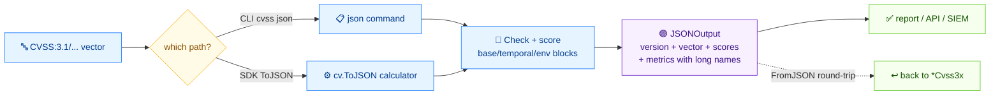

# 📄 把 CVSS 向量导出为结构化 JSON

## 问题

你需要某个向量的结构化 JSON 文档——向量串、基础分、严重性、每个指标的长名——用来喂给仪表盘、API 响应或 SIEM 采集管道。

## 方案

流程如下：



### CLI：`json`

```bash
cvss json "CVSS:3.1/AV:N/AC:L/PR:N/UI:N/S:U/C:H/I:H/A:H"
```

```json
{
  "version": "3.1",
  "vectorString": "CVSS:3.1/AV:N/AC:L/PR:N/UI:N/S:U/C:H/I:H/A:H",
  "baseScore": 9.8,
  "baseSeverity": "Critical",
  "metrics": {
    "base": {
      "attackVector": "Network",
      "attackComplexity": "Low",
      "privilegesRequired": "None",
      "userInteraction": "None",
      "scope": "Unchanged",
      "confidentiality": "High",
      "integrity": "High",
      "availability": "High",
      "exploitabilityScore": 3.8870427750000003,
      "impactScore": 5.873118720000001
    }
  }
}
```

输出是紧凑的。用 `jq .` 美化，或 `jq -c .` 强制单行 NDJSON：

```bash
cvss json "CVSS:3.1/AV:N/AC:L/PR:N/UI:N/S:U/C:H/I:H/A:H" | jq -c .
```

带时间指标的向量会额外输出 `temporalScore`、`temporalSeverity` 和 `metrics.temporal` 块；带环境指标的会额外输出 `environmental` 块和 `environmentalScore`。

### Go SDK：`Cvss3x.ToJSON`

`ToJSON` 返回与 `encoding/json` 兼容的字节流，结构和 CLI 一致。传 `nil` 它会自己建一个 calculator。

```go
package main

import (
	"fmt"

	"github.com/scagogogo/cvss-skills/pkg/cvss"
	"github.com/scagogogo/cvss-skills/pkg/parser"
)

func main() {
	cv, err := parser.ParseString("CVSS:3.1/AV:N/AC:L/PR:N/UI:N/S:U/C:H/I:H/A:H")
	if err != nil {
		panic(err)
	}

	calc := cvss.NewCalculator(cv)
	raw, err := cv.ToJSON(calc)
	if err != nil {
		panic(err)
	}
	fmt.Println(string(raw))
}
```

`ToJSON` 会先调 `calculator.cvss.Check()`，所以基础指标不完整时会返回错误——和 CLI 的 `json` 一样的保证。

::: tip 用 FromJSON 往返
`cvss.FromJSON(data []byte) (*Cvss3x, error)` 能把 `ToJSON` 产出的 JSON 解析回 `Cvss3x`。适合把富化后的记录存盘再加载，而不必重新解析向量串。
:::

## 讨论

- **分数字段始终是基础分。** 即使有环境指标，`baseScore` 也只是基础分；`temporalScore` 和 `environmentalScore` 是独立的可选字段。需要环境分时别把 `baseScore` 当成“那个分”。
- **长名而非短码。** JSON 里是 `"Network"` 而不是 `"N"`。要短码的话，CLI 用 `cvss map`，Go 用 `Cvss3x.ToMap()`。
- **Go 里美化输出。** `ToJSON` 返回紧凑字节。要缩进输出，先 unmarshal 到 `interface{}`，再用 `json.MarshalIndent` 重新序列化。
- **不是你想要的？** 要带分数的 CSV 而不是 JSON，看 [从 CSV 解析](/zh/recipes/parse-from-csv)。要对很多向量批量输出 JSON，用 `batch score --format json`（见 [筛选 Critical 漏洞](/zh/recipes/filter-critical-vulns)）。

## 另见

- [`json`](/zh/cli/commands/json)——本篇用到的 CLI 命令
- [JSON 序列化](/zh/sdk/json)——`ToJSON` / `FromJSON` / `JSONOutput` 参考
- [`map`](/zh/cli/commands/map)——输出 key=value 短码形式
- [从 CSV 解析](/zh/recipes/parse-from-csv)
- [筛选 Critical 漏洞](/zh/recipes/filter-critical-vulns)
