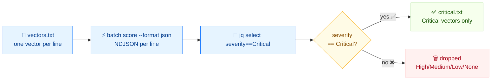

# 🚨 从向量文件筛选 Critical 漏洞

## 问题

你有一个纯文本的 CVSS 向量文件（每行一个，来自公告抓取或扫描器导出），想只挑出 **Critical** 级别的用于分诊处理。

## 方案

流程如下：



### 1. 准备输入文件

`vectors.txt`——每行一个 CVSS 向量：

```text
CVSS:3.1/AV:N/AC:L/PR:N/UI:N/S:U/C:H/I:H/A:H
CVSS:3.1/AV:N/AC:L/PR:N/UI:N/S:U/C:N/I:N/A:L
CVSS:3.1/AV:L/AC:H/PR:H/UI:R/S:U/C:L/I:L/A:L
CVSS:3.1/AV:N/AC:L/PR:N/UI:N/S:C/C:H/I:H/A:H
CVSS:3.0/AV:N/AC:L/PR:N/UI:N/S:U/C:H/I:H/A:H
CVSS:3.1/AV:P/AC:H/PR:H/UI:R/S:U/C:N/I:N/A:N
```

### 2. 把每个向量评分并输出为 JSON

`batch score` 会解析、评分，并按行输出 JSON 对象（NDJSON）。`--workers 4` 并行解析：

```bash
cvss batch score vectors.txt --format json
```

```json
{
  "line": 1,
  "score": 9.8,
  "severity": "Critical",
  "vector": "CVSS:3.1/AV:N/AC:L/PR:N/UI:N/S:U/C:H/I:H/A:H"
}
{
  "line": 2,
  "score": 5.3,
  "severity": "Medium",
  "vector": "CVSS:3.1/AV:N/AC:L/PR:N/UI:N/S:U/C:N/I:N/A:L"
}
{
  "line": 3,
  "score": 3.8,
  "severity": "Low",
  "vector": "CVSS:3.1/AV:L/AC:H/PR:H/UI:R/S:U/C:L/I:L/A:L"
}
{
  "line": 4,
  "score": 10,
  "severity": "Critical",
  "vector": "CVSS:3.1/AV:N/AC:L/PR:N/UI:N/S:C/C:H/I:H/A:H"
}
{
  "line": 5,
  "score": 9.8,
  "severity": "Critical",
  "vector": "CVSS:3.0/AV:N/AC:L/PR:N/UI:N/S:U/C:H/I:H/A:H"
}
{
  "line": 6,
  "score": 0,
  "severity": "None",
  "vector": "CVSS:3.1/AV:P/AC:H/PR:H/UI:R/S:U/C:N/I:N/A:N"
}
```

### 3. 用 `jq` 筛选

选出 `severity` 为 `Critical` 的对象：

```bash
cvss batch score vectors.txt --format json \
  | jq -r 'select(.severity == "Critical") | "\(.score)\t\(.vector)"'
```

```text
9.8	CVSS:3.1/AV:N/AC:L/PR:N/UI:N/S:U/C:H/I:H/A:H
10	CVSS:3.1/AV:N/AC:L/PR:N/UI:N/S:C/C:H/I:H/A:H
9.8	CVSS:3.0/AV:N/AC:L/PR:N/UI:N/S:U/C:H/I:H/A:H
```

::: tip 按分数阈值筛选
`jq -r 'select(.score >= 9) | ...'` 会保留所有 9.0 及以上的向量，这正是 Critical 的数值边界（≥ 9.0）。当你想按自己的策略顺带捞到 8.9 以上的 High 级向量时，用分数形式更灵活。
:::

### 4. 保存筛选结果

```bash
cvss batch score vectors.txt --format json \
  | jq -r 'select(.severity == "Critical") | .vector' \
  > critical.txt
```

`critical.txt` 现在只含 Critical 向量，每行一个，可以直接喂给 `cvss diff`、`cvss sort` 或你的工单系统。

## 讨论

- **为什么用 JSON + jq，而不是 `--severity` 选项？** `batch score` 输出全部向量；`jq` 让你按*任意*条件切片（`>= 7`、某个严重性、向量串正则）而不必重新评分。评一次分，多角度切。
- **混合版本没问题。** 上面的输入混了 `3.0` 和 `3.1` 向量——`batch score` 按各自规范评分，所以那行 v3.0 正确算出 9.8。
- **无效行会让整批中止。** `batch score` 遇到第一个无法解析的行就停。先用 `cvss batch validate vectors.txt` 预检，或者先清洗文件。
- **不是你想要的？** 如果你要的是*排序*而不是筛选，看 [按严重性排序](/zh/recipes/sort-by-severity)。如果输入是 CSV，看 [从 CSV 解析](/zh/recipes/parse-from-csv)。

## 另见

- [`batch score`](/zh/cli/commands/batch-score)——本篇用到的评分命令
- [`batch validate`](/zh/cli/commands/batch-validate)——评分前预检文件
- [`severity`](/zh/cli/commands/severity)——单个分数的严重性查询
- [按严重性排序](/zh/recipes/sort-by-severity)
- [从 CSV 解析](/zh/recipes/parse-from-csv)
