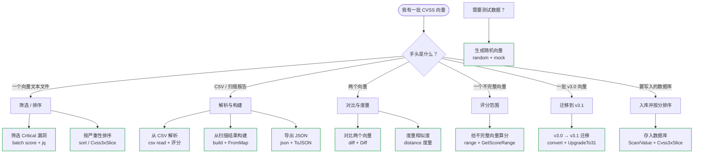

# 📚 实战菜谱

每篇菜谱用 `cvss` CLI 和 `github.com/scagogogo/cvss-skills` Go SDK 解决一个具体问题。按你手头的任务挑——筛选、排序、解析 CSV、导出 JSON、对比、迁移、入库——把命令和代码直接复制到你的项目里。

## 问题分类

## 全部菜谱

| 菜谱 | 解决的问题 | 工具 |
| --- | --- | --- |
| [筛选 Critical 漏洞](/zh/recipes/filter-critical-vulns) | 从向量文件中只保留 Critical | `batch score --format json` + `jq` |
| [按严重性排序](/zh/recipes/sort-by-severity) | 把一批向量按分数排序 | `sort` + `Cvss3xSlice` |
| [从 CSV 解析](/zh/recipes/parse-from-csv) | 给 CSV 里每个向量评分 | `csv read` + `csv write` |
| [导出 JSON](/zh/recipes/export-to-json) | 输出结构化 JSON 报告 | `json` + `Cvss3x.ToJSON` |
| [对比两个向量](/zh/recipes/compare-two-vectors) | 展示指标差异与分数变化 | `diff` + `Cvss3x.Diff` |
| [度量相似度](/zh/recipes/measure-similarity) | 算两个向量的距离/相似度 | `distance` + `DistanceCalculator` |
| [从扫描结果构建](/zh/recipes/build-from-scan) | 把扫描结果变成 CVSS 向量 | `build` + `FromMap` |
| [v3.0 → v3.1 迁移](/zh/recipes/migrate-v3-to-v31) | 把旧向量升级到 v3.1 | `convert --to 3.1` + `UpgradeTo31` |
| [给不完整向量算分](/zh/recipes/score-partial-vector) | 不完整向量的评分范围 | `range` + `GetScoreRange`/`GetWorstCase` |
| [生成测试数据](/zh/recipes/generate-test-data) | 生成随机 CVSS 向量 | `random` + `mock.RandomCvss3xFull` |
| [存入数据库](/zh/recipes/store-in-database) | 持久化向量并按分排序 | `Scan`/`Value` + `Cvss3xSlice` |

::: tip 每篇菜谱都自包含
“方案”一节是可以直接照着跑的分步流程；“讨论”说明什么时候**不该**用它；“另见”链到对应的 CLI 命令页和 SDK 参考。
:::
