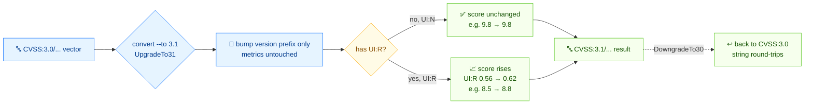

# 🔁 把 CVSS v3.0 向量迁移到 v3.1

## 问题

你积压的公告都是 CVSS v3.0 向量，但工具链现在要 v3.1。你需要转换它们，并知道分数什么时候会变。

## 方案

流程如下：



### CLI：`convert --to 3.1`

`AV:N/AC:L/PR:N/UI:N/S:U/C:H/I:H/A:H` 在两个版本里指标完全一致，所以分数不变：

```bash
cvss convert --to 3.1 "CVSS:3.0/AV:N/AC:L/PR:N/UI:N/S:U/C:H/I:H/A:H"
```

```text
Original:  CVSS:3.0/AV:N/AC:L/PR:N/UI:N/S:U/C:H/I:H/A:H (9.8)
Converted: CVSS:3.1/AV:N/AC:L/PR:N/UI:N/S:U/C:H/I:H/A:H (9.8)
```

但 `UI:R`（需要用户交互）在 **v3.0 算 0.56**、**v3.1 算 0.62**，所以任何带 `UI:R` 的向量都会变：

```bash
cvss convert --to 3.1 "CVSS:3.0/AV:N/AC:L/PR:N/UI:R/S:U/C:H/I:H/A:H"
```

```text
Original:  CVSS:3.0/AV:N/AC:L/PR:N/UI:R/S:U/C:H/I:H/A:H (8.5)
Converted: CVSS:3.1/AV:N/AC:L/PR:N/UI:R/S:U/C:H/I:H/A:H (8.8)
```

降级反过来（8.8 → 8.5）：

```bash
cvss convert --to 3.0 "CVSS:3.1/AV:N/AC:L/PR:N/UI:R/S:U/C:H/I:H/A:H"
```

```text
Original:  CVSS:3.1/AV:N/AC:L/PR:N/UI:R/S:U/C:H/I:H/A:H (8.8)
Converted: CVSS:3.0/AV:N/AC:L/PR:N/UI:R/S:U/C:H/I:H/A:H (8.5)
```

### Go SDK：`UpgradeTo31`

`UpgradeTo31` 是 `ConvertToVersion(3, 1)` 的便捷写法。它克隆向量并改版本号——指标值不动，但 calculator 在结果上用 v3.1 的权重。

```go
package main

import (
	"fmt"

	"github.com/scagogogo/cvss-skills/pkg/cvss"
	"github.com/scagogogo/cvss-skills/pkg/parser"
)

func main() {
	v30, _ := parser.ParseString("CVSS:3.0/AV:N/AC:L/PR:N/UI:R/S:U/C:H/I:H/A:H")

	v31, err := v30.UpgradeTo31()
	if err != nil {
		panic(err)
	}
	fmt.Println(v31.String()) // CVSS:3.1/AV:N/AC:L/PR:N/UI:R/S:U/C:H/I:H/A:H

	// 降级是对称的。
	back, _ := v31.DowngradeTo30()
	fmt.Println(back.String()) // CVSS:3.0/AV:N/AC:L/PR:N/UI:R/S:U/C:H/I:H/A:H

	_ = cvss.NewCalculator
}
```

`ConvertToVersion` 只接受 `3.0` 和 `3.1`；其他版本返回 `unsupported version: %d.%d`。

## 讨论

- **只有 `UI:R` 会改变分数。** v3.0→v3.1 影响评分的规格改动就是 `UI:Required` 的权重（0.56 → 0.62）。带 `UI:N`（常见情况）的向量转换后分数一分不差。
- **严重性档位可能跳变。** 一个 v3.0 下 8.9（High）、带 `UI:R` 的向量升级后可能到 9.x（Critical）。迁移后务必复查严重性，别只看分数。
- **指标值不会被改。** `convert` 只是升版本号，不是重新解释指标——v3.0 向量里若有 `E:F`，v3.1 结果里还是 `E:F`。
- **批量迁移。** 在 shell 里对 `vectors.txt` 循环跑 `convert`，或在 `ReadCSV`→`WriteCSV` 管道里调 `UpgradeTo31`。转换后用 [从 CSV 解析](/zh/recipes/parse-from-csv) 重新评分。
- **不是你想要的？** 如果你在对比同一个 CVE 的 v3.0 和 v3.1 向量，用 [对比两个向量](/zh/recipes/compare-two-vectors)——`diff` 支持跨版本。

## 另见

- [`convert`](/zh/cli/commands/convert)——本篇用到的 CLI 命令
- [版本转换](/zh/sdk/conversion)——`ConvertToVersion` / `UpgradeTo31` / `DowngradeTo30` 参考
- [对比两个向量](/zh/recipes/compare-two-vectors)
- [从 CSV 解析](/zh/recipes/parse-from-csv)
