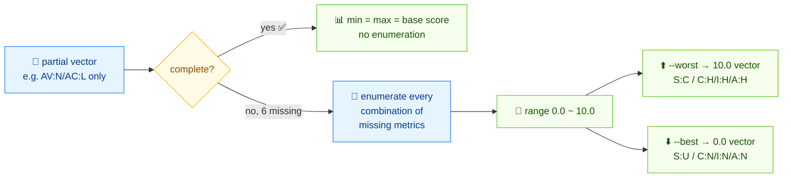

# 🎯 给不完整的 CVSS 向量算分数范围

## 问题

扫描器或分析师给你的向量只填了部分基础指标——比如只有 `AV:N/AC:L`，其他都没有。你没法精确评分，但你需要知道可能的分数*范围*，以及最坏情况的补全。

## 方案

流程如下：



### CLI：`range`

对完整向量，`range` 报告 `min = max = 实际分`：

```bash
cvss range "CVSS:3.1/AV:N/AC:L/PR:N/UI:N/S:U/C:H/I:H/A:H"
```

```text
Score range: 9.8 (Critical) ~ 9.8 (Critical)
Complete: true, Missing metrics: 0
```

对不完整向量，它会穷举缺失指标的所有组合，报告完整范围：

```bash
cvss range "CVSS:3.1/AV:N/AC:L"
```

```text
Score range: 0.0 (None) ~ 10.0 (Critical)
Complete: false, Missing metrics: 6
```

`--worst` 和 `--best` 输出产生高分和低端的那个补全向量：

```bash
cvss range --worst "CVSS:3.1/AV:N/AC:L"
```

```text
Score range: 0.0 (None) ~ 10.0 (Critical)
Complete: false, Missing metrics: 6
Worst case: CVSS:3.1/AV:N/AC:L/PR:N/UI:N/S:C/C:H/I:H/A:H (10.0)
```

```bash
cvss range --best "CVSS:3.1/AV:N/AC:L"
```

```text
Score range: 0.0 (None) ~ 10.0 (Critical)
Complete: false, Missing metrics: 6
Best case: CVSS:3.1/AV:N/AC:L/PR:N/UI:N/S:U/C:N/I:N/A:N (0.0)
```

要机器可读，用 `--format json`：

```bash
cvss range --format json "CVSS:3.1/AV:N/AC:L"
```

```json
{
  "MinScore": 0,
  "MaxScore": 10,
  "MinSeverity": "None",
  "MaxSeverity": "Critical",
  "IsComplete": false,
  "MissingCount": 6
}
```

### Go SDK：`GetScoreRange` / `GetWorstCase` / `GetBestCase`

用 `parser.ParseRelaxed` 解析不完整向量（它接受不带 `CVSS:` 前缀的向量和一个默认版本），然后算范围和极端补全。

```go
package main

import (
	"fmt"

	"github.com/scagogogo/cvss-skills/pkg/cvss"
	"github.com/scagogogo/cvss-skills/pkg/parser"
)

func main() {
	partial, err := parser.ParseRelaxed("AV:N/AC:L", "3.1")
	if err != nil {
		panic(err)
	}

	rng := cvss.GetScoreRange(partial)
	fmt.Println(rng.String())
	// 0.0 (None) ~ 10.0 (Critical) [6 metrics missing]

	worst, score, err := cvss.GetWorstCase(partial)
	if err != nil {
		panic(err)
	}
	fmt.Printf("worst: %s (%.1f)\n", worst.String(), score)
	// worst: CVSS:3.1/AV:N/AC:L/PR:N/UI:N/S:C/C:H/I:H/A:H (10.0)

	best, score, err := cvss.GetBestCase(partial)
	if err != nil {
		panic(err)
	}
	fmt.Printf("best : %s (%.1f)\n", best.String(), score)
	// best : CVSS:3.1/AV:N/AC:L/PR:N/UI:N/S:U/C:N/I:N/A:N (0.0)
}
```

## 讨论

- **组合爆炸成本。** `GetScoreRange` 会穷举每个缺失指标的每个取值，所以缺 8 个基础指标的向量要试 `4×2×3×2×2×3×3×3 = 2592` 种组合——很快，但如果你在紧凑循环里对成千上万个不完整向量调用，要缓存结果。
- **`IsComplete` 会短路。** 没有缺失指标时，`GetScoreRange` 返回 `min == max == 实际基础分`，不做穷举。
- **最坏情况是保守分诊的答案。** 当你必须凭不完整向量决定要不要打补丁时，按最坏情况（`GetWorstCase`）评分，把该发现当成“至少这么严重”。
- **`GetWorstCase`/`GetBestCase` 也返回补全后的向量。** 用返回的 `*Cvss3x` 看*哪几个*指标值产生极端——用来解释“它凭什么可能是 10 分”。
- **不是你想要的？** 如果你想填默认值后确定性评分，用 [从扫描结果构建](/zh/recipes/build-from-scan) 显式给值，而不是在未知上算范围。

## 另见

- [`range`](/zh/cli/commands/range)——本篇用到的 CLI 命令
- [评分范围](/zh/sdk/score-range)——`GetScoreRange` / `GetWorstCase` / `GetBestCase` / `ScoreRange` 参考
- [从扫描结果构建](/zh/recipes/build-from-scan)
- [评分（calculator）](/zh/sdk/calculator)——完整向量的 `GetBaseScore`
