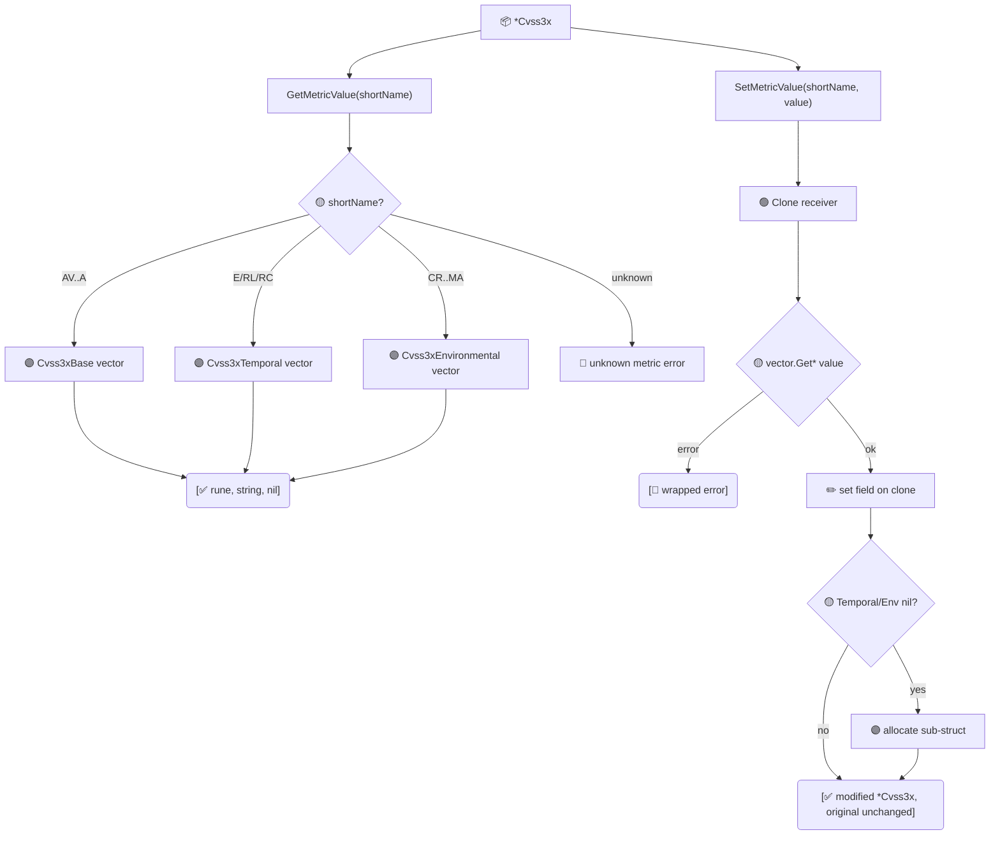

# 🔧 指标读写器

🔧 功能点 · `pkg/cvss`

`GetMetricValue` 与 `SetMetricValue` 按短名（`AV`、`AC`、`PR`、`UI`、`S`、`C`、`I`、`A`、`E`、`RL`、`RC`、`CR`、`IR`、`AR` 及 `M*` 系列）在 `*Cvss3x` 上读写单个指标。`SetMetricValue` 返回修改后的**副本**——接收者不会被修改——这与 `With*Method` 系列的不可变风格保持一致。

## 简介

```go
shortVal, longVal, _ := cv.GetMetricValue("AV")   // 'N', "Network", nil
modified, _ := cv.SetMetricValue("AV", 'L')        // 新 *Cvss3x，AV:N -> AV:L
```

两个方法都跨三组指标工作。设置 Temporal 或 Environmental 指标时，返回副本上对应的子结构（`Cvss3xTemporal` / `Cvss3xEnvironmental`）会被惰性分配。未知的短名或非法值会以 `error` 形式返回，并包装底层 `pkg/vector` 工厂的错误。

## 工作原理

`GetMetricValue` 经 `getVectorByShortName` 读取；`SetMetricValue` 克隆接收者，通过 `pkg/vector` 工厂解析取值并写入副本——原对象不被触碰。



## 接口参考

### GetMetricValue

```go
func (x *Cvss3x) GetMetricValue(shortName string) (rune, string, error)
```

返回指定指标的短值字符（如 `'N'`）和长值字符串（如 `"Network"`）。当 `Cvss3xTemporal` 为 `nil` 时读取 Temporal 指标返回错误 `no temporal metrics`；当 `Cvss3xEnvironmental` 为 `nil` 时读取 Environmental 指标返回 `no environmental metrics`。未知短名返回 `unknown metric: <name>`。

```go
short, long, err := cv.GetMetricValue("C")
// short = 'H', long = "High"
```

### SetMetricValue

```go
func (x *Cvss3x) SetMetricValue(shortName string, value rune) (*Cvss3x, error)
```

返回 `x` 的**修改副本**，将指定指标设为 `value`。接收者保持不变。`value` 由对应的 `vector.Get*` 工厂校验；失败时错误被包装为 `<短名>: <原因>`（例如 `AV: unknown attack vector value: Z`）。

```go
modified, err := cv.SetMetricValue("AV", 'L')
if err != nil { /* 例如 AV: unknown attack vector value: Q */ }
```

::: tip 支持的短名
基础：`AV AC PR UI S C I A` · 时间：`E RL RC` · 环境：`CR IR AR MAV MAC MPR MUI MS MC MI MA`。完整列表与 CVSS v3.1 规范一致。
:::

::: warning SetMetricValue 绝不修改接收者
由于 `SetMetricValue` 会先克隆接收者，对原对象链式调用是无效的。请重新赋值结果：`cv, _ = cv.SetMetricValue("AV", 'L')`。
:::

## 示例

```go
package main

import (
    "fmt"

    "github.com/scagogogo/cvss-skills/pkg/parser"
)

func main() {
    cv, err := parser.ParseString("CVSS:3.1/AV:N/AC:L/PR:N/UI:N/S:U/C:H/I:H/A:H")
    if err != nil {
        panic(err)
    }

    // 读取单个指标。
    short, long, err := cv.GetMetricValue("AV")
    if err != nil {
        panic(err)
    }
    fmt.Printf("AV = %c (%s)\n", short, long) // AV = N (Network)

    // 在副本上设置单个指标，原对象不变。
    modified, err := cv.SetMetricValue("AV", 'L')
    if err != nil {
        panic(err)
    }
    fmt.Println(cv.String())       // 仍是 .../AV:N/...
    fmt.Println(modified.String()) // .../AV:L/...

    // 设置 Temporal 指标时，会在副本上惰性分配该组。
    correct, err := cv.SetMetricValue("E", 'F')
    if err != nil {
        panic(err)
    }
    fmt.Println(correct.HasTemporalMetrics()) // true

    // 未知短名以错误形式返回。
    _, err = cv.SetMetricValue("ZZ", 'N')
    fmt.Println(err) // unknown metric: ZZ
}
```

## 相关

- [With-Method 风格](/zh/sdk/with-method) —— 与之对应的不可变逐指标 setter 系列
- [From-Map](/zh/sdk/from-map) —— 从 `map[string]string` 批量构造
- [pkg/vector](/zh/sdk/vector) —— 校验每个值的 `Get*` 工厂
- CLI：[`get`](/zh/cli/commands/get) 与 [`modify`](/zh/cli/commands/modify)
