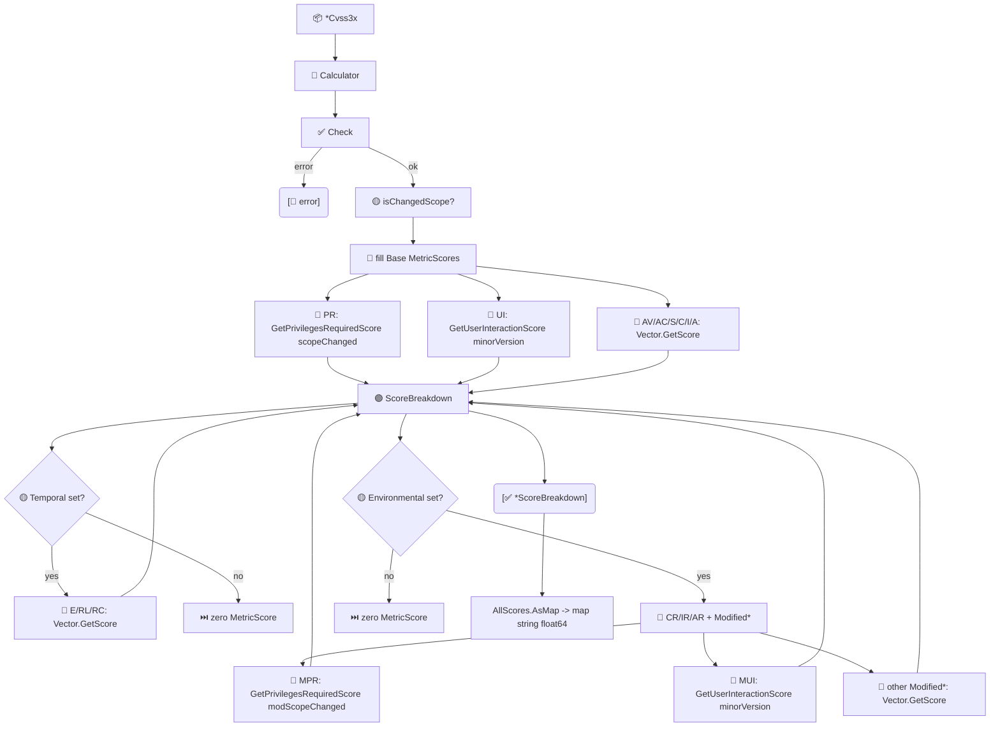

# 📊 分数分解

📊 功能点 · `pkg/cvss`

`GetScoreBreakdown` 返回 `*Cvss3x` 上每个指标的**有效分数**，已应用规范对 `PR`（Scope）与 `UI`（版本）的上下文调整。配合 `AllScores.AsMap`，既可得到结构化的逐指标视图，也可得到用于序列化的扁平 `map[string]float64`。

## 简介

```go
calc := cvss.NewCalculator(cv)
bd, err := calc.GetScoreBreakdown() // 每个 MetricScore 含 ShortName/LongName/Value/Score
fmt.Println(bd.AttackVector.String()) // AV:N=0.85
```

`MetricScore` 记录短名（`AV`）、长名（`Attack Vector`）、值（`N`），以及该值在当前向量上下文中实际获得的分数。`ScoreBreakdown` 是一个普通结构体，每个 CVSS 指标对应一个 `MetricScore` 字段；未设置的指标返回零值 `MetricScore{}`（`ShortName` 为空）。

## 工作原理

`GetScoreBreakdown` 校验向量后，直接从各 `Vector.GetScore()` 填充基础指标——但 `PR`（经 Scope 通过 `GetPrivilegesRequiredScore` 调整）与 `UI`（经版本通过 `GetUserInteractionScore` 调整）例外。时间/环境修改后指标对修改后 scope 使用同样感知 Scope/版本的辅助函数。



## 接口参考

### MetricScore

```go
type MetricScore struct {
    ShortName string  // 如 "AV"
    LongName  string  // 如 "Attack Vector"
    Value     string  // 如 "N"
    Score     float64 // 有效分数，PR/UI 已按上下文调整
}

func (m MetricScore) String() string // "AV:N=0.85"
```

### ScoreBreakdown

```go
type ScoreBreakdown struct {
    // 基础指标
    AttackVector, AttackComplexity, PrivilegesRequired,
    UserInteraction, Scope, Confidentiality, Integrity, Availability MetricScore
    // 时间指标
    ExploitCodeMaturity, RemediationLevel, ReportConfidence MetricScore
    // 环境需求因子
    ConfidentialityRequirement, IntegrityRequirement, AvailabilityRequirement MetricScore
    // 修改后的指标
    ModifiedAttackVector, ModifiedAttackComplexity, ModifiedPrivilegesRequired,
    ModifiedUserInteraction, ModifiedScope, ModifiedConfidentiality,
    ModifiedIntegrity, ModifiedAvailability MetricScore
}
```

### GetScoreBreakdown

```go
func (c *Calculator) GetScoreBreakdown() (*ScoreBreakdown, error)
```

返回分解。它先执行 `cv.Check()`，因此不完整的基础向量会在此暴露错误。`PrivilegesRequired` 分数通过 `vector.GetPrivilegesRequiredScore(pr, scopeChanged)` 计算，`UserInteraction` 通过 `vector.GetUserInteractionScore(ui, minorVersion)` 计算——这是两个值依赖上下文的指标。

```go
bd, err := calc.GetScoreBreakdown()
fmt.Printf("PR=%.2f UI=%.2f\n", bd.PrivilegesRequired.Score, bd.UserInteraction.Score)
```

::: tip PR 与 UI 受上下文调整
`PR` 依赖 Scope：`PR:L` 在 Scope Unchanged 下为 `0.62`，Scope Changed 下为 `0.68`（`PR:N` 恒为 `0.85`）。`UI:R` 依赖版本：v3.0 为 `0.56`，v3.1 为 `0.62`（`UI:N` 两版均为 `0.85`）。`GetScoreBreakdown` 始终返回*当前*向量的有效值。
:::

### AllScores.AsMap

```go
func (s *AllScores) AsMap() map[string]float64
```

将 `*AllScores` 扁平化为 `map[string]float64`，键为 `baseScore`、`impactSubScore`、`exploitabilitySubScore`；当存在时间指标时追加 `temporalScore`，当存在环境指标时追加 `environmentalScore`、`modifiedImpactSubScore`、`modifiedExploitabilitySubScore`。便于 JSON/模板渲染。

```go
m := all.AsMap()
// {"baseScore":9.8, "impactSubScore":5.87, "exploitabilitySubScore":3.89}
```

::: warning AsMap 会省略不存在的键
未设置时间指标时 `temporalScore` 键不存在（不是 `0`），未设置环境指标时三个 `modified*` 键也不存在。用逗号-ok 形式判断存在性，而非与零比较。
:::

## 示例

```go
package main

import (
    "encoding/json"
    "fmt"

    "github.com/scagogogo/cvss-skills/pkg/cvss"
    "github.com/scagogogo/cvss-skills/pkg/parser"
)

func main() {
    cv, err := parser.ParseString(
        "CVSS:3.1/AV:N/AC:L/PR:N/UI:N/S:U/C:H/I:H/A:H")
    if err != nil {
        panic(err)
    }
    calc := cvss.NewCalculator(cv)

    bd, err := calc.GetScoreBreakdown()
    if err != nil {
        panic(err)
    }
    // PR 与 UI 已按上下文调整；AV/AC/C/I/A 用指标自身分数。
    for _, m := range []cvss.MetricScore{
        bd.AttackVector, bd.PrivilegesRequired, bd.UserInteraction, bd.Confidentiality,
    } {
        fmt.Println(m.String())
    }

    // AsMap 给出聚合分数的序列化友好视图。
    all, err := calc.GetAllScores()
    if err != nil {
        panic(err)
    }
    raw, _ := json.MarshalIndent(all.AsMap(), "", "  ")
    fmt.Println(string(raw))
}
```

对 `CVSS:3.1/AV:N/AC:L/PR:N/UI:N/S:U/C:H/I:H/A:H` 运行时，CLI 的 `score --breakdown` 报告相同的逐指标数值，如 `AV:N = 0.85`、`PR:N = 0.85`、`UI:N = 0.85`、`C:H = 0.56`。

## 相关

- [评分计算器](/zh/sdk/calculator) —— `GetScoreBreakdown` 位于 `*Calculator` 上
- [评分](/zh/sdk/scores) —— `AllScores` 与 `GetAllScores`，`AsMap` 的来源
- [影响与敏感性](/zh/sdk/impact) —— 基于逐指标分数的敏感性分析
- CLI：[`score --breakdown`](/zh/cli/commands/score) 与 [`subs`](/zh/cli/commands/subs)
