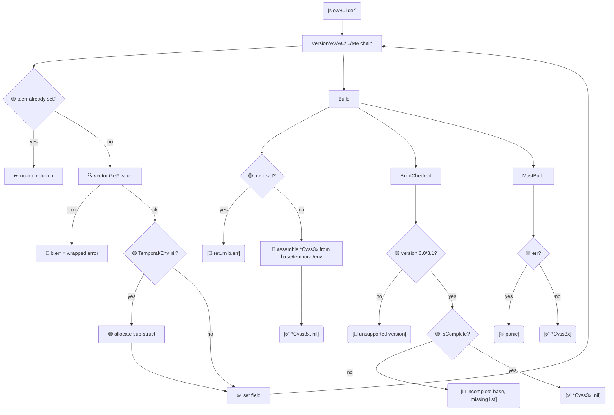

# 🔧 Builder 构建器

`cvss.Cvss3xBuilder` 是 `*Cvss3x` 的流式构建器。链式调用 `Version(...).AV('N').AC('L')...`，最后用 `Build`（宽松）、`BuildChecked`（校验完整性）或 `MustBuild`（出错 panic）收尾。

## 简介

```go
cv, err := cvss.NewBuilder().
    Version(3, 1).
    AV('N').AC('L').PR('N').UI('N').S('U').C('H').I('H').A('H').
    Build()
```

构建器默认 v3.1，并在首次设置某组的指标时惰性分配 Temporal/Environmental 组。

## 工作原理

每个链式 setter 通过 `pkg/vector` 工厂解析取值并存入 builder 的 `base`/`temporal`/`env` 结构；任何工厂错误被存入 `b.err` 并短路后续 setter。`Build` 组装一个 `*Cvss3x`；`BuildChecked` 额外校验版本与基础指标完整性；`MustBuild` 出错即 panic。



## 接口参考

### 构造

```go
func NewBuilder() *Cvss3xBuilder
func (b *Cvss3xBuilder) Version(major, minor int) *Cvss3xBuilder
```

### 基础指标 setter

```go
func (b *Cvss3xBuilder) AV(val rune) *Cvss3xBuilder  // Attack Vector
func (b *Cvss3xBuilder) AC(val rune) *Cvss3xBuilder  // Attack Complexity
func (b *Cvss3xBuilder) PR(val rune) *Cvss3xBuilder  // Privileges Required
func (b *Cvss3xBuilder) UI(val rune) *Cvss3xBuilder  // User Interaction
func (b *Cvss3xBuilder) S(val rune)   *Cvss3xBuilder  // Scope
func (b *Cvss3xBuilder) C(val rune)  *Cvss3xBuilder  // Confidentiality
func (b *Cvss3xBuilder) I(val rune)  *Cvss3xBuilder  // Integrity
func (b *Cvss3xBuilder) A(val rune)  *Cvss3xBuilder  // Availability
```

### 时间指标 setter

```go
func (b *Cvss3xBuilder) E(val rune)  *Cvss3xBuilder  // Exploit Code Maturity
func (b *Cvss3xBuilder) RL(val rune) *Cvss3xBuilder  // Remediation Level
func (b *Cvss3xBuilder) RC(val rune) *Cvss3xBuilder  // Report Confidence
```

### 环境指标 setter

```go
func (b *Cvss3xBuilder) CR(val rune) *Cvss3xBuilder  // Confidentiality Requirement
func (b *Cvss3xBuilder) IR(val rune) *Cvss3xBuilder  // Integrity Requirement
func (b *Cvss3xBuilder) AR(val rune) *Cvss3xBuilder  // Availability Requirement
func (b *Cvss3xBuilder) MAV(val rune) *Cvss3xBuilder // Modified Attack Vector
func (b *Cvss3xBuilder) MAC(val rune) *Cvss3xBuilder // Modified Attack Complexity
func (b *Cvss3xBuilder) MPR(val rune) *Cvss3xBuilder // Modified Privileges Required
func (b *Cvss3xBuilder) MUI(val rune) *Cvss3xBuilder // Modified User Interaction
func (b *Cvss3xBuilder) MS(val rune)  *Cvss3xBuilder // Modified Scope
func (b *Cvss3xBuilder) MC(val rune)  *Cvss3xBuilder // Modified Confidentiality
func (b *Cvss3xBuilder) MI(val rune)  *Cvss3xBuilder // Modified Integrity
func (b *Cvss3xBuilder) MA(val rune)  *Cvss3xBuilder // Modified Availability
```

每个 setter 委托给对应的 `vector.Get*` 工厂，并将任何错误暂存到构建器（`b.err`）。一旦 `b.err` 被设置，后续 setter 即为空操作，因此错误只在 `Build` 时浮现一次。

### 终结方法

```go
func (b *Cvss3xBuilder) Build() (*Cvss3x, error)
func (b *Cvss3xBuilder) BuildChecked() (*Cvss3x, error)
func (b *Cvss3xBuilder) MustBuild() *Cvss3x
```

| 方法 | 校验值? | 校验版本? | 校验完整性? | panic? |
| --- | --- | --- | --- | --- |
| `Build` | 是 | 否 | 否 | 否 |
| `BuildChecked` | 是 | 是（3.0/3.1） | 是（8 个基础指标全设置） | 否 |
| `MustBuild` | 是 | 否 | 否 | 是 |

`BuildChecked` 按名称报告缺失指标：`incomplete base metrics, missing: [AV PR]`。

::: tip 与 Functional Options 对比
构建器与 `NewCvss3xWithOptions`（见 [选项](/zh/sdk/options)）职责相同。指标多时构建器更线性易读；想要可复用预设（如 `WithCriticalBase()`）时选项组合性更好。
:::

## 示例

```go
package main

import (
    "fmt"

    "github.com/scagogogo/cvss-skills/pkg/cvss"
)

func main() {
    // 完整流式构建，含时间 + 环境。
    cv, err := cvss.NewBuilder().
        Version(3, 1).
        AV('N').AC('L').PR('N').UI('N').S('C').C('H').I('H').A('H').
        E('F').RL('U').RC('C').
        CR('H').IR('H').AR('H').
        MAV('N').MC('H').MI('H').MA('H').
        Build()
    if err != nil {
        panic(err)
    }
    fmt.Println(cv.String())

    // BuildChecked 捕获不完整的基础指标。
    _, err = cvss.NewBuilder().
        Version(3, 1).
        AV('N').AC('L'). // 忘了 PR/UI/S/C/I/A
        BuildChecked()
    fmt.Println(err) // incomplete base metrics, missing: [PR UI S C I A]

    // 非法值会被 Build 捕获，而非 panic。
    _, err = cvss.NewBuilder().AV('Z').Build()
    fmt.Println(err) // AV: unknown attack vector value: Z
}
```

## 相关

- [Functional Options](/zh/sdk/options) —— 另一种构建方式
- [pkg/vector](/zh/sdk/vector) —— setter 所调用的 `Get*` 工厂
- [校验](/zh/sdk/validation) —— `BuildChecked` 所强制的内容
