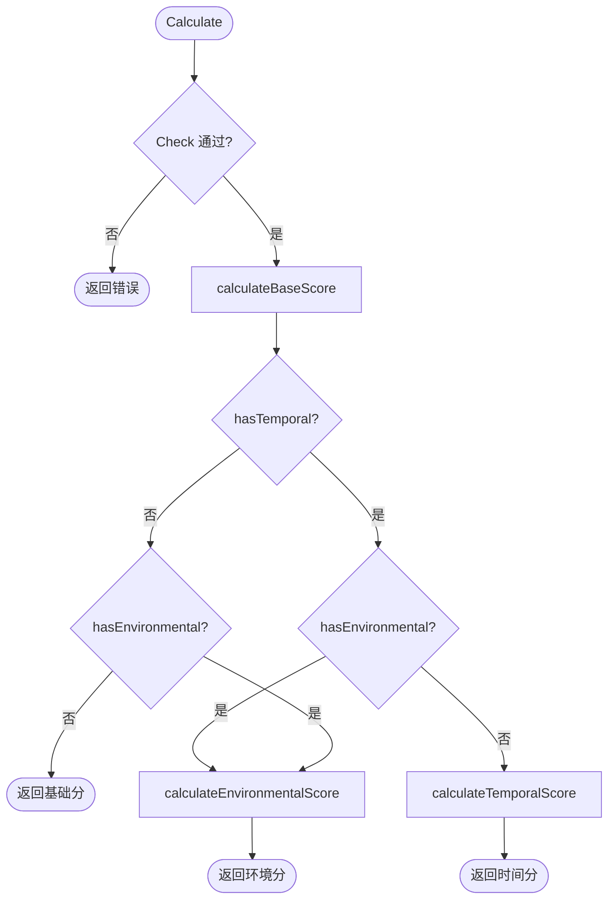

# 🧮 评分计算器

`cvss.Calculator` 按 CVSS v3.0/v3.1 规范把 `*Cvss3x` 转为数值评分，包含版本相关的 UI:R 差异（0.56 vs 0.62）以及依赖 Scope 的 PR 评分。

## 简介

```go
calc := cvss.NewCalculator(cv)
score, err := calc.Calculate()                 // "当前"评分
all, _    := calc.GetAllScores()               // base + temporal + environmental + 子分
bd, _     := calc.GetScoreBreakdown()          // 各指标有效分数
```

## 评分流程

`Calculate` 依据已设置的指标组，选择最精炼的评分：



- **基础分** = `Roundup(Min(ImpactSub + ExploitSub, 10))`，Scope 为 Changed 时乘 `1.08*`。
- **时间分** = `Roundup(Base × E × RL × RC)`，未设置的时间指标默认 1.0。
- **环境分** = `Roundup(Min(1.08*(ModImpact+ModExploit), 10)) × E × RL × RC`，使用修改后指标与 CR/IR/AR 需求因子（H=1.5、M=1.0、L=0.5）。

## 类型

### `Calculator`

```go
type Calculator struct { cvss *Cvss3x }
```
不透明——用 `NewCalculator` 创建，无导出字段。

### `AllScores`

| 字段 | 类型 | 含义 |
| --- | --- | --- |
| `BaseScore` | `float64` | 始终存在 |
| `TemporalScore` | `float64` | 仅在 `HasTemporal` 时有意义 |
| `EnvironmentalScore` | `float64` | 仅在 `HasEnvironmental` 时有意义 |
| `BaseSeverity` | `Severity` | |
| `TemporalSeverity` | `Severity` | 缺失时默认 `SeverityNone` |
| `EnvironmentalSeverity` | `Severity` | 缺失时默认 `SeverityNone` |
| `ImpactSubScore` | `float64` | ISC |
| `ExploitabilitySubScore` | `float64` | ESC |
| `ModifiedImpactSubScore` | `float64` | 仅在 `HasEnvironmental` 时设置 |
| `ModifiedExploitabilitySubScore` | `float64` | 仅在 `HasEnvironmental` 时设置 |
| `HasTemporal` | `bool` | |
| `HasEnvironmental` | `bool` | |

提供 `String()` 摘要与 `AsMap() map[string]float64` 便于序列化。

### `ScoreBreakdown` 与 `MetricScore`

`GetScoreBreakdown` 返回 `*ScoreBreakdown`，每个指标对应一个 `MetricScore`。`MetricScore` 携带 `ShortName`、`LongName`、`Value`（短值字符的字符串形式）以及有效 `Score`——对 PR 与 UI 而言是上下文调整后的分数，而非静态预设分数。

## 接口参考

```go
func NewCalculator(cvss *Cvss3x) *Calculator

func (c *Calculator) Calculate() (float64, error)
func (c *Calculator) GetBaseScore() (float64, error)
func (c *Calculator) GetTemporalScore() (float64, error)
func (c *Calculator) GetEnvironmentalScore() (float64, error)
func (c *Calculator) GetImpactSubScore() (float64, error)
func (c *Calculator) GetExploitabilitySubScore() (float64, error)
func (c *Calculator) GetModifiedImpactSubScore() (float64, error)
func (c *Calculator) GetModifiedExploitabilitySubScore() (float64, error)

func (c *Calculator) GetAllScores() (*AllScores, error)
func (c *Calculator) GetScoreBreakdown() (*ScoreBreakdown, error)

func (c *Calculator) GetSeverityRating(score float64) Severity
func RoundUp(x float64) float64
```

每个方法都会先调用 `cvss.Check()`，若基础指标不完整则返回其错误。

::: tip 优先用 GetAllScores 而非多次调用
`GetAllScores` 一次算出全部评分。分别调用 `GetBaseScore` + `GetTemporalScore` + `GetEnvironmentalScore` 会重复计算基础分——单次无妨，循环中浪费。
:::

::: warning Calculate 不等于 GetEnvironmentalScore
`Calculate` 返回可用的**最精炼**评分（base → temporal → environmental）。`GetEnvironmentalScore` 专返回环境分，但在缺少环境指标时回退到时间/基础分。要得到"人会引用的那个分"，用 `Calculate`。
:::

## 示例

```go
package main

import (
    "fmt"

    "github.com/scagogogo/cvss-skills/pkg/cvss"
    "github.com/scagogogo/cvss-skills/pkg/parser"
)

func main() {
    cv, _ := parser.ParseString(
        "CVSS:3.1/AV:N/AC:L/PR:N/UI:N/S:U/C:H/I:H/A:H/E:F/RL:U/RC:C")

    calc := cvss.NewCalculator(cv)

    // 头条评分（因设置了 temporal，为环境分）。
    score, _ := calc.Calculate()
    fmt.Printf("active score: %.1f (%s)\n", score, calc.GetSeverityRating(score))

    // 一次拿到全部。
    all, _ := calc.GetAllScores()
    fmt.Printf("base=%.1f temporal=%.1f environmental=%.1f\n",
        all.BaseScore, all.TemporalScore, all.EnvironmentalScore)

    // 各指标有效分数（PR/UI 已按上下文调整）。
    bd, _ := calc.GetScoreBreakdown()
    fmt.Printf("PR effective=%.2f  UI effective=%.2f\n",
        bd.PrivilegesRequired.Score, bd.UserInteraction.Score)

    // RoundUp 遵循规范的整数算法定义。
    fmt.Printf("RoundUp(7.318) = %.1f\n", cvss.RoundUp(7.318)) // 7.4
}
```

## 相关

- [pkg/cvss](/zh/sdk/cvss) —— 输入类型
- [pkg/vector](/zh/sdk/vector) —— 为什么 PR/UI 分数依赖上下文
- [评分范围](/zh/sdk/score-range) —— 不完整向量的最好/最坏情况
