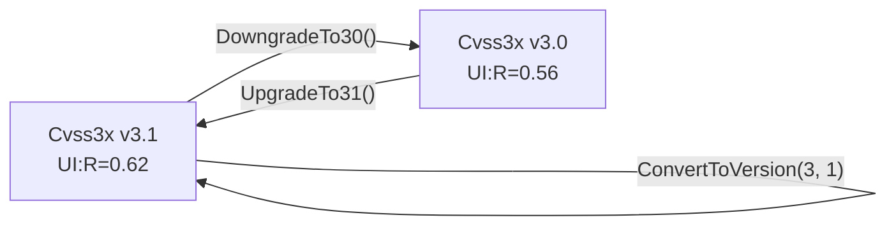

# 🔄 版本转换与分组

🔄 功能点 · `pkg/cvss`

转换 API 在 v3.0 与 v3.1 之间切换 `*Cvss3x`（返回副本——只改版本号，指标值不变，但分数会重新计算，因为 `UI:R` 随版本不同）。分组 API 将向量拆为 `Base` / `Temporal` / `Environmental` 指标组，并渲染部分向量字符串。

## 简介

```go
v30, _ := cv.ConvertToVersion(3, 0)  // 3.1 -> 3.0 副本
v31, _ := v30.UpgradeTo31()          // 回到 3.1

groups := cv.GetMetricGroups()        // []MetricGroup{Base, Temporal?, Environmental?}
baseStr := cv.GetBaseVectorString()   // "CVSS:3.1/AV:N/.../A:H"
```

## 接口参考

### 版本转换

```go
func (x *Cvss3x) ConvertToVersion(major, minor int) (*Cvss3x, error) // 3.0 <-> 3.1
func (x *Cvss3x) UpgradeTo31() (*Cvss3x, error)                      // == ConvertToVersion(3, 1)
func (x *Cvss3x) DowngradeTo30() (*Cvss3x, error)                    // == ConvertToVersion(3, 0)
```

`ConvertToVersion` 克隆接收者并设置 `MajorVersion`/`MinorVersion`。仅支持 `3.0` 与 `3.1`——其它版本返回 `unsupported version: <m>.<n> (only 3.0 and 3.1 supported)`。指标值不被修改。

::: warning UI:R 跨版本会变值
`UI:Required` 在 v3.0 中为 `0.56`，v3.1 中为 `0.62`。转换保留指标值，但**分数**会重新计算，因此若向量含 `UI:R`，先降级再升级可能与原向量显示不同基础分。
:::



### 分组

```go
type MetricGroup struct {
    Name    string            // "Base"、"Temporal"、"Environmental"
    Metrics []MetricValuePair
}
type MetricValuePair struct {
    ShortName, LongName, Value, LongValue string
}

func (mg MetricGroup) String() string
func (x *Cvss3x) GetMetricGroups() []MetricGroup
```

`GetMetricGroups` 始终输出 `Base` 组（基础为 `nil` 时其指标可能为空），仅在 `HasTemporalMetrics` / `HasEnvironmentalMetrics` 为真时才条件性输出 `Temporal` / `Environmental` 组。每个 `MetricValuePair` 记录短名、长名、短值、长值（如 `AV` / `Attack Vector` / `N` / `Network`）；已存在组中未设置的指标仍会出现，但值字段为空。

```go
for _, g := range cv.GetMetricGroups() {
    fmt.Println(g.String())
}
```

### 部分向量字符串

```go
func (x *Cvss3x) GetBaseVectorString() string         // "CVSS:3.1/AV:.../A:H"
func (x *Cvss3x) GetTemporalVectorString() string     // base + temporal
func (x *Cvss3x) GetEnvironmentalVectorString() string // == String()（完整）
```

`GetBaseVectorString` 返回仅含基础部分并带版本前缀的字符串。`GetTemporalVectorString` 在存在时间指标时追加时间段，否则返回基础字符串。`GetEnvironmentalVectorString` 是完整向量，等价于 `x.String()`。三者对 nil 接收者或 nil 基础均返回 `""`。

::: tip 三种粒度，同一来源
它们都是对同一结构的纯投影。想忽略 temporal/env 漂移比较两向量时用 `GetBaseVectorString`；想渲染时间等价形式用 `GetTemporalVectorString`。
:::

## 示例

```go
package main

import (
    "fmt"

    "github.com/scagogogo/cvss-skills/pkg/parser"
)

func main() {
    cv, err := parser.ParseString(
        "CVSS:3.1/AV:N/AC:L/PR:N/UI:N/S:U/C:H/I:H/A:H/E:F/RL:U/RC:C")
    if err != nil {
        panic(err)
    }

    // 版本往返：值保留，版本号翻转。
    v30, err := cv.DowngradeTo30()
    if err != nil {
        panic(err)
    }
    fmt.Println(v30.Version())           // 3.0
    fmt.Println(cv.Equal(v30))           // false——版本不同
    back, _ := v30.UpgradeTo31()
    fmt.Println(cv.Equal(back))          // true——同版本同指标

    // 不支持的版本返回错误。
    _, err = cv.ConvertToVersion(4, 0)
    fmt.Println(err) // unsupported version: 4.0 (only 3.0 and 3.1 supported)

    // 按 Base / Temporal / Environmental 分组指标。
    for _, g := range cv.GetMetricGroups() {
        fmt.Println(g.String())
    }

    // 三种粒度的向量字符串。
    fmt.Println(cv.GetBaseVectorString())        // CVSS:3.1/AV:N/AC:L/PR:N/UI:N/S:U/C:H/I:H/A:H
    fmt.Println(cv.GetTemporalVectorString())    // base + E:F/RL:U/RC:C
    fmt.Println(cv.GetEnvironmentalVectorString() == cv.String()) // true
}
```

## 相关

- [便捷方法](/zh/sdk/convenience) —— 此处用到的 `Version` / `Is30` / `Is31` / `HasTemporalMetrics`
- [Vector](/zh/sdk/vector) —— 转换后保留的底层指标值
- [评分](/zh/sdk/scores) —— 版本相关的 `UI:R` 分数在此体现
- CLI：[`convert`](/zh/cli/commands/convert) 与 [`groups`](/zh/cli/commands/groups)
