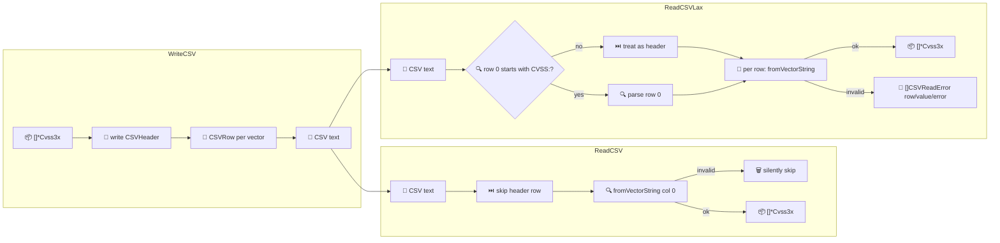

# 📊 CSV 读写

以 CSV 读写 CVSS 向量。`WriteCSV` 输出表头加每向量一行评分；`ReadCSV` 把第一列解析回 `*Cvss3x`；`ReadCSVLax` 是容错变体，按行收集错误而非快速失败。

## 简介

```go
var buf bytes.Buffer
cvss.WriteCSV(&buf, []*cvss.Cvss3x{a, b})
vectors, _ := cvss.ReadCSV(&buf)
```

## 工作原理

`WriteCSV` 为每个向量评分并输出一行；两条读取路径只在错误处理上不同——`ReadCSV` 静默跳过坏行，`ReadCSVLax` 把它们记为 `CSVReadError` 条目。



## CSV schema

`CSVHeader()` 返回规范列顺序：

| # | 列 | 示例 |
| --- | --- | --- |
| 1 | `vector_string` | `CVSS:3.1/AV:N/...` |
| 2 | `version` | `3.1` |
| 3 | `base_score` | `9.8` |
| 4 | `base_severity` | `High` |
| 5 | `temporal_score` | （无则为空） |
| 6 | `temporal_severity` | （无则为空） |
| 7 | `environmental_score` | （无则为空） |
| 8 | `environmental_severity` | （无则为空） |
| 9 | `impact_sub_score` | `5.9`（4 位小数） |
| 10 | `exploitability_sub_score` | `3.9`（4 位小数） |

## 接口参考

```go
func CSVHeader() []string
func (x *Cvss3x) CSVRow(calc *Calculator) ([]string, error)
func WriteCSV(w io.Writer, vectors []*Cvss3x) error
func ReadCSV(r io.Reader) ([]*Cvss3x, error)
func ReadCSVLax(r io.Reader) ([]*Cvss3x, []CSVReadError, error)

type CSVReadError struct {
    Row   int
    Value string
    Error error
}
func (e CSVReadError) String() string
```

- `CSVRow(nil)` 会自建 `Calculator`。分数来自 `GetAllScores`；时间/环境组缺失时对应列填空字符串。
- `WriteCSV` 先写表头，再每向量一行，跳过 `nil` 条目。返回首个生成行错误。
- `ReadCSV` 跳过表头行，随后解析每行第 0 列。**无效行会被静默跳过**——若需知道哪些行失败，用 `ReadCSVLax`。
- `ReadCSVLax` 自动判断首行是否为表头（通过检查 `CVSS:` 前缀），并为每个坏行收集一个 `CSVReadError`，含行号与原始值。

::: tip 用 ReadCSVLax 处理脏数据
导入外部工具导出的 CSV 时，行可能格式错误、含注释或非向量字符串。`ReadCSVLax` 返回合法向量与一份 `[]CSVReadError` 日志，让你报告问题而不中断整批。
:::

::: warning ReadCSV 只读第 0 列
两个读取器都仅把第一列解析为向量字符串。分数/严重性列不往返——写入时重算、读取时丢弃。
:::

## 示例

```go
package main

import (
    "bytes"
    "fmt"

    "github.com/scagogogo/cvss-skills/pkg/cvss"
)

func main() {
    a := cvss.HighV31()
    b := cvss.MediumV31()

    var buf bytes.Buffer
    if err := cvss.WriteCSV(&buf, []*cvss.Cvss3x{a, b}); err != nil {
        panic(err)
    }
    fmt.Println(buf.String())

    // 容错读取：注入一行坏数据。
    buf.WriteString("not-a-vector\n")
    vectors, errs, _ := cvss.ReadCSVLax(&buf)
    fmt.Printf("parsed %d vectors, %d errors\n", len(vectors), len(errs))
    for _, e := range errs {
        fmt.Println("  ", e.String())
    }
}
```

## 相关

- [JSON 序列化](/zh/sdk/json) —— 结构化序列化
- [pkg/cvss](/zh/sdk/cvss) —— `ToMap`/`FromMap` 键值形式
- [评分计算器](/zh/sdk/calculator) —— `GetAllScores` 支撑分数列
