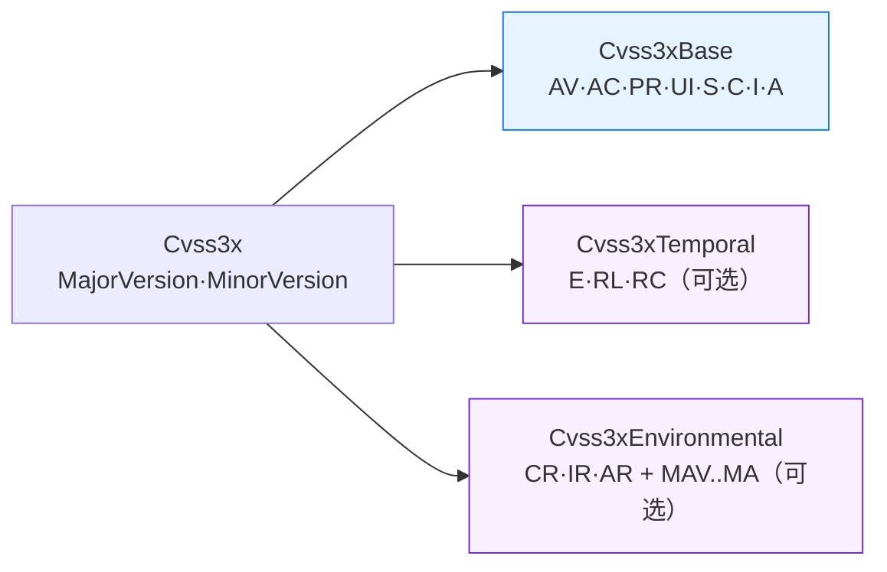

# 🧱 pkg/cvss

`pkg/cvss` 包承载核心模型：`Cvss3x` 结构体及其三个内嵌指标组（Base / Temporal / Environmental），外加其他所有 SDK 功能赖以构建的构造器、访问器与序列化钩子。

## 简介

一条 CVSS v3.x 向量（如 `CVSS:3.1/AV:N/AC:L/PR:N/UI:N/S:U/C:H/I:H/A:H/E:F/RL:U/RC:C`）被建模为由三个可选阶段组合而成的 `Cvss3x`。基础指标必填，时间与环境指标可选且按需惰性分配。



## 核心类型

### `Cvss3x`

| 字段 | 类型 | 说明 |
| --- | --- | --- |
| `Cvss3xBase` | `*Cvss3xBase` | 内嵌；8 个基础指标。评分时必填。 |
| `Cvss3xTemporal` | `*Cvss3xTemporal` | 内嵌；在设置任意 Temporal 指标前为 `nil`。 |
| `Cvss3xEnvironmental` | `*Cvss3xEnvironmental` | 内嵌；在设置任意 Environmental 指标前为 `nil`。 |
| `MajorVersion` | `int` | 恒为 `3`。 |
| `MinorVersion` | `int` | `0`（v3.0）或 `1`（v3.1）。影响 UI:R 的分数。 |

### `Cvss3xBase` 字段

| 字段 | Vector 类型 | 短名称 |
| --- | --- | --- |
| `AttackVector` | `vector.Vector` | AV |
| `AttackComplexity` | `vector.Vector` | AC |
| `PrivilegesRequired` | `vector.Vector` | PR |
| `UserInteraction` | `vector.Vector` | UI |
| `Scope` | `vector.Vector` | S |
| `Confidentiality` | `vector.Vector` | C |
| `Integrity` | `vector.Vector` | I |
| `Availability` | `vector.Vector` | A |

`Cvss3xTemporal` 持有 `ExploitCodeMaturity`（E）、`RemediationLevel`（RL）、`ReportConfidence`（RC）。`Cvss3xEnvironmental` 持有 `ConfidentialityRequirement`/`IntegrityRequirement`/`AvailabilityRequirement`（CR/IR/AR）以及八个 `Modified*` 指标（MAV、MAC、MPR、MUI、MS、MC、MI、MA）。所有字段都是 `vector.Vector` 指针，可为 `nil`（视为 "Not Defined"）。

## 接口参考

### 构造器

```go
func NewCvss3x() *Cvss3x
```
返回一个空的 v3.1 `Cvss3x`，已分配 `Cvss3xBase`，Temporal/Environmental 组为 `nil`。

```go
func FromMap(m map[string]string) (*Cvss3x, error)
func MustFromMap(m map[string]string) *Cvss3x
func FromVectorValues(version string, pairs ...string) (*Cvss3x, error)
```
从 `map`（`"version": "3.1"`、`"AV": "N"`、…）或 `"AV:N"` 形式的键值对（前置版本号字符串）构造。

### 校验与序列化

```go
func (x *Cvss3x) Check() error
func (x *Cvss3x) Validate() error
func (x *Cvss3x) IsComplete() bool
func (x *Cvss3x) MissingMetrics() []string
func (x *Cvss3x) String() string
```
`Check` 在遇到第一个问题时即短路返回；`Validate` 收集全部问题为 `ValidationErrors`。`String` 输出规范化的 `CVSS:3.1/AV:.../...` 形式，指标按规范顺序排列。

```go
func (x *Cvss3x) MarshalJSON() ([]byte, error)
func (x *Cvss3x) UnmarshalJSON(data []byte) error
func (x *Cvss3x) MarshalText() ([]byte, error)
func (x *Cvss3x) UnmarshalText(data []byte) error
```
JSON 序列化为向量字符串（`"CVSS:3.1/..."`）；Text 钩子覆盖 XML、`mapstructure` 与数据库驱动场景。

### 访问与修改

```go
func (x *Cvss3x) GetMetricValue(shortName string) (rune, string, error)
func (x *Cvss3x) SetMetricValue(shortName string, value rune) (*Cvss3x, error)
func (x *Cvss3x) Clone() *Cvss3x
func (x *Cvss3x) BaseOnly() *Cvss3x
func (x *Cvss3x) Merge(other *Cvss3x) *Cvss3x
func (x *Cvss3x) Diff(other *Cvss3x) []DiffEntry
func (x *Cvss3x) Equal(other *Cvss3x) bool
```
`SetMetricValue` 返回修改后的**副本**——原对象保持不变。`Merge` 仅用 `other` 填充接收者中为空的槽位。

### 版本与分组辅助

```go
func (x *Cvss3x) Version() string        // "3.1"
func (x *Cvss3x) Is30() bool
func (x *Cvss3x) Is31() bool
func (x *Cvss3x) HasTemporalMetrics() bool
func (x *Cvss3x) HasEnvironmentalMetrics() bool
func (x *Cvss3x) GetMetricGroups() []MetricGroup
func (x *Cvss3x) Description() string
func (x *Cvss3x) GetBaseVectorString() string
func (x *Cvss3x) GetTemporalVectorString() string
func (x *Cvss3x) GetEnvironmentalVectorString() string
```

::: tip String() 本身已是规范形式
`String()` 始终按 CVSS 规范顺序输出指标（AV、AC、PR、UI、S、C、I、A，随后 E/RL/RC，再 CR/IR/AR + MAV..MA）。对于你自行构建的对象，无需额外的规范化步骤。
:::

## 示例

```go
package main

import (
    "encoding/json"
    "fmt"

    "github.com/scagogogo/cvss-skills/pkg/cvss"
    "github.com/scagogogo/cvss-skills/pkg/vector"
)

func main() {
    // 直接构造一个 v3.1 High 向量。
    cv := &cvss.Cvss3x{
        MajorVersion: 3,
        MinorVersion: 1,
        Cvss3xBase: &cvss.Cvss3xBase{
            AttackVector:       vector.AttackVectorNetwork,
            AttackComplexity:   vector.AttackComplexityLow,
            PrivilegesRequired: vector.PrivilegesRequiredNone,
            UserInteraction:    vector.UserInteractionNone,
            Scope:              vector.ScopeUnchanged,
            Confidentiality:    vector.ConfidentialityHigh,
            Integrity:          vector.IntegrityHigh,
            Availability:       vector.AvailabilityHigh,
        },
    }

    fmt.Println(cv.String())     // CVSS:3.1/AV:N/AC:L/PR:N/UI:N/S:U/C:H/I:H/A:H
    fmt.Println(cv.IsComplete()) // true

    // 修改副本——原对象保持不变。
    scoped, _ := cv.SetMetricValue("S", 'C')
    fmt.Println(scoped.String()) // .../S:C/...

    // JSON 经向量字符串往返。
    raw, _ := json.Marshal(cv)
    fmt.Printf("%s\n", raw)      // "CVSS:3.1/AV:N/AC:L/PR:N/UI:N/S:U/C:H/I:H/A:H"
}
```

## 相关

- [pkg/parser](/zh/sdk/parser) —— 用字符串而非结构体字面量构建 `*Cvss3x`
- [评分计算器](/zh/sdk/calculator) —— 把 `Cvss3x` 转为数值评分
- [校验](/zh/sdk/validation) —— 深入了解 `Validate` / `MissingMetrics` 的错误模型
