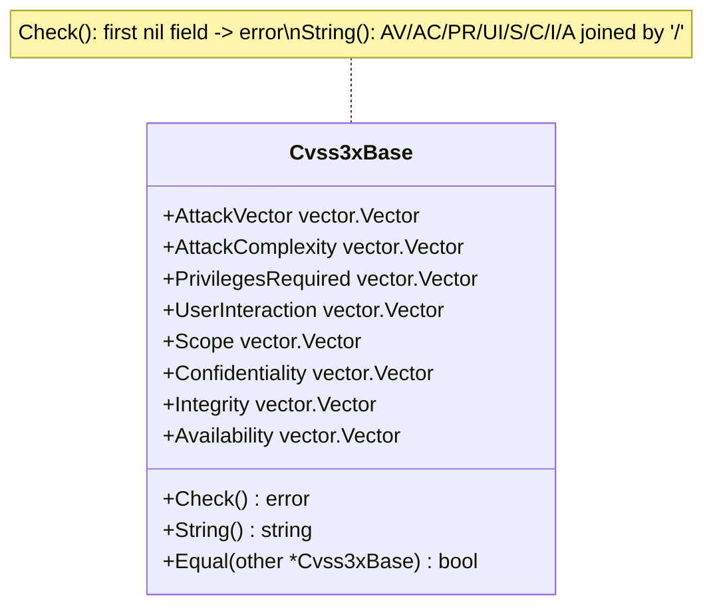

# 🧱 Cvss3xBase 基础指标

`pkg/cvss/cvss3x_base.go` · 基础指标 · 8 个 vector 字段

## 简介

`Cvss3xBase` 是每个 CVSS 3.x 向量必须具备的基础部分，持有 8 个基础指标——攻击向量、攻击复杂度、所需权限、用户交互、影响范围、机密性、完整性、可用性——每个字段类型均为 `vector.Vector`。`Check()` 强制要求 8 个字段均不能为 `nil`；`String()` 以 `/` 拼接已设置的字段。

```go
base := cvss.NewCvss3x().Cvss3xBase // 实际使用中由 parser/builder 填充
base.AttackVector = vector.AttackVectorNetwork
base.Confidentiality = vector.ConfidentialityNone
// ...
fmt.Println(base.String()) // AV:N/AC:.../...
fmt.Println(base.Check())  // 8 个字段都设置时返回 <nil>
```

## 工作原理

`Cvss3xBase` 是一个由八个 `vector.Vector` 字段组成的普通结构体。`Check` 按序遍历并在首个 `nil` 处返回；`String` 按规范顺序（AV/AC/PR/UI/S/C/I/A）收集非 nil 字段并以 `/` 连接。



## 接口参考

### `Cvss3xBase` 结构体

```go
type Cvss3xBase struct {
    AttackVector      vector.Vector // AV
    AttackComplexity  vector.Vector // AC
    PrivilegesRequired vector.Vector // PR
    UserInteraction   vector.Vector // UI
    Scope             vector.Vector // S
    Confidentiality   vector.Vector // C
    Integrity         vector.Vector // I
    Availability      vector.Vector // A
}
```

| 字段 | 短名 | 常见取值 |
| --- | --- | --- |
| `AttackVector` | `AV` | `N` / `A` / `L` / `P` |
| `AttackComplexity` | `AC` | `L` / `H` |
| `PrivilegesRequired` | `PR` | `N` / `L` / `H` |
| `UserInteraction` | `UI` | `N` / `R` |
| `Scope` | `S` | `U` / `C` |
| `Confidentiality` | `C` | `N` / `L` / `H` |
| `Integrity` | `I` | `N` / `L` / `H` |
| `Availability` | `A` | `N` / `L` / `H` |

所有字段均持有 `pkg/vector` 中的预设变量（如 `vector.AttackVectorNetwork`）。`nil` 表示"未设置"。

### `Check`

```go
func (x *Cvss3xBase) Check() error
```

当接收者为 `nil`，或 8 个基础指标字段中任一为 `nil` 时返回错误。基础指标是强制的——与时间/环境指标不同，每个字段都必须填充向量才合法。错误信息由 `fmt.Errorf` 产生（如 `"Attack Vector can not empty"`）。

### `String`

```go
func (x *Cvss3xBase) String() string
```

按固定顺序 `AV/AC/PR/UI/S/C/I/A` 序列化已设置字段，每个字段由 `vector.Vector.String()` 渲染为 `短名:取值`（如 `AV:N`）。`nil` 字段被跳过。结果以 `/` 拼接，首尾不含分隔符。

## 示例

```go
package main

import (
	"fmt"

	"github.com/scagogogo/cvss-skills/pkg/cvss"
	"github.com/scagogogo/cvss-skills/pkg/vector"
)

func main() {
	base := &cvss.Cvss3xBase{
		AttackVector:       vector.AttackVectorLocal,
		AttackComplexity:   vector.AttackComplexityLow,
		PrivilegesRequired: vector.PrivilegesRequiredLow,
		UserInteraction:    vector.UserInteractionNone,
		Scope:              vector.ScopeUnchanged,
		Confidentiality:    vector.ConfidentialityNone,
		Integrity:          vector.IntegrityHigh,
		Availability:       vector.AvailabilityHigh,
	}

	fmt.Println(base.String())
	// AV:L/AC:L/PR:L/UI:N/S:U/C:N/I:H/A:H

	fmt.Println(base.Check()) // <nil>
}
```

## 相关

- [/zh/sdk/cvss](/zh/sdk/cvss) — `Cvss3x` 总览（内嵌 `Cvss3xBase`）
- [/zh/sdk/cvss3x](/zh/sdk/cvss3x) — 主类型 `Cvss3x` 与序列化
- [/zh/sdk/vector](/zh/sdk/vector) — `vector.Vector` 接口与预设变量
- [/zh/sdk/cvss3x-temporal](/zh/sdk/cvss3x-temporal) — 时间指标
- [/zh/sdk/cvss3x-environmental](/zh/sdk/cvss3x-environmental) — 环境指标
