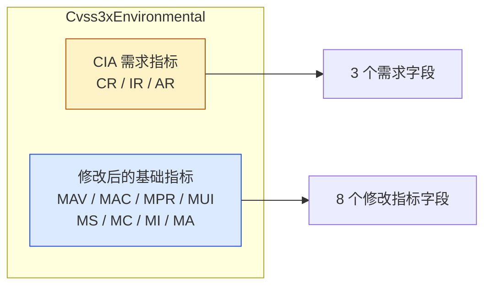

# 🌍 Cvss3xEnvironmental 环境指标

`pkg/cvss/cvss3x_environmental.go` · 环境指标 · 11 个 vector 字段

## 简介

`Cvss3xEnvironmental` 是 CVSS 3.x 向量的可选环境部分，持有 3 个 CIA 需求指标（`CR`/`IR`/`AR`）和 8 个修改后的基础指标（`MAV`/`MAC`/`MPR`/`MUI`/`MS`/`MC`/`MI`/`MA`），共 11 个字段，类型均为 `vector.Vector`。所有字段均可选；`Check()` 仅校验已设置字段的短名是否正确，`String()` 以 `/` 拼接已设置字段。

```go
env := &cvss.Cvss3xEnvironmental{
    ConfidentialityRequirement: vector.ConfidentialityRequirementHigh,
    ModifiedAttackVector:       vector.ModifiedAttackVectorNetwork,
}
fmt.Println(env.String()) // CR:H/MAV:N
fmt.Println(env.Check())  // <nil>
```

## 结构图



## 接口参考

### `Cvss3xEnvironmental` 结构体

```go
type Cvss3xEnvironmental struct {
    ConfidentialityRequirement vector.Vector // CR
    IntegrityRequirement       vector.Vector // IR
    AvailabilityRequirement    vector.Vector // AR

    ModifiedAttackVector       vector.Vector // MAV
    ModifiedAttackComplexity   vector.Vector // MAC
    ModifiedPrivilegesRequired vector.Vector // MPR
    ModifiedUserInteraction    vector.Vector // MUI
    ModifiedScope              vector.Vector // MS
    ModifiedConfidentiality    vector.Vector // MC
    ModifiedIntegrity          vector.Vector // MI
    ModifiedAvailability       vector.Vector // MA
}
```

| 分组 | 字段 | 短名 | 取值 |
| --- | --- | --- | --- |
| 需求 | `ConfidentialityRequirement` | `CR` | `X` / `L` / `M` / `H` |
| 需求 | `IntegrityRequirement` | `IR` | `X` / `L` / `M` / `H` |
| 需求 | `AvailabilityRequirement` | `AR` | `X` / `L` / `M` / `H` |
| 修改 | `ModifiedAttackVector` | `MAV` | `X` / `N` / `A` / `L` / `P` |
| 修改 | `ModifiedAttackComplexity` | `MAC` | `X` / `L` / `H` |
| 修改 | `ModifiedPrivilegesRequired` | `MPR` | `X` / `N` / `L` / `H` |
| 修改 | `ModifiedUserInteraction` | `MUI` | `X` / `N` / `R` |
| 修改 | `ModifiedScope` | `MS` | `X` / `U` / `C` |
| 修改 | `ModifiedConfidentiality` | `MC` | `X` / `N` / `L` / `H` |
| 修改 | `ModifiedIntegrity` | `MI` | `X` / `N` / `L` / `H` |
| 修改 | `ModifiedAvailability` | `MA` | `X` / `N` / `L` / `H` |

所有字段均可选——`nil` 表示"未设置"。修改指标的 `X`（Not Defined）值表示"不修改基础指标"，详见 [/zh/sdk/vector-not-defined](/zh/sdk/vector-not-defined)。

### `Check`

```go
func (x *Cvss3xEnvironmental) Check() error
```

校验任一非 `nil` 字段是否属于正确的指标类别：通过 `GetShortName()` 比对期望短名（需求为 `CR`/`IR`/`AR`，修改指标为 `MAV`/`MAC`/`MPR`/`MUI`/`MS`/`MC`/`MI`/`MA`）。不匹配会返回 `fmt.Errorf`。`nil` 字段被接受。

### `String`

```go
func (x *Cvss3xEnvironmental) String() string
```

按固定顺序序列化已设置字段：先是需求（`CR`/`IR`/`AR`），再是修改指标（`MAV`/`MAC`/`MPR`/`MUI`/`MS`/`MC`/`MI`/`MA`），每个字段由 `vector.Vector.String()` 渲染为 `短名:取值`（如 `CR:H`）。`nil` 字段被跳过。结果以 `/` 拼接。

## 示例

```go
package main

import (
	"fmt"

	"github.com/scagogogo/cvss-skills/pkg/cvss"
	"github.com/scagogogo/cvss-skills/pkg/vector"
)

func main() {
	env := &cvss.Cvss3xEnvironmental{
		ConfidentialityRequirement: vector.ConfidentialityRequirementHigh,
		IntegrityRequirement:       vector.IntegrityRequirementMedium,
		AvailabilityRequirement:    vector.AvailabilityRequirementLow,

		ModifiedAttackVector:    vector.ModifiedAttackVectorNetwork,
		ModifiedConfidentiality: vector.ModifiedConfidentialityLow,
		ModifiedAvailability:    vector.AvailabilityNotDefined, // X -> 回退到基础值
	}

	fmt.Println(env.String())
	// CR:H/IR:M/AR:L/MAV:N/MC:L/MA:X

	fmt.Println(env.Check()) // <nil>
}
```

## 相关

- [/zh/sdk/cvss](/zh/sdk/cvss) — `Cvss3x` 总览（内嵌 `Cvss3xEnvironmental`）
- [/zh/sdk/cvss3x-base](/zh/sdk/cvss3x-base) — 基础指标（强制）
- [/zh/sdk/cvss3x-temporal](/zh/sdk/cvss3x-temporal) — 时间指标
- [/zh/sdk/cvss3x](/zh/sdk/cvss3x) — 主类型 `Cvss3x` 与序列化
- [/zh/sdk/vector-not-defined](/zh/sdk/vector-not-defined) — `X`（Not Defined）回退语义
