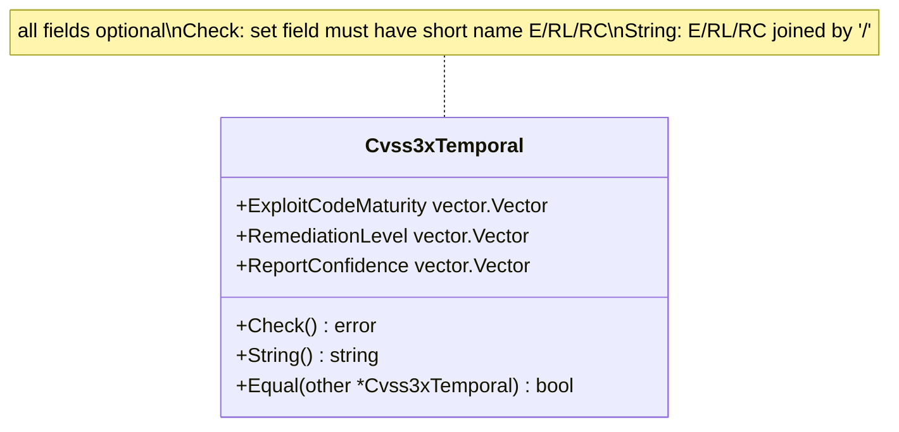

# ⏱️ Cvss3xTemporal 时间指标

`pkg/cvss/cvss3x_temporal.go` · 时间指标 · 3 个 vector 字段

## 简介

`Cvss3xTemporal` 是 CVSS 3.x 向量的可选时间部分，持有 3 个时间指标——利用代码成熟度（`E`）、修复级别（`RL`）、报告可信度（`RC`）——每个字段类型均为 `vector.Vector`。所有字段均可选；`Check()` 仅校验已设置字段的短名是否正确，`String()` 以 `/` 拼接已设置字段。

```go
temp := &cvss.Cvss3xTemporal{
    ExploitCodeMaturity: vector.ExploitCodeMaturityFunctional,
    RemediationLevel:    vector.RemediationLevelOfficialFix,
    ReportConfidence:    vector.ReportConfidenceConfirmed,
}
fmt.Println(temp.String()) // E:F/RL:O/RC:C
fmt.Println(temp.Check())  // <nil>
```

## 工作原理

`Cvss3xTemporal` 是三个可选 `vector.Vector` 字段。与基础组不同，`Check` 不要求它们存在——只断言非 nil 字段携带其期望短名（`E`/`RL`/`RC`），以防预设被放错位置。`String` 按 E/RL/RC 顺序输出已设置的字段。



## 接口参考

### `Cvss3xTemporal` 结构体

```go
type Cvss3xTemporal struct {
    ExploitCodeMaturity vector.Vector // E
    RemediationLevel    vector.Vector // RL
    ReportConfidence    vector.Vector // RC
}
```

| 字段 | 短名 | 说明 | 取值 |
| --- | --- | --- | --- |
| `ExploitCodeMaturity` | `E` | 利用代码成熟度 | `X` / `U` / `P` / `F` / `H` |
| `RemediationLevel` | `RL` | 修复级别 | `X` / `O` / `T` / `W` / `U` |
| `ReportConfidence` | `RC` | 报告可信度 | `X` / `U` / `R` / `C` |

三者均可选——`nil` 表示"未设置"，对应 CVSS 时间指标的 Not Defined 语义。

### `Check`

```go
func (x *Cvss3xTemporal) Check() error
```

校验任一非 `nil` 字段是否属于正确的指标类别：`ExploitCodeMaturity.GetShortName()` 必须为 `"E"`，`RemediationLevel.GetShortName()` 必须为 `"RL"`，`ReportConfidence.GetShortName()` 必须为 `"RC"`。不匹配（如误赋了基础指标预设）会返回 `fmt.Errorf`。`nil` 字段被接受。

### `String`

```go
func (x *Cvss3xTemporal) String() string
```

按固定顺序 `E/RL/RC` 序列化已设置字段，每个字段由 `vector.Vector.String()` 渲染为 `短名:取值`（如 `E:F`）。`nil` 字段被跳过。结果以 `/` 拼接。

## 示例

```go
package main

import (
	"fmt"

	"github.com/scagogogo/cvss-skills/pkg/cvss"
	"github.com/scagogogo/cvss-skills/pkg/vector"
)

func main() {
	temp := &cvss.Cvss3xTemporal{
		ExploitCodeMaturity: vector.ExploitCodeMaturityFunctional,
		RemediationLevel:    vector.RemediationLevelOfficialFix,
		ReportConfidence:    vector.ReportConfidenceConfirmed,
	}

	fmt.Println(temp.String()) // E:F/RL:O/RC:C
	fmt.Println(temp.Check())  // <nil>

	// 空的时间段合法，序列化结果为 ""。
	empty := &cvss.Cvss3xTemporal{}
	fmt.Printf("%q %v\n", empty.String(), empty.Check()) // "" <nil>
}
```

## 相关

- [/zh/sdk/cvss](/zh/sdk/cvss) — `Cvss3x` 总览（内嵌 `Cvss3xTemporal`）
- [/zh/sdk/cvss3x-base](/zh/sdk/cvss3x-base) — 基础指标（强制）
- [/zh/sdk/cvss3x-environmental](/zh/sdk/cvss3x-environmental) — 环境指标
- [/zh/sdk/cvss3x](/zh/sdk/cvss3x) — 主类型 `Cvss3x` 与序列化
