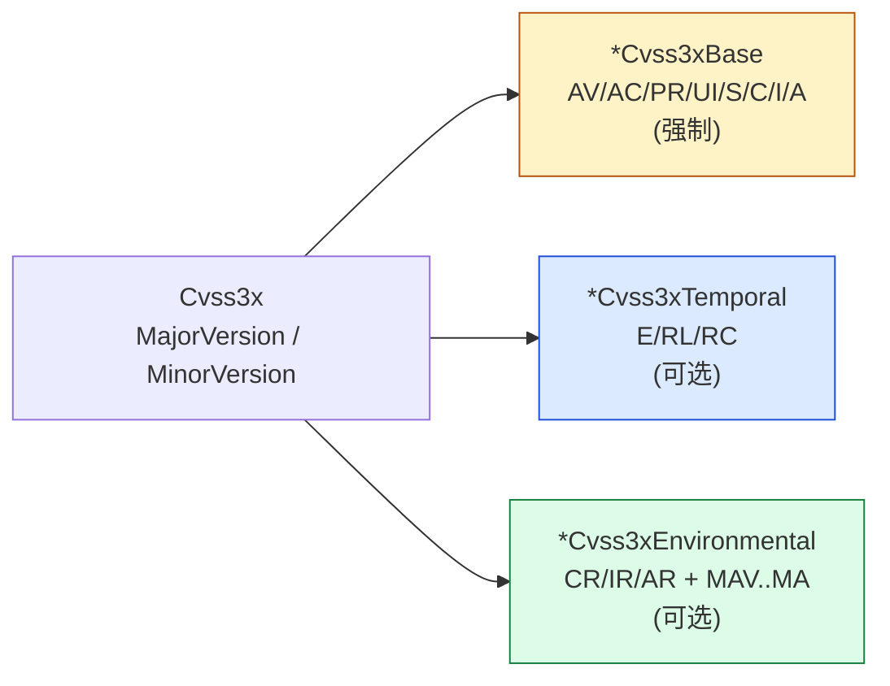

# 🧬 Cvss3x 主类型

`pkg/cvss/cvss3x.go` · 主类型 · 内嵌三段 + 版本号

> 本页文档化 `pkg/cvss/cvss3x.go` 中 `Cvss3x` 类型定义及其序列化接口实现。`pkg/cvss` 包的高层概览（解析、评分、构建）见 [/zh/sdk/cvss](/zh/sdk/cvss)。

## 简介

`Cvss3x` 是 CVSS 3.x 的主值类型，内嵌三段指标——`Cvss3xBase`（强制）、`Cvss3xTemporal` 与 `Cvss3xEnvironmental`（均可选）——并附加主/次版本号。`String()` 渲染规范形式 `CVSS:3.1/AV:.../...`，四个 `Marshal*/Unmarshal*` 方法使其可集成到 `encoding/json`、`encoding/xml`、`mapstructure` 与数据库驱动。

```go
cv := cvss.NewCvss3x()                  // base 已分配，temporal/env 为 nil
cv.MajorVersion, cv.MinorVersion = 3, 1
// 实际使用中由 parser/builder 填充
fmt.Println(cv.String())                // CVSS:3.1/...
fmt.Println(cv.Check())                 // 合法时返回 <nil>
```

## 结构图



## 接口参考

### `Cvss3x` 结构体

```go
type Cvss3x struct {
    *Cvss3xBase
    *Cvss3xTemporal
    *Cvss3xEnvironmental

    MajorVersion int
    MinorVersion int
}
```

内嵌指针使 `Cvss3x` 可直接访问三段的所有指标字段与方法。`MajorVersion`/`MinorVersion` 构成 `3.0` / `3.1` 前缀。

### `NewCvss3x`

```go
func NewCvss3x() *Cvss3x
```

返回一个 `*Cvss3x`，其中 `Cvss3xBase` 已分配（为空），`Cvss3xTemporal` / `Cvss3xEnvironmental` 保持 `nil`。版本字段为零值——由调用方（或 parser）后续设置。

### `Check`

```go
func (x *Cvss3x) Check() error
```

按顺序校验整个向量：

1. nil 接收者 → `fmt.Errorf("Cvss3x is nil")`
2. `MajorVersion != 3` → 报错（仅支持主版本 3）
3. `MinorVersion` 不在 `{0, 1}` → 报错（仅支持 3.0 与 3.1）
4. `Cvss3xBase` 为 nil → 报错；否则调用 `x.Cvss3xBase.Check()`（8 个基础指标必须全部设置）
5. 若 `Cvss3xTemporal` 非 nil，调用 `x.Cvss3xTemporal.Check()`
6. 若 `Cvss3xEnvironmental` 非 nil，调用 `x.Cvss3xEnvironmental.Check()`

时间段与环境段可选；存在时仅校验其*已设置*的字段。

### `String`

```go
func (x *Cvss3x) String() string
```

构建规范向量字符串：`CVSS:<Major>.<Minor>`，后接 `/` 前缀的各段输出（来自 `Cvss3xBase.String()`、`Cvss3xTemporal.String()`、`Cvss3xEnvironmental.String()`，仅当对应段非 nil 且非空时）。示例：`CVSS:3.1/AV:L/AC:L/PR:L/UI:N/S:U/C:N/I:H/A:H`。

### JSON 序列化

```go
func (x *Cvss3x) MarshalJSON() ([]byte, error)
func (x *Cvss3x) UnmarshalJSON(data []byte) error
```

`MarshalJSON` 实现 `json.Marshaler`：nil 接收者返回 `null`，否则将向量字符串作为 JSON 字符串输出（`"CVSS:3.1/..."`）。

`UnmarshalJSON` 实现 `json.Unmarshaler`：`null` 与 `""` 为空操作；其他字符串经内部 `fromVectorString`（与 `pkg/parser` 同一解析器）解析。解析失败包装为 `failed to unmarshal Cvss3x: %w`。

### Text 序列化

```go
func (x *Cvss3x) MarshalText() ([]byte, error)
func (x *Cvss3x) UnmarshalText(data []byte) error
```

`MarshalText` 实现 `encoding.TextMarshaler`：nil → `nil, nil`，否则返回 `x.String()` 的原始字节。`UnmarshalText` 实现 `encoding.TextUnmarshaler`：空输入为空操作，否则经 `fromVectorString` 解析（包装错误：`failed to unmarshal Cvss3x from text: %w`）。

这对 text 方法使 `Cvss3x` 可用作 map key、`encoding/xml` 属性/元素、`mapstructure` 目标，或 `database/sql` 扫描值——凡查询 `encoding.Text*` 接口的地方皆可用。

## 示例

```go
package main

import (
	"encoding/json"
	"fmt"

	"github.com/scagogogo/cvss-skills/pkg/cvss"
	"github.com/scagogogo/cvss-skills/pkg/parser"
)

func main() {
	// 将向量字符串解析为 Cvss3x。
	cv, err := parser.ParseString("CVSS:3.1/AV:L/AC:L/PR:L/UI:N/S:U/C:N/I:H/A:H")
	if err != nil {
		panic(err)
	}

	fmt.Println(cv.String()) // CVSS:3.1/AV:L/AC:L/PR:L/UI:N/S:U/C:N/I:H/A:H
	fmt.Println(cv.Check())  // <nil>

	// 通过 MarshalJSON / UnmarshalJSON 完成 JSON 往返。
	b, _ := json.Marshal(cv)
	fmt.Println(string(b)) // "CVSS:3.1/AV:L/AC:L/PR:L/UI:N/S:U/C:N/I:H/A:H"

	var cv2 cvss.Cvss3x
	if err := json.Unmarshal(b, &cv2); err != nil {
		panic(err)
	}
	fmt.Println(cv2.String()) // 同一向量

	// 通过 MarshalText / UnmarshalText 完成 text 往返（适用于 xml/sql/mapstructure）。
	txt, _ := cv.MarshalText()
	var cv3 cvss.Cvss3x
	_ = cv3.UnmarshalText(txt)
	fmt.Println(cv3.String())
}
```

## 相关

- [/zh/sdk/cvss](/zh/sdk/cvss) — 包级概览（本页为其类型级补充）
- [/zh/sdk/cvss3x-base](/zh/sdk/cvss3x-base) · [/zh/sdk/cvss3x-temporal](/zh/sdk/cvss3x-temporal) · [/zh/sdk/cvss3x-environmental](/zh/sdk/cvss3x-environmental) — 三段内嵌类型
- [/zh/sdk/json](/zh/sdk/json) — 基于这些方法的 JSON 序列化助手
- [/zh/sdk/parser](/zh/sdk/parser) — `UnmarshalJSON` / `UnmarshalText` 所用的 `fromVectorString` 解析器
