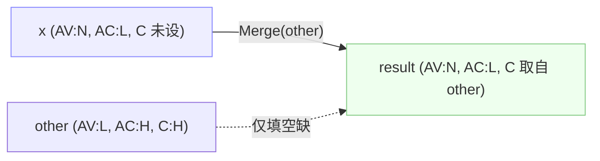

# 🔀 差异、合并与描述

🔀 功能点 · `pkg/cvss`

`Diff` 返回两向量不同的指标；`Merge` 生成一份副本，用另一向量填补其空缺（绝不覆盖已设值）；`Description` 渲染所有已设指标的扁平人类可读字符串。三者覆盖比较向量时的三件常见事：看差异、调和差异、叙述差异。

## 简介

```go
diffs := a.Diff(b)            // []DiffEntry——仅不同的指标
merged := a.Merge(b)          // a 的空缺由 b 填补，a 的已设值保留
desc := a.Description()       // "Attack Vector: Network, Attack Complexity: Low, ..."
```

## 接口参考

### DiffEntry

```go
type DiffEntry struct {
    Metric string // 短名，如 "AV"
    V1, V2 string // 短值，如 "N" / "L"；一侧未设置时为 "-"
    V1Long, V2Long string // 长名，如 "Network" / "Local"
}

func (d DiffEntry) String() string // "AV: N vs L"
```

### Diff

```go
func (x *Cvss3x) Diff(other *Cvss3x) []DiffEntry
```

遍历基础、时间、环境指标。一侧设置而另一侧未设置视为差异（缺失侧显示 `"-"` / `"-"`）。两侧均设置但短值不同视为差异。两侧均未设置**不**视为差异。任一接收者为 `nil` 时返回 `nil`。

```go
diffs := a.Diff(b)
for _, d := range diffs { fmt.Println(d) } // AV: N vs L
```

### Merge

```go
func (x *Cvss3x) Merge(other *Cvss3x) *Cvss3x
```

返回 `x` 的**副本**，将 `x` 中为 `nil` 但 `other` 中已设置的每个指标从 `other` 填入。`x` 中已设置的指标**绝不覆盖**——Merge 是左偏向的填补，不是覆盖。当 `other` 贡献了某组的指标时，副本上对应的子结构（`Cvss3xTemporal`、`Cvss3xEnvironmental`）会被惰性分配。`nil` 接收者返回 `other.Clone()`；`other` 为 `nil` 返回 `x.Clone()`。



::: warning Merge 绝不覆盖
由于 Merge 只填 `nil` 槽，`a.Merge(b)` 后再 `a.Merge(c)` 对 `b`/`c` 中已设的任一指标与顺序无关：第一个贡献者胜出。要强制覆盖，请用 [`SetMetricValue`](/zh/sdk/accessor) 或 [`With*Method`](/zh/sdk/with-method) 系列。
:::

### Description

```go
func (x *Cvss3x) Description() string
```

返回 `"Attack Vector: Network, Attack Complexity: Low, Privileges Required: None, ..."`——按 CVSS 规范顺序、跨三组列出所有已设指标，以 `", "` 连接。未设置的指标被跳过。nil 接收者返回 `""`。这正是 CLI `describe` 命令打印的格式。

```go
fmt.Println(cv.Description())
// Attack Vector: Network, Attack Complexity: Low, Privileges Required: None, ...
```

## 示例

```go
package main

import (
    "fmt"

    "github.com/scagogogo/cvss-skills/pkg/parser"
)

func main() {
    a, err := parser.ParseString("CVSS:3.1/AV:N/AC:L/PR:N/UI:N/S:U/C:H/I:H/A:H")
    if err != nil {
        panic(err)
    }
    b, err := parser.ParseString("CVSS:3.1/AV:L/AC:L/PR:N/UI:N/S:U/C:H/I:H/A:H/E:F/RL:U/RC:C")
    if err != nil {
        panic(err)
    }

    // Diff：AV 不同（N vs L）；E/RL/RC 在 b 已设而 a 未设。
    for _, d := range a.Diff(b) {
        fmt.Println(d)
    }
    // AV: N vs L
    // E: - vs F
    // RL: - vs U
    // RC: - vs C

    // Merge：a 保留 AV:N，从 b 获得 E/RL/RC。
    merged := a.Merge(b)
    fmt.Println(merged.GetTemporalVectorString()) // .../A:H/E:F/RL:U/RC:C
    fmt.Println(merged.Equal(a))                   // false——merged 含时间指标

    // Merge 不覆盖：尽管 b 的 AV 为 L，合并后 AV 仍为 N。
    s, _, _ := merged.GetMetricValue("AV")
    fmt.Printf("合并后 AV: %c\n", s) // N

    // Description：扁平的人类可读摘要。
    fmt.Println(a.Description())
    // Attack Vector: Network, Attack Complexity: Low, Privileges Required: None, ...
}
```

## 相关

- [指标读写器](/zh/sdk/accessor) —— 用于强制覆盖的 `GetMetricValue` / `SetMetricValue`
- [With-Method 风格](/zh/sdk/with-method) —— 不可变逐指标 setter
- [便捷方法](/zh/sdk/convenience) —— 整向量相等用 `Equal`
- CLI：[`diff`](/zh/cli/commands/diff)、[`merge`](/zh/cli/commands/merge)、[`describe`](/zh/cli/commands/describe)
