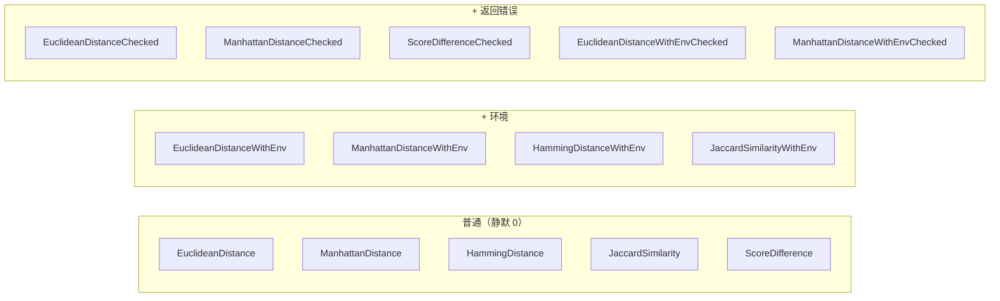

# 📏 距离与比较

`cvss.DistanceCalculator` 度量两个 CVSS 向量之间的差异程度。提供五种度量，每种各有三种风格：普通（基础指标不完整时静默返回 0）、`WithEnv`（加入环境指标）、`Checked`（返回错误而非静默 0）。

## 简介

```go
dc := cvss.NewDistanceCalculator(a, b)
fmt.Println(dc.EuclideanDistance())          // 基础 + 时间
fmt.Println(dc.EuclideanDistanceWithEnv())   // + 环境
e, err := dc.EuclideanDistanceChecked()      // 基础不完整时返回错误
```

## 度量关系



| 度量 | 计什么 | 范围 | 说明 |
| --- | --- | --- | --- |
| 欧几里得 | 各指标维度分数差的平方和再开方 | ≥ 0 | PR/UI 差异用上下文调整后的分数 |
| 曼哈顿 | 各指标维度分数差绝对值之和 | ≥ 0 | 同样的上下文调整 |
| 汉明 | 不同的指标个数 | int ≥ 0 | 比较短值而非分数 |
| Jaccard 相似度 | 相同指标数 / 总指标数 | 0–1 | 1 = 完全相同；内部用 Hamming |
| 分数差 | \|score(a) − score(b)\| | 0–10 | 用 `Calculate`，即最精炼的评分 |

## 接口参考

```go
func NewDistanceCalculator(vector1, vector2 *Cvss3x) *DistanceCalculator
```

### 普通（基础指标不完整时静默返回 0）

```go
func (dc *DistanceCalculator) EuclideanDistance() float64
func (dc *DistanceCalculator) ManhattanDistance() float64
func (dc *DistanceCalculator) HammingDistance() int
func (dc *DistanceCalculator) JaccardSimilarity() float64
func (dc *DistanceCalculator) ScoreDifference() float64
```

### 含环境指标

```go
func (dc *DistanceCalculator) EuclideanDistanceWithEnv() float64
func (dc *DistanceCalculator) ManhattanDistanceWithEnv() float64
func (dc *DistanceCalculator) HammingDistanceWithEnv() int
func (dc *DistanceCalculator) JaccardSimilarityWithEnv() float64
```
当两个向量都有环境指标时，加入 11 个环境维度（CR/IR/AR + MAV..MA）；否则行为与普通变体一致。

### Checked（返回错误而非静默 0）

```go
func (dc *DistanceCalculator) EuclideanDistanceChecked() (float64, error)
func (dc *DistanceCalculator) ManhattanDistanceChecked() (float64, error)
func (dc *DistanceCalculator) ScoreDifferenceChecked() (float64, error)
func (dc *DistanceCalculator) EuclideanDistanceWithEnvChecked() (float64, error)
func (dc *DistanceCalculator) ManhattanDistanceWithEnvChecked() (float64, error)
```
`*Checked` 变体在任一向量缺少必需基础指标时返回 `errIncompleteMetrics`（"base metrics incomplete, cannot compute distance"），而非静默返回 0。

::: tip Jaccard 是相似度而非距离
`JaccardSimilarity` 对完全相同的向量返回 1.0，对完全不相交的返回 0.0。若需不相似度，用 `1 - jaccard` 转换。
:::

::: warning ScoreDifference 在任一向量为 nil 时返回 0
`ScoreDifference` 在任一向量为 `nil` 或任一 `Calculate` 出错时静默返回 `0.0`。用 `ScoreDifferenceChecked` 让这些情况浮现。
:::

## 示例

```go
package main

import (
    "fmt"

    "github.com/scagogogo/cvss-skills/pkg/cvss"
    "github.com/scagogogo/cvss-skills/pkg/parser"
)

func main() {
    a, _ := parser.ParseString("CVSS:3.1/AV:N/AC:L/PR:N/UI:N/S:U/C:H/I:H/A:H")
    b, _ := parser.ParseString("CVSS:3.1/AV:L/AC:H/PR:H/UI:R/S:C/C:L/I:L/A:N")

    dc := cvss.NewDistanceCalculator(a, b)
    fmt.Printf("Euclidean : %.4f\n", dc.EuclideanDistance())
    fmt.Printf("Manhattan : %.4f\n", dc.ManhattanDistance())
    fmt.Printf("Hamming   : %d\n", dc.HammingDistance())        // 8
    fmt.Printf("Jaccard   : %.4f\n", dc.JaccardSimilarity())     // 0/8 -> 0.0
    fmt.Printf("ScoreDiff : %.1f\n", dc.ScoreDifference())       // |9.8 - 5.0| ...

    // Checked 变体让不完整基础指标浮现。
    partial, _ := parser.ParseRelaxed("AV:N/AC:L", "3.1") // 仅 2/8
    dc2 := cvss.NewDistanceCalculator(a, partial)
    if _, err := dc2.EuclideanDistanceChecked(); err != nil {
        fmt.Println("checked error:", err)
    }
}
```

## 相关

- [pkg/cvss](/zh/sdk/cvss) —— `Diff` 给逐指标差异、`Equal` 判等
- [评分计算器](/zh/sdk/calculator) —— `ScoreDifference` 所用
- [影响与敏感性](/zh/sdk/impact) —— 单向量的"哪个指标最重要"分析
