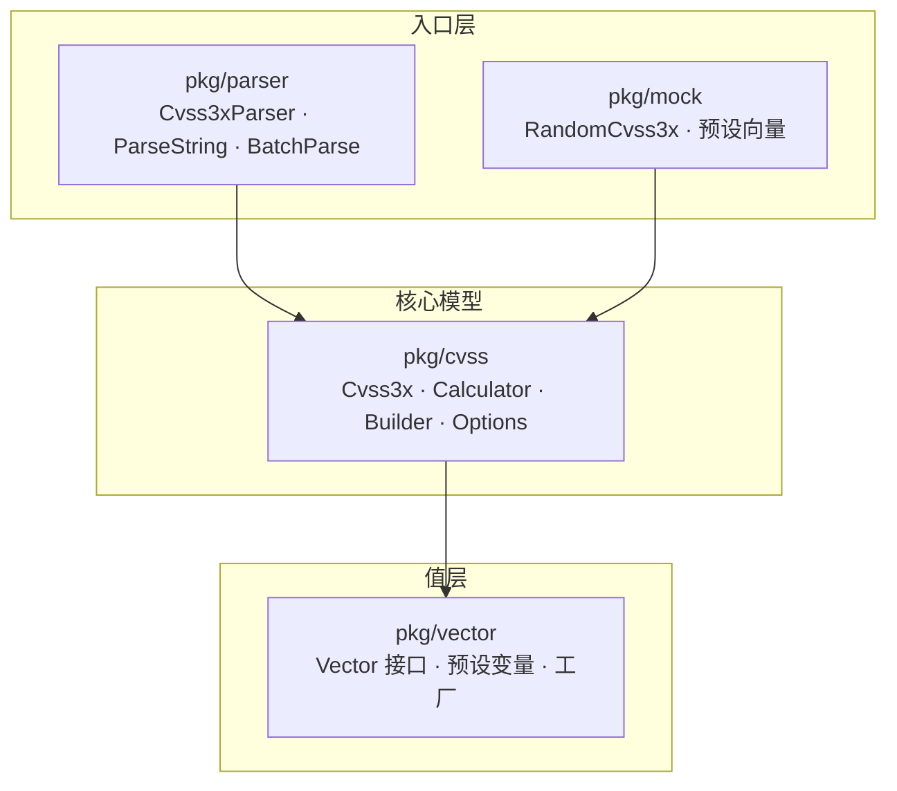

# 📦 Go SDK 总览

`pkg/cvss` · `pkg/parser` · `pkg/vector` · `pkg/mock` —— 符合 CVSS v3.0/v3.1 规范的 Go 评分、解析与比较工具。

## 包结构

SDK 拆分为四个包，依赖方向清晰：`pkg/parser` 与 `pkg/mock` 位于 `pkg/cvss` 之上，而 `pkg/cvss` 又依赖 `pkg/vector` 提供不可变的指标值对象。



| 包 | 职责 | 关键类型 |
| --- | --- | --- |
| `pkg/cvss` | 核心：`Cvss3x` 模型、评分、构建器、选项、预设、距离、影响、JSON/CSV、校验、SQL、枚举 | `Cvss3x`、`Calculator`、`Cvss3xBuilder`、`Option`、`DistanceCalculator` |
| `pkg/parser` | 把向量字符串转成 `*Cvss3x`，提供严格、宽松、批量、解析并评分等多种方式 | `Cvss3xParser`、`VectorParser`、`ParseString`、`BatchParse` |
| `pkg/vector` | 不可变的指标值对象，以及将短名称+值解析为 `Vector` 的工厂 | `Vector`、`VectorImpl`、`GetAttackVector`、`AttackVectorNetwork` |
| `pkg/mock` | 随机向量生成与按严重性分级的预设夹具，用于测试与演示 | `RandomCvss3x`、`RandomCvss3xFull`、`CriticalCvss31` |

## 安装

```bash
go get github.com/scagogogo/cvss-skills@latest
```

module path 为 `github.com/scagogogo/cvss-skills`（Go 1.18+）。按需导入对应包：

```go
import (
    "github.com/scagogogo/cvss-skills/pkg/cvss"
    "github.com/scagogogo/cvss-skills/pkg/parser"
    "github.com/scagogogo/cvss-skills/pkg/vector"
    "github.com/scagogogo/cvss-skills/pkg/mock"
)
```

## 5 分钟入门

三步走：**解析**向量字符串、**计算**评分、读取**严重性**。

```go
package main

import (
    "fmt"

    "github.com/scagogogo/cvss-skills/pkg/cvss"
    "github.com/scagogogo/cvss-skills/pkg/parser"
)

func main() {
    // 1. 把 CVSS 向量字符串解析为 *Cvss3x。
    cv, err := parser.ParseString("CVSS:3.1/AV:N/AC:L/PR:N/UI:N/S:U/C:H/I:H/A:H")
    if err != nil {
        panic(err)
    }

    // 2. 用 Calculator 计算评分。
    calc := cvss.NewCalculator(cv)
    score, err := calc.Calculate()
    if err != nil {
        panic(err)
    }

    // 3. 把分数映射为严重性等级。
    severity := calc.GetSeverityRating(score)

    fmt.Printf("vector    : %s\n", cv.String())
    fmt.Printf("score     : %.1f\n", score)       // 9.8
    fmt.Printf("severity  : %s\n", severity)       // High
}
```

::: tip 一步解析并评分
当你只想从字符串拿到分数时，用 `parser.ParseAndScore` 跳过中间步骤，一次返回对象、分数和严重性。
:::

## 接下来读什么

下面每个主题各成一页，附完整 API 参考与可运行示例。

| 主题 | 你将学到 |
| --- | --- |
| [pkg/cvss](/zh/sdk/cvss) | `Cvss3x` 类型及其 Base / Temporal / Environmental 三段式结构 |
| [pkg/parser](/zh/sdk/parser) | 严格、宽松、校验、批量解析 |
| [pkg/vector](/zh/sdk/vector) | `Vector` 接口、预设变量与 `Get*` 工厂 |
| [pkg/mock](/zh/sdk/mock) | 随机向量生成与严重性预设 |
| [评分计算器](/zh/sdk/calculator) | Base / Temporal / Environmental 评分与分解 |
| [Builder 构建器](/zh/sdk/builder) | 流式 `NewBuilder().AV('N')...Build()` 构建 |
| [Functional Options](/zh/sdk/options) | `NewCvss3xWithOptions(WithAV('N'), ...)` |
| [预设向量](/zh/sdk/presets) | `CriticalV31()`、`HighV31()` 及 v3.0 系列 |
| [距离与比较](/zh/sdk/distance) | 欧几里得、曼哈顿、汉明、Jaccard、分数差 |
| [影响与敏感性](/zh/sdk/impact) | 哪个指标对评分影响最大 |
| [JSON 序列化](/zh/sdk/json) | `ToJSON` / `FromJSON` 与 `JSONOutput` 结构 |
| [CSV 读写](/zh/sdk/csv) | `WriteCSV` / `ReadCSV` / `ReadCSVLax` |
| [校验](/zh/sdk/validation) | `Validate`、`MissingMetrics`、哨兵错误 |
| [枚举](/zh/sdk/enumerate) | 列出指标、遍历全部 2592 种基础组合 |
| [评分范围](/zh/sdk/score-range) | 不完整向量的最好/最坏情况 |
| [SQL 与排序](/zh/sdk/sql-sort) | `sql.Scanner` / `driver.Valuer`、按分排序、规范化 |

## 相关

- [命令行参考](/zh/cli/) —— `cvss-cli` 只是这些包之上的一层薄壳
- [API 参考（godoc）](/docs/zh/api/) —— 自动生成的完整符号清单
- [集成方式](/zh/integration/) —— 在 SDK、CLI、Skills 与 MCP 之间选择
