# 🧾 JSON 序列化

两种 JSON 形式并存：紧凑的向量字符串形式（经 `MarshalJSON`/`UnmarshalJSON`）与丰富的结构化形式（经 `ToJSON`/`FromJSON`）。紧凑形式是 `*Cvss3x` 默认序列化结果；结构化形式对应 FIRST.org JSON schema，含各指标长名与子分。

## 简介

```go
compact, _ := json.Marshal(cv)        // "CVSS:3.1/AV:N/..."
rich, _    := cv.ToJSON(nil)          // 结构化 JSONOutput
back, _    := cvss.FromJSON(rich)     // -> *Cvss3x
```

## 工作原理

`ToJSON` 校验向量后遍历基础/时间/环境组，为每个评分层级调用计算器。`FromJSON` 优先使用内嵌的 `vectorString`，仅在该字段缺失时才回退到按指标长名重建。

```mermaid
flowchart TD
    subgraph Out[ToJSON]
        CV[📦 *Cvss3x] --> Calc[🧮 Calculator Check]
        Calc -- error --> OErr("[🔴 error]")
        Calc -- ok --> BaseS[🔢 calculateBaseScore]
        BaseS --> Build["🧱 JSONOutput{version,vectorString,baseScore,baseSeverity}"]
        Build --> TM{"🟡 hasTemporal?"}
        TM -- yes --> TS[🔢 temporalScore+severity, Metrics.Temporal]
        TM -- no --> SkipT[⏭️ omit temporal]
        TS --> EM{"🟡 hasEnvironmental?"}
        SkipT --> EM
        EM -- yes --> ES[🔢 envScore+severity, Metrics.Environmental + modified sub-scores]
        EM -- no --> SkipE[⏭️ omit environmental]
        ES --> Marshal("[✅ JSON bytes]")
        SkipE --> Marshal
    end
    subgraph In[FromJSON]
        Bytes[📄 JSON bytes] --> Unm["🔍 json.Unmarshal -> JSONOutput"]
        Unm --> VS{"🟡 vectorString present?"}
        VS -- yes --> Parse[🔍 fromVectorString]
        VS -- no --> Rebuild["🔧 fromJSONMetrics: LongValue -> ShortValue -> GetVectorByShortName"]
        Parse --> CVOut("[✅ *Cvss3x]")
        Rebuild --> CVOut
    end
```



## 类型

### `JSONOutput`（顶层）

| 字段 | 类型 | JSON tag |
| --- | --- | --- |
| `Version` | `string` | `version` |
| `VectorString` | `string` | `vectorString` |
| `BaseScore` | `float64` | `baseScore` |
| `TemporalScore` | `float64` | `temporalScore,omitempty` |
| `EnvironmentalScore` | `float64` | `environmentalScore,omitempty` |
| `BaseSeverity` | `Severity` | `baseSeverity` |
| `TemporalSeverity` | `Severity` | `temporalSeverity,omitempty` |
| `EnvironmentalSeverity` | `Severity` | `environmentalSeverity,omitempty` |
| `Metrics` | `*JSONMetrics` | `metrics` |

### `JSONMetrics`

| 字段 | 类型 | JSON tag |
| --- | --- | --- |
| `Base` | `*JSONBaseMetrics` | `base` |
| `Temporal` | `*JSONTemporalMetrics` | `temporal,omitempty` |
| `Environmental` | `*JSONEnvironmentalMetrics` | `environmental,omitempty` |

### `JSONBaseMetrics`

AV/AC/PR/UI/S/C/I/A 的长名字符串，外加 `ExploitabilityScore` 与 `ImpactScore`（ESC 与 ISC 子分）。

### `JSONTemporalMetrics`

`ExploitCodeMaturity`、`RemediationLevel`、`ReportConfidence`——长名字符串。

### `JSONEnvironmentalMetrics`

`ConfidentialityRequirement`/`IntegrityRequirement`/`AvailabilityRequirement` 与八个 `Modified*` 指标（均为长名字符串，`omitempty`），外加 `ModifiedExploitabilityScore` 与 `ModifiedImpactScore`。

## 接口参考

```go
func (x *Cvss3x) ToJSON(calculator *Calculator) ([]byte, error)
func FromJSON(data []byte) (*Cvss3x, error)

func (x *Cvss3x) MarshalJSON() ([]byte, error)
func (x *Cvss3x) UnmarshalJSON(data []byte) error
```

- `ToJSON(nil)` 会自建 `Calculator`。它经 `Check` 校验并输出缩进 JSON（`MarshalIndent`）。
- `FromJSON` 优先使用 `vectorString` 字段；若缺失，则用内部 long→short 映射从各指标长名字段重建向量。
- `MarshalJSON` 输出带引号的向量字符串（`"CVSS:3.1/..."`）；`UnmarshalJSON` 经内部向量解析器还原。`null` 与 `""` 均解码为空的 `Cvss3x`。

::: tip 紧凑 vs 丰富——用哪个？
当消费者只需向量时，存/传紧凑向量字符串（`MarshalJSON`）。当消费者想要预计算分数与可读指标名（如匹配 FIRST.org 形式的 API 响应）时，输出 `ToJSON`。
:::

::: warning 无 vectorString 时 FromJSON 需要合法长名
若 `vectorString` 缺失，`FromJSON` 把长名（如 `"Network"`）映射回短值。拼写错误或未知长名会报错（如 `unknown value Netwerk for metric AV`），而非静默丢弃指标。
:::

## 示例

```go
package main

import (
    "encoding/json"
    "fmt"

    "github.com/scagogogo/cvss-skills/pkg/cvss"
    "github.com/scagogogo/cvss-skills/pkg/parser"
)

func main() {
    cv, _ := parser.ParseString(
        "CVSS:3.1/AV:N/AC:L/PR:N/UI:N/S:U/C:H/I:H/A:H/E:F/RL:U/RC:C")

    // 紧凑向量字符串 JSON（默认序列化）。
    compact, _ := json.Marshal(cv)
    fmt.Printf("compact: %s\n", compact)

    // 丰富的结构化 JSON。
    rich, _ := cv.ToJSON(nil)
    fmt.Printf("rich: %s\n", rich)

    // 把丰富 JSON 往还原回 *Cvss3x。
    back, _ := cvss.FromJSON(rich)
    fmt.Println(back.String())

    // 紧凑形式也可经 UnmarshalJSON 往返。
    var again cvss.Cvss3x
    _ = json.Unmarshal(compact, &again)
    fmt.Println(again.String())
}
```

## 相关

- [CSV 读写](/zh/sdk/csv) —— 表格序列化
- [pkg/cvss](/zh/sdk/cvss) —— `MarshalText`/`UnmarshalText` 用于 XML 与数据库驱动
- [评分计算器](/zh/sdk/calculator) —— `ToJSON` 内联计算评分
