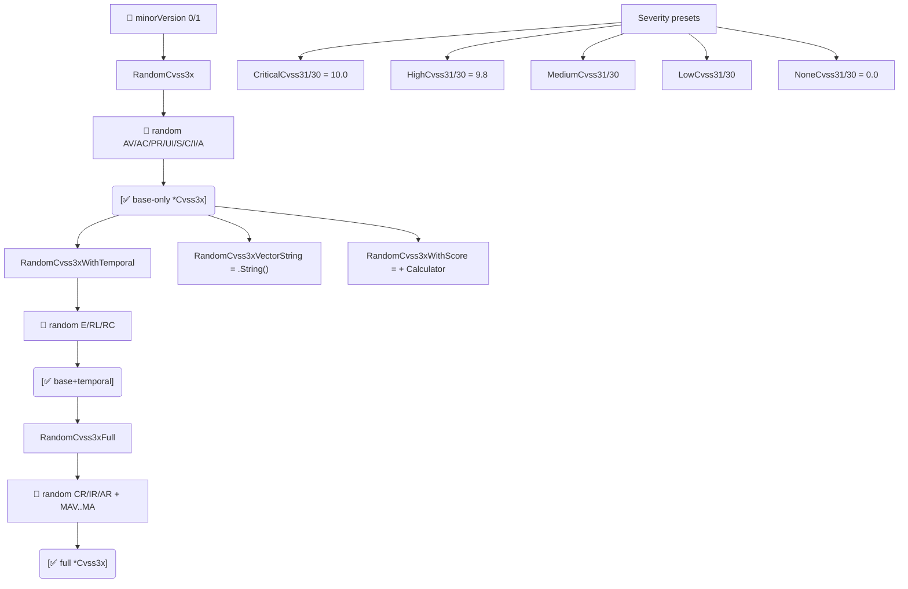

# 🎲 pkg/mock

生成随机 `Cvss3x` 向量并获取现成的严重性预设。适合用于测试、基准、演示数据，以及对评分引擎做基于性质的检查。

## 简介

```go
cv := mock.RandomCvss3xFull(1)        // base + temporal + environmental
obj, score, _ := mock.RandomCvss3xWithScore(1)
preset := mock.CriticalCvss31()       // CVSS:3.1/.../S:C/C:H/I:H/A:H (10.0)
```

::: warning 非密码学随机
`pkg/mock` 使用 `math/rand`。生成的向量适用于测试夹具与演示，不适用于安全敏感的播种场景。
:::

## 工作原理

`RandomCvss3x` 从 `pkg/vector` 目录为每个基础指标随机选一个预设；`RandomCvss3xWithTemporal` 与 `RandomCvss3xFull` 在其上叠加时间与环境组。`*Cvss3x`/`*Cvss30` 严重性预设在各评级档返回固定的、手工挑选的向量，用于确定性测试数据。



## 接口参考

### 随机生成器

```go
func RandomCvss3x(minorVersion int) *cvss.Cvss3x
func RandomCvss3xWithTemporal(minorVersion int) *cvss.Cvss3x
func RandomCvss3xFull(minorVersion int) *cvss.Cvss3x
func RandomCvss3xVectorString(minorVersion int) string
func RandomCvss3xWithScore(minorVersion int) (*cvss.Cvss3x, float64, error)
```

| 函数 | 填充的指标 | 返回 |
| --- | --- | --- |
| `RandomCvss3x` | 仅基础 | `*Cvss3x` |
| `RandomCvss3xWithTemporal` | 基础 + 时间（E/RL/RC） | `*Cvss3x` |
| `RandomCvss3xFull` | 基础 + 时间 + 环境（CR/IR/AR + MAV..MA） | `*Cvss3x` |
| `RandomCvss3xVectorString` | 仅基础 | 向量字符串 |
| `RandomCvss3xWithScore` | 仅基础 | `(*Cvss3x, score, error)` |

`minorVersion` 必须为 `0` 或 `1`；其他值会被强制为 `1`。

### 严重性预设

各严重性等级的现成 `*Cvss3x` 夹具，覆盖 v3.0 与 v3.1：

```go
// CVSS 3.1
func CriticalCvss31() *cvss.Cvss3x  // AV:N/AC:L/PR:N/UI:N/S:C/C:H/I:H/A:H  (10.0)
func HighCvss31() *cvss.Cvss3x      // AV:N/AC:L/PR:N/UI:N/S:U/C:H/I:H/A:H  (9.8)
func MediumCvss31() *cvss.Cvss3x    // AV:N/AC:L/PR:N/UI:N/S:U/C:L/I:L/A:N  (6.5)
func LowCvss31() *cvss.Cvss3x       // AV:N/AC:H/PR:N/UI:N/S:U/C:L/I:N/A:N  (3.7)
func NoneCvss31() *cvss.Cvss3x      // AV:N/AC:L/PR:N/UI:N/S:U/C:N/I:N/A:N  (0.0)

// CVSS 3.0 —— 同一组，minorVersion 为 0（Medium 使用 UI:R）
func CriticalCvss30() *cvss.Cvss3x
func HighCvss30() *cvss.Cvss3x
func MediumCvss30() *cvss.Cvss3x
func LowCvss30() *cvss.Cvss3x
func NoneCvss30() *cvss.Cvss3x
```

它们与 `pkg/cvss` 中的预设（`CriticalV31`、…）对应，但放在 `mock` 包内以方便测试使用。

## 示例

```go
package main

import (
    "fmt"

    "github.com/scagogogo/cvss-skills/pkg/cvss"
    "github.com/scagogogo/cvss-skills/pkg/mock"
)

func main() {
    // 生成完整的随机 v3.1 向量并评分。
    cv := mock.RandomCvss3xFull(1)
    calc := cvss.NewCalculator(cv)
    score, _ := calc.Calculate()
    fmt.Printf("%s -> %.1f (%s)\n", cv.String(), score, cvss.GetSeverity(score))

    // 用预设获得确定性测试用例。
    high := mock.HighCvss31()
    fmt.Println(high.String()) // CVSS:3.1/AV:N/AC:L/PR:N/UI:N/S:U/C:H/I:H/A:H

    // 一步拿到随机向量与分数。
    _, s, _ := mock.RandomCvss3xWithScore(1)
    fmt.Printf("random score: %.1f\n", s)
}
```

## 相关

- [预设向量](/zh/sdk/presets) —— 同样夹具在 `pkg/cvss` 中的版本
- [pkg/cvss](/zh/sdk/cvss) —— 所生成的类型
- [枚举](/zh/sdk/enumerate) —— 用穷举代替随机
