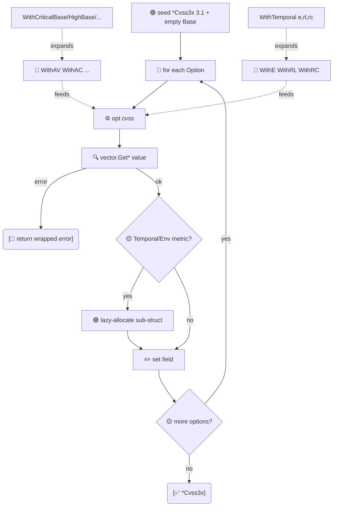

# ⚙️ Functional Options

用于构造 `*Cvss3x` 的惯用 Go Functional Options 模式。任意组合 `With*` 选项；新增选项不会破坏已有调用点。

## 简介

```go
cv, err := cvss.NewCvss3xWithOptions(
    cvss.WithVersion31(),
    cvss.WithAV('N'), cvss.WithAC('L'), cvss.WithPR('N'), cvss.WithUI('N'),
    cvss.WithS('U'), cvss.WithC('H'), cvss.WithI('H'), cvss.WithA('H'),
)
```

或使用基础预设加时间微调：

```go
cv, _ := cvss.NewCvss3xWithOptions(
    cvss.WithCriticalBase(),
    cvss.WithTemporal('F', 'U', 'C'),
)
```

## 工作原理

`NewCvss3xWithOptions` 以空 `Cvss3xBase` 初始化一个 v3.1 `*Cvss3x`，随后按序应用每个 `Option`；首个失败的 Option 中止链。每个 `With*` 通过 `pkg/vector` 工厂解析其 rune，并在需要时惰性分配时间/环境子结构。组合 Option（`WithTemporal`、`WithRequirements`、`WithCriticalBase`…）只是扇出到单指标 Option。



## 接口参考

### 核心

```go
type Option func(*Cvss3x) error

func NewCvss3xWithOptions(opts ...Option) (*Cvss3x, error)
func MustNewCvss3xWithOptions(opts ...Option) *Cvss3x
```
各选项按顺序应用；首个错误即短路。`Must*` 出错时 panic。返回对象默认 v3.1，已分配 `Cvss3xBase`。

### 版本

```go
func WithVersion(major, minor int) Option
func WithVersion31() Option  // = WithVersion(3, 1)
func WithVersion30() Option  // = WithVersion(3, 0)
```

### 基础指标

```go
func WithAV(val rune) Option
func WithAC(val rune) Option
func WithPR(val rune) Option
func WithUI(val rune) Option
func WithS(val rune) Option
func WithC(val rune) Option
func WithI(val rune) Option
func WithA(val rune) Option
```

### 时间指标

```go
func WithE(val rune) Option
func WithRL(val rune) Option
func WithRC(val rune) Option
func WithTemporal(e, rl, rc rune) Option  // 一次设置全部三个
```

### 环境指标

```go
func WithCR(val rune) Option
func WithIR(val rune) Option
func WithAR(val rune) Option
func WithRequirements(cr, ir, ar rune) Option   // 一次设置全部三个
func WithMAV(val rune) Option
func WithMAC(val rune) Option
func WithMPR(val rune) Option
func WithMUI(val rune) Option
func WithMS(val rune) Option
func WithMC(val rune) Option
func WithMI(val rune) Option
func WithMA(val rune) Option
```

### 基础严重性预设

```go
func WithCriticalBase() Option  // AV:N/AC:L/PR:N/UI:N/S:C/C:H/I:H/A:H
func WithHighBase() Option      // AV:N/AC:L/PR:N/UI:N/S:U/C:H/I:H/A:H
func WithMediumBase() Option    // AV:N/AC:L/PR:N/UI:N/S:U/C:L/I:L/A:N
func WithLowBase() Option       // AV:N/AC:H/PR:N/UI:R/S:U/C:L/I:N/A:N
func WithNoneBase() Option      // AV:N/AC:L/PR:N/UI:N/S:U/C:N/I:N/A:N
```
各预设按规范顺序应用八个基础指标选项。可与时间/环境选项组合叠加。

::: tip 选项是可组合的值
`Option` 只是一个 `func(*Cvss3x) error`。可存入切片、四处传递、构建你自己的预设：`var myPreset = []cvss.Option{cvss.WithHighBase(), cvss.WithE('F')}`。
:::

::: warning 预设是覆盖而非与先前调用合并
`WithCriticalBase()` 设置全部八个基础指标。若在其之前调用 `WithS('U')`，预设的 `WithS('C')` 会胜出。请把预设排在前面、微调排在后面。
:::

## 示例

```go
package main

import (
    "fmt"

    "github.com/scagogogo/cvss-skills/pkg/cvss"
)

func main() {
    // 预设 + 微调。
    cv, err := cvss.NewCvss3xWithOptions(
        cvss.WithHighBase(),   // S:U/C:H/I:H/A:H ...
        cvss.WithS('C'),       // ... 但把 Scope 改为 Changed -> Critical
    )
    if err != nil {
        panic(err)
    }
    fmt.Println(cv.String())

    // 各用一次调用设置时间与需求。
    full, _ := cvss.NewCvss3xWithOptions(
        cvss.WithCriticalBase(),
        cvss.WithTemporal('F', 'U', 'C'),
        cvss.WithRequirements('H', 'H', 'H'),
    )
    fmt.Println(full.HasTemporalMetrics(), full.HasEnvironmentalMetrics())

    // 可复用的预设切片。
    highWithTemporal := []cvss.Option{
        cvss.WithHighBase(),
        cvss.WithTemporal('F', 'U', 'C'),
    }
    a, _ := cvss.NewCvss3xWithOptions(highWithTemporal...)
    fmt.Println(a.String())
}
```

## 相关

- [Builder 构建器](/zh/sdk/builder) —— 流式替代方案
- [预设向量](/zh/sdk/presets) —— `CriticalV31()` 等现成完整向量
- [pkg/cvss](/zh/sdk/cvss) —— 所构造的类型
