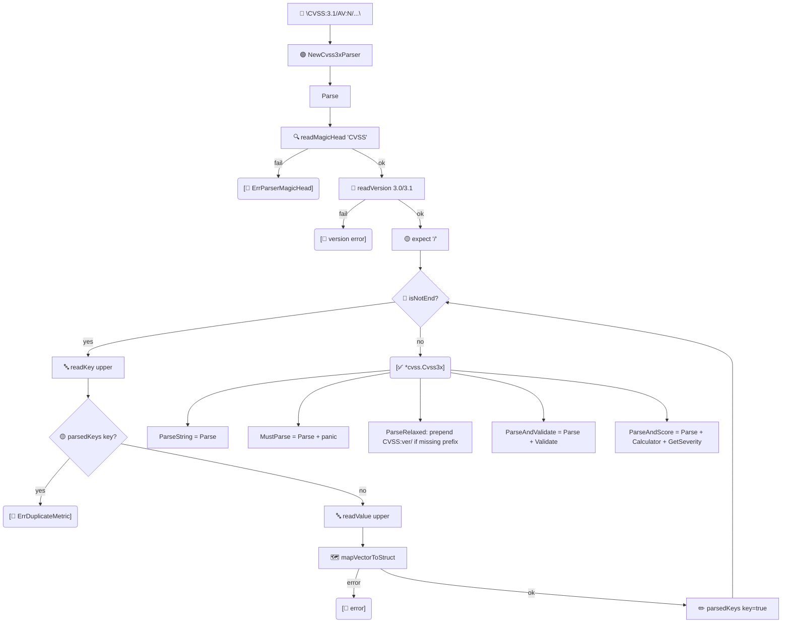

# 🔤 pkg/parser

把 `CVSS:3.1/AV:N/...` 字符串转为 `*cvss.Cvss3x` 对象。本包提供低层 `Cvss3xParser`、一次性便捷函数、并行批量助手，以及把指标短名称解析为 `vector.Vector` 值的 `VectorParser` 注册表。

## 简介

```go
cv, err := parser.ParseString("CVSS:3.1/AV:N/AC:L/PR:N/UI:N/S:U/C:H/I:H/A:H")
```

严格解析器要求 `CVSS:` 魔术头与 `3.0`/`3.1` 版本号。`ParseRelaxed` 接受不带前缀的 `AV:N/...` 尾部。`ParseAndValidate` 与 `ParseAndScore` 组合了解析+校验 / 解析+评分。

## 工作原理

`Cvss3xParser.Parse` 是基于游标的扫描：读 `CVSS` 魔数头、读版本，然后循环读取 `/KEY:VALUE` 对——两半都转大写、拒绝重复键、经 `mapVectorToStruct` 派发每对。便捷函数包装 `Parse` 并对其结果做后处理。



## 类型

### `Cvss3xParser`

| 字段 | 类型 | 说明 |
| --- | --- | --- |
| `cvss3xStr` | `string` | 去除首尾空白后的输入。 |
| `cvss3x` | `*cvss.Cvss3x` | 在 `Parse` 期间填充。 |
| `cvss3xRunes`、`i` | rune 切片、int | 游标状态。 |
| `parsedKeys` | `map[string]bool` | 重复键检测。 |

用 `NewCvss3xParser(str)` 创建；调用 `Parse()` 得到 `(*cvss.Cvss3x, error)`。

### `VectorParser`

将 `(shortName, shortValue)` 映射到 `vector.Vector` 的注册表。`DefaultVectorParser` 已预载全部基础、时间、环境与修改指标值。

| 方法 | 签名 |
| --- | --- |
| `Add` | `func (x *VectorParser) Add(v vector.Vector)` |
| `Parse` | `func (x *VectorParser) Parse(vectorName string, vectorValue rune) (vector.Vector, error)` |

### 结果结构

| 结构体 | 字段 |
| --- | --- |
| `BatchParseResult` | `Index int`、`Vector *cvss.Cvss3x`、`Error error` |
| `BatchValidateResult` | `Index int`、`Vector *cvss.Cvss3x`、`Valid bool`、`Errors []string`、`Error error` |

## 接口参考

### 一次性解析

```go
func ParseString(cvss3xStr string) (*cvss.Cvss3x, error)
func MustParse(cvss3xStr string) *cvss.Cvss3x
func ParseRelaxed(cvss3xStr string, defaultVersion string) (*cvss.Cvss3x, error)
func ParseAndValidate(cvss3xStr string) (*cvss.Cvss3x, error)
func ParseAndScore(cvss3xStr string) (*cvss.Cvss3x, float64, cvss.Severity, error)
```
- `MustParse` 在失败时 panic——仅用于编译期已知合法的向量。
- `ParseRelaxed` 在缺少 `CVSS:` 头时自动补 `CVSS:<version>/` 前缀；`defaultVersion` 为 `""` 时默认 `"3.1"`。
- `ParseAndScore` 一次返回对象、计算分数与严重性。

### 批量助手（并行）

```go
func BatchParse(vectors []string, workerCount int) []BatchParseResult
func BatchValidate(vectors []string, workerCount int) []BatchValidateResult
```
`workerCount <= 0` 时取 `len(vectors)`；上限为 `len(vectors)`。结果通过 `Index` 字段保持输入顺序。

### 低层与注册表

```go
func NewCvss3xParser(cvss3xStr string) *Cvss3xParser
func (x *Cvss3xParser) Parse() (*cvss.Cvss3x, error)

var DefaultVectorParser = NewVectorParser()
func NewVectorParser() *VectorParser
```

### 哨兵错误

```go
var ErrParserMagicHead = errors.New("...invalid magic head, it must equal 'CVSS'")
var ErrDuplicateMetric = errors.New("...duplicate metric key")
const CVSSMagicHead = "CVSS"
```

::: warning 重复键会被拒绝
解析器记录已见过的每个键，若同一指标出现两次则返回包装 `ErrDuplicateMetric` 的错误——例如 `.../AV:N/.../AV:L/`。
:::

## 示例

```go
package main

import (
    "fmt"
    "log"

    "github.com/scagogogo/cvss-skills/pkg/parser"
)

func main() {
    // 严格解析。
    cv, err := parser.ParseString("CVSS:3.1/AV:N/AC:L/PR:N/UI:N/S:U/C:H/I:H/A:H")
    if err != nil {
        log.Fatal(err)
    }
    fmt.Println(cv.String())

    // 宽松解析——无需 CVSS: 前缀。
    relaxed, _ := parser.ParseRelaxed("AV:N/AC:L/PR:N/UI:N/S:U/C:H/I:H/A:H", "3.0")
    fmt.Println(relaxed.Version()) // 3.0

    // 一步解析并评分。
    _, score, severity, _ := parser.ParseAndScore(cv.String())
    fmt.Printf("%.1f %s\n", score, severity) // 9.8 High

    // 并行批量解析。
    results := parser.BatchParse([]string{
        "CVSS:3.1/AV:N/AC:L/PR:N/UI:N/S:U/C:H/I:H/A:H",
        "not-a-vector",
    }, 2)
    for _, r := range results {
        if r.Error != nil {
            fmt.Printf("index %d failed: %v\n", r.Index, r.Error)
        } else {
            fmt.Printf("index %d ok: %s\n", r.Index, r.Vector.String())
        }
    }
}
```

## 相关

- [pkg/cvss](/zh/sdk/cvss) —— `Parse` 产出的对象类型
- [校验](/zh/sdk/validation) —— `ParseAndValidate` 内部所做的检查
- [评分计算器](/zh/sdk/calculator) —— `ParseAndScore` 所用
