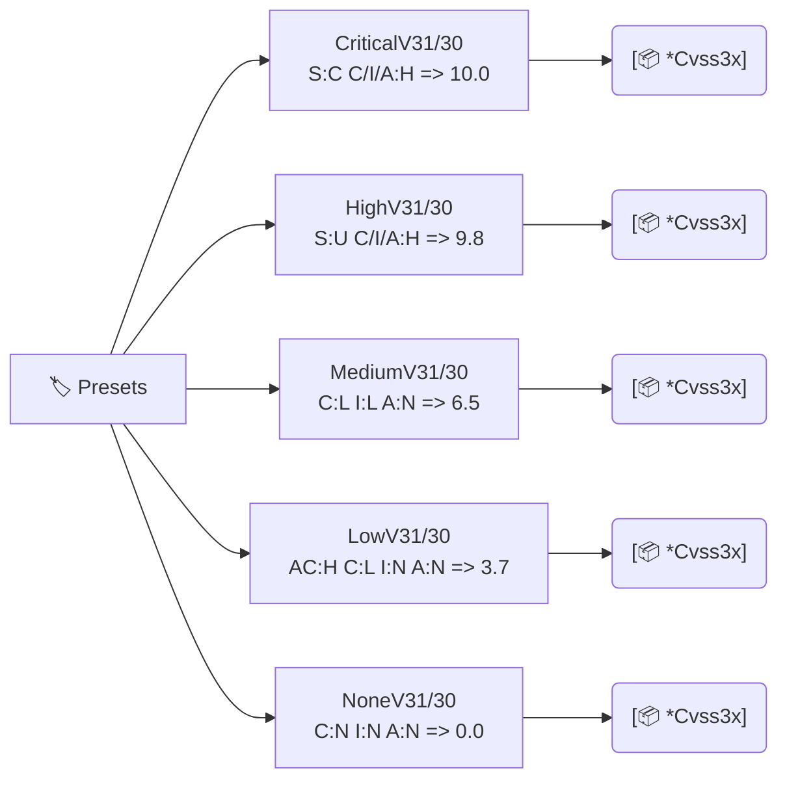

# 🏷️ 预设向量

各严重性等级的现成 `*cvss.Cvss3x` 向量，覆盖 CVSS v3.0 与 v3.1。可用作夹具、基线，或作为用 `SetMetricValue` / `With*Method` 修改的起点。

## 简介

```go
cv := cvss.CriticalV31()  // CVSS:3.1/AV:N/AC:L/PR:N/UI:N/S:C/C:H/I:H/A:H
fmt.Println(cv.String())
```

## 工作原理

每个预设是一个手工挑选的、仅基础指标的 `*Cvss3x`，处于固定严重性档。v3.1 与 v3.0 两族除规范不同处外（如 `MediumV30` 用 `UI:R`，而 `MediumV31` 用 `UI:N`）共享相同的指标选择。它们都是网络攻击（`AV:N`）、无权限（`PR:N`）基线。



## 接口参考

### CVSS 3.1 预设

```go
func CriticalV31() *Cvss3x  // AV:N/AC:L/PR:N/UI:N/S:C/C:H/I:H/A:H  -> 10.0
func HighV31() *Cvss3x      // AV:N/AC:L/PR:N/UI:N/S:U/C:H/I:H/A:H  -> 9.8
func MediumV31() *Cvss3x    // AV:N/AC:L/PR:N/UI:N/S:U/C:L/I:L/A:N  -> 6.5
func LowV31() *Cvss3x       // AV:N/AC:H/PR:N/UI:N/S:U/C:L/I:N/A:N  -> 3.7
func NoneV31() *Cvss3x      // AV:N/AC:L/PR:N/UI:N/S:U/C:N/I:N/A:N  -> 0.0
```

### CVSS 3.0 预设

```go
func CriticalV30() *Cvss3x  // 与 CriticalV31 指标相同，minorVersion 为 0 -> 10.0
func HighV30() *Cvss3x      // -> 9.8
func MediumV30() *Cvss3x    // AV:N/AC:L/PR:N/UI:R/S:U/C:L/I:L/A:N（注意 v3.0 中为 UI:R）
func LowV30() *Cvss3x       // AV:N/AC:H/PR:N/UI:N/S:U/C:L/I:N/A:N
func NoneV30() *Cvss3x      // -> 0.0
```

所有预设都只返回基础指标向量（无 Temporal 或 Environmental）。v3.0 与 v3.1 系列仅在 `MinorVersion` 上不同——对于 `Medium`，还在于 `UI` 值（v3.0 `Medium` 用 `UI:R`，v3.1 用 `UI:N`）。

::: tip 3.0 与 3.1 的 UI 差异
v3.0 中 `UI:R` 分数为 `0.56`；v3.1 中为 `0.62`。`Medium` 预设正体现这点：`MediumV30` 用 `UI:R`，`MediumV31` 用 `UI:N`。`pkg/mock` 预设同样如此。
:::

::: warning 预设是共享指针
每个预设在每次调用时返回同一个 `*Cvss3x` 指针（其基础指标指向共享的 `vector.*` 预设变量，后者不可变）。修改返回结构体自身字段没问题，但若要修改，建议先 `Clone()` 以保持各调用点相互隔离。
:::

## 示例

```go
package main

import (
    "fmt"

    "github.com/scagogogo/cvss-skills/pkg/cvss"
)

func main() {
    for name, cv := range map[string]*cvss.Cvss3x{
        "Critical": cvss.CriticalV31(),
        "High":     cvss.HighV31(),
        "Medium":   cvss.MediumV31(),
        "Low":      cvss.LowV31(),
        "None":     cvss.NoneV31(),
    } {
        calc := cvss.NewCalculator(cv)
        score, _ := calc.Calculate()
        fmt.Printf("%-8s %.1f %s  %s\n",
            name, score, calc.GetSeverityRating(score), cv.String())
    }

    // 从预设出发再做微调。
    high := cvss.HighV31()
    scoped, _ := high.SetMetricValue("S", 'C') // 提升至 Critical 区间
    calc := cvss.NewCalculator(scoped)
    s, _ := calc.Calculate()
    fmt.Printf("refined: %.1f %s\n", s, calc.GetSeverityRating(s))
}
```

## 相关

- [pkg/mock](/zh/sdk/mock) —— `CriticalCvss31()` 等，mock 包中的同样夹具
- [Functional Options](/zh/sdk/options) —— `WithCriticalBase()` 等用于构造全新向量
- [评分计算器](/zh/sdk/calculator) —— 为预设评分
