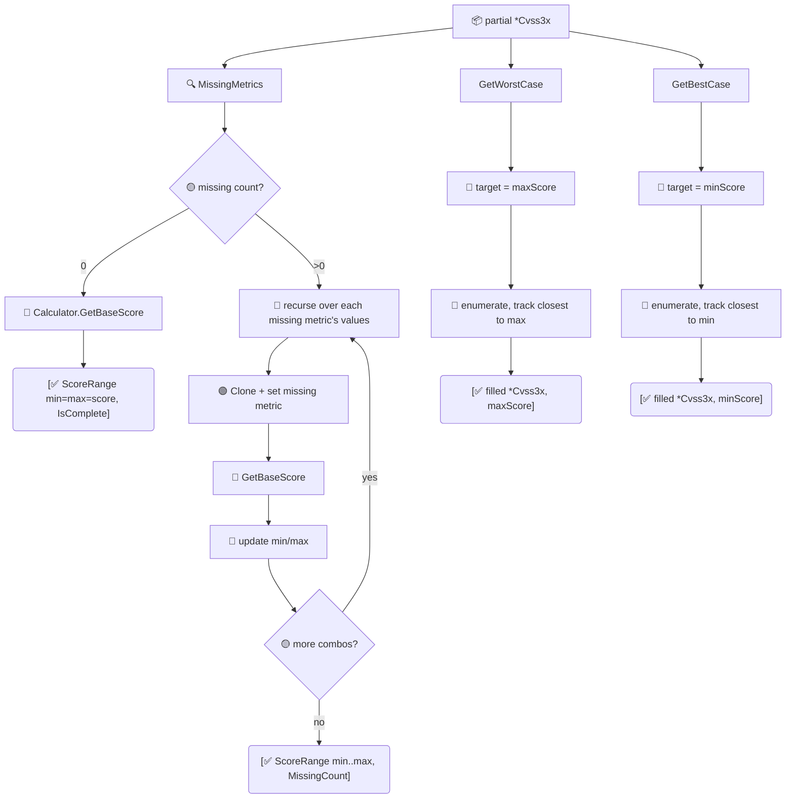

# 📈 分数范围

对于一个缺失基础指标的向量，计算当缺口被补齐后它*可能*取得的分数范围。`GetScoreRange` 给出上下界；`GetWorstCase` 与 `GetBestCase` 返回达到极值的那个补全后的向量。

## 简介

```go
partial, _ := parser.ParseRelaxed("AV:N/AC:L", "3.1") // 8 个指标中已知 2 个
rng := cvss.GetScoreRange(partial)
fmt.Printf("%.1f ~ %.1f\n", rng.MinScore, rng.MaxScore)
worst, _, _ := cvss.GetWorstCase(partial)
```

## 工作原理

`GetScoreRange` 统计缺失的基础指标；若无缺失，把精确评分作为 min 与 max 返回。否则递归枚举缺失指标的所有取值组合，逐个评分，追踪 min/max。`GetWorstCase`/`GetBestCase` 复用该枚举，选取最接近 max/min 目标的组合（无容差，优先精确匹配）。



## 类型

### `ScoreRange`

| 字段 | 类型 | 含义 |
| --- | --- | --- |
| `MinScore` | `float64` | 可达的最低基础分 |
| `MaxScore` | `float64` | 可达的最高基础分 |
| `MinSeverity` | `Severity` | `MinScore` 对应的严重性 |
| `MaxSeverity` | `Severity` | `MaxScore` 对应的严重性 |
| `IsComplete` | `bool` | 无基础指标缺失（Min == Max）时为 `true` |
| `MissingCount` | `int` | 缺失的基础指标数 |

`String()` 渲染为 `"<score> (<sev>) [complete]"` 或 `"<min> (<sev>) ~ <max> (<sev>) [<n> metrics missing]"`。

## 接口参考

```go
func GetScoreRange(cv *Cvss3x) ScoreRange
func GetWorstCase(cv *Cvss3x) (*Cvss3x, float64, error)
func GetBestCase(cv *Cvss3x) (*Cvss3x, float64, error)
```

- `GetScoreRange` 在 8 个基础指标全部已设时返回 `IsComplete: true` 及单一分数。对不完整向量，它穷举缺失指标的所有取值组合（合法值集合：AV `{N,A,L,P}`、AC `{L,H}`、PR `{N,L,H}`、UI `{N,R}`、S `{U,C}`、C/I/A `{H,L,N}`），记录基础分的最大/最小值。
- `GetWorstCase` 返回基础分等于 `MaxScore` 的补全向量及该分数。`GetBestCase` 对 `MinScore` 做相反的事。
- 当输入已完整时，两者都返回输入的克隆及其基础分。
- `GetWorstCase`/`GetBestCase` 的 `nil` 输入返回 `ErrNilReceiver`。

::: tip 为不完整通告做分诊
当一份通告只列出 `AV:N/AC:L`（早期披露常见），`GetScoreRange` 无需猜测就能告诉你现实的最差情形——适合在完整向量落地前做优先级排队。
:::

::: warning 穷举搜索成本
缺失指标枚举在 `MissingCount` 上是指数级的。8 个指标全缺时即完整的 2592 组合空间——对单个向量没问题，但避免在紧密循环里对许多不完整向量调用 `GetScoreRange`。对完整向量成本仅一次评分计算。
:::

## 示例

```go
package main

import (
    "fmt"

    "github.com/scagogogo/cvss-skills/pkg/cvss"
    "github.com/scagogogo/cvss-skills/pkg/parser"
)

func main() {
    // 8 个基础指标中仅已知 2 个。
    partial, _ := parser.ParseRelaxed("AV:N/AC:L", "3.1")

    rng := cvss.GetScoreRange(partial)
    fmt.Println(rng.String())
    fmt.Printf("missing %d metrics; severity could be %s..%s\n",
        rng.MissingCount, rng.MinSeverity, rng.MaxSeverity)

    // 达到最差情形的向量。
    worst, score, _ := cvss.GetWorstCase(partial)
    fmt.Printf("worst: %.1f  %s\n", score, worst.String())

    // 达到最佳情形的向量。
    best, score, _ := cvss.GetBestCase(partial)
    fmt.Printf("best:  %.1f  %s\n", score, best.String())

    // 完整向量：范围坍缩为一个点。
    full := cvss.HighV31()
    fmt.Println(cvss.GetScoreRange(full).String())
}
```

## 相关

- [评分计算器](/zh/sdk/calculator) —— 为每个候选组合评分
- [校验](/zh/sdk/validation) —— `MissingMetrics` 驱动枚举
- [影响与敏感度](/zh/sdk/impact) —— 单向量"改 X 会怎样"
