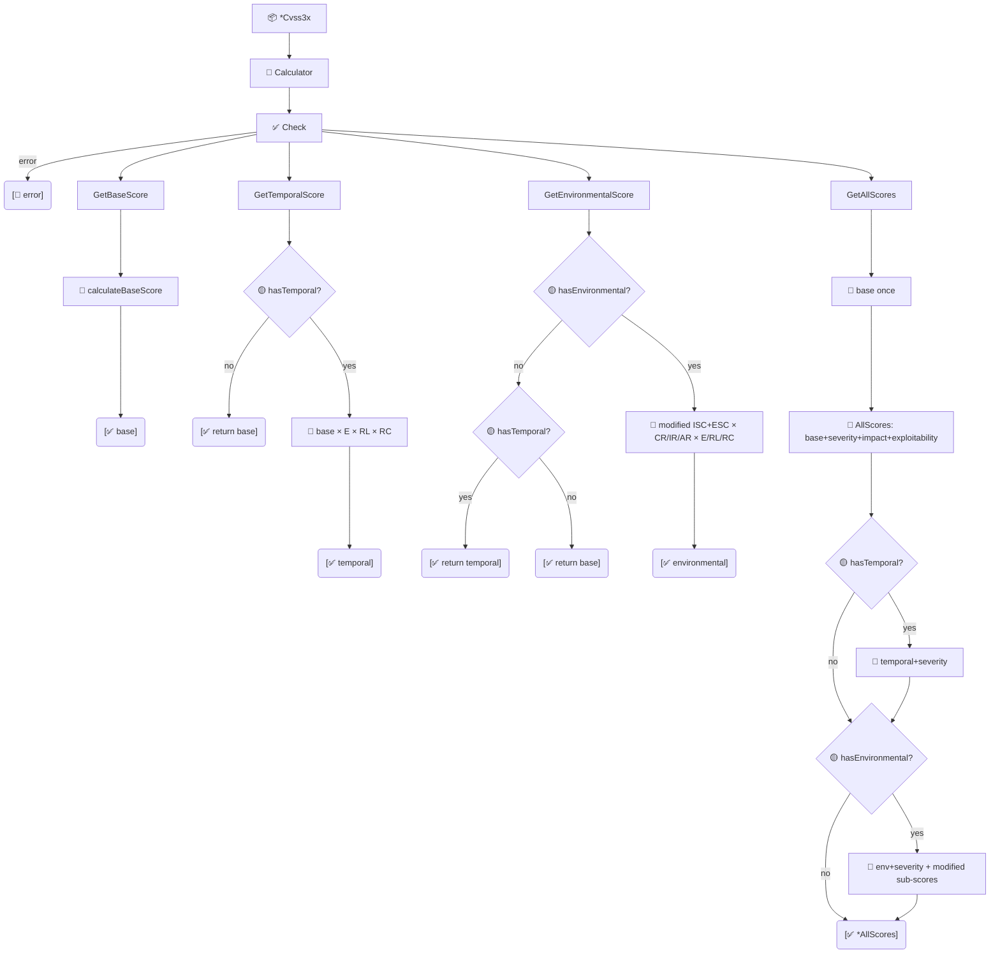

# 🎯 评分

🎯 功能点 · `pkg/cvss`

`pkg/cvss/scores.go` 是 `*Calculator` 上的评分访问层。它暴露三个主分数（基础、时间、环境）、四个子评分（影响、可利用性及其修改变体）、一次性计算全部的 `GetAllScores`（不重复遍历向量），以及实现规范取整规则的公开 `RoundUp` 辅助函数。

## 简介

```go
calc := cvss.NewCalculator(cv)
base, _ := calc.GetBaseScore()                 // 仅依赖 AV/AC/PR/UI/S/C/I/A
temporal, _ := calc.GetTemporalScore()         // base * E * RL * RC（无时间指标则返回 base）
env, _ := calc.GetEnvironmentalScore()         // 完整环境分
all, _ := calc.GetAllScores()                  // 全部聚合到一个结构体
fmt.Println(cvss.RoundUp(7.318))               // 7.4
```

每个访问器都先调用 `cv.Check()`，因此不完整的基础向量以错误形式暴露，而非返回 0。

## 工作原理

每个访问器以 `Check()` 守卫，再计算其层级。时间/环境优雅降级：无时间组→返回基础；无环境组→返回时间（或基础）。`GetAllScores` 计算一次基础并派生其余，同时填充 `ImpactSubScore`/`ExploitabilitySubScore` 及修改后变体。



## 接口参考

### 主分数

```go
func (c *Calculator) GetBaseScore() (float64, error)
func (c *Calculator) GetTemporalScore() (float64, error)
func (c *Calculator) GetEnvironmentalScore() (float64, error)
```

`GetBaseScore` 仅使用 8 个基础指标。`GetTemporalScore` 为 `roundUp(baseScore * E * RL * RC)`；未设置时间指标时直接返回基础分。`GetEnvironmentalScore` 计算修改影响 / 修改可利用性路径；未设置环境指标时回退到时间分（若无时间指标则回退到基础分）。

```go
base, _ := calc.GetBaseScore()
env, _ := calc.GetEnvironmentalScore() // 无时间且无环境时 == base
```

### 子评分

```go
func (c *Calculator) GetImpactSubScore() (float64, error)               // ISC，经 Scope 调整
func (c *Calculator) GetExploitabilitySubScore() (float64, error)       // 8.22 * AV * AC * PR * UI
func (c *Calculator) GetModifiedImpactSubScore() (float64, error)      // 仅环境
func (c *Calculator) GetModifiedExploitabilitySubScore() (float64, error) // 仅环境
```

`GetImpactSubScore` 为 `1 - (1-C)*(1-I)*(1-A)`，经 Scope 调整。`GetExploitabilitySubScore` 为 `8.22 * AV * AC * PR * UI`。两个 `Modified*` 变体直接读取 `Cvss3xEnvironmental` 子结构，将 `nil` 或 `'X'` 的修改指标视作"使用基础值"——但子结构本身必须非 nil，因此仅在 `HasEnvironmentalMetrics()` 为真时调用（正如 `GetAllScores` 所做）。

::: warning Modified* 要求环境组非 nil
`GetModifiedImpactSubScore` 与 `GetModifiedExploitabilitySubScore` 解引用 `c.cvss.Cvss3xEnvironmental` 时无 nil 守卫。在环境组为 `nil` 的向量上调用会 panic。请用 `cv.HasEnvironmentalMetrics()` 守卫，或使用 `GetAllScores`——它仅在 `HasEnvironmental` 为真时计算它们。
:::

::: tip 子评分驱动 CLI subs 命令
`cvss subs` 打印 `Impact Sub-Score`、`Exploitability Sub-Score`，以及（环境存在时）`Modified Impact Sub-Score`、`Modified Exploitability Sub-Score`。这四个方法正是该输出的来源。
:::

### AllScores 与 GetAllScores

```go
type AllScores struct {
    BaseScore, TemporalScore, EnvironmentalScore           float64
    BaseSeverity, TemporalSeverity, EnvironmentalSeverity  Severity
    ImpactSubScore, ExploitabilitySubScore                float64
    ModifiedImpactSubScore, ModifiedExploitabilitySubScore float64
    HasTemporal, HasEnvironmental                          bool
}

func (c *Calculator) GetAllScores() (*AllScores, error)
func (s *AllScores) String() string
```

`GetAllScores` 只计算一次基础分，并由此派生一切，避免分别调用时的重复遍历。`HasTemporal` / `HasEnvironmental` 标志告诉你 `TemporalScore` / `EnvironmentalScore` 是否真的被计算（缺指标意味着字段持有的是基础分回退值，而非单独计算的值）。`TemporalSeverity` 与 `EnvironmentalSeverity` 在对应组缺失时默认为 `SeverityNone`。

```go
all, _ := calc.GetAllScores()
fmt.Println(all.String()) // Base: 9.8 (Critical), Temporal: 8.8 (High), ...
```

### RoundUp

```go
func RoundUp(x float64) float64
```

CVSS 规范的整数算术取整：将输入乘以 100000 并向上取整到 10000 的倍数，实现保留一位小数的"向上取整"。公开以便外部代码应用与计算器相同的取整。

```go
cvss.RoundUp(7.318)  // 7.4
cvss.RoundUp(7.30)   // 7.3
```

::: warning 不要用 math.Ceil(x*10)/10
规范的取整是在第 4 位小数处的整数算术向上取整（输入乘以 100000 后取整到 10000 的倍数）。多数输入上与朴素取整一致，但规范规则才是契约——始终用 `cvss.RoundUp`，以保未来边界情形正确。
:::

## 示例

```go
package main

import (
    "fmt"

    "github.com/scagogogo/cvss-skills/pkg/cvss"
    "github.com/scagogogo/cvss-skills/pkg/parser"
)

func main() {
    cv, err := parser.ParseString(
        "CVSS:3.1/AV:N/AC:L/PR:N/UI:N/S:U/C:H/I:H/A:H/CR:H/IR:H/AR:H/MAV:L")
    if err != nil {
        panic(err)
    }
    calc := cvss.NewCalculator(cv)

    // 组缺失时主分数优雅降级。
    base, _ := calc.GetBaseScore()
    temporal, _ := calc.GetTemporalScore()
    env, _ := calc.GetEnvironmentalScore()
    fmt.Printf("base=%.1f temporal=%.1f environmental=%.1f\n", base, temporal, env)

    // 子评分——主分数的构建块。
    isc, _ := calc.GetImpactSubScore()
    esc, _ := calc.GetExploitabilitySubScore()
    misc, _ := calc.GetModifiedImpactSubScore()
    mesc, _ := calc.GetModifiedExploitabilitySubScore()
    fmt.Printf("ISC=%.4f ESC=%.4f MISc=%.4f MESC=%.4f\n", isc, esc, misc, mesc)

    // 一次性：全部计算一次。
    all, _ := calc.GetAllScores()
    fmt.Println(all.HasTemporal, all.HasEnvironmental) // false true
    fmt.Println(all.String())

    // 规范取整——用这个，而非 math.Ceil。
    fmt.Printf("RoundUp(7.318)=%.1f\n", cvss.RoundUp(7.318)) // 7.4
}
```

运行该示例会打印 `environmental=9.0` 与 `Modified Impact Sub-Score: 6.3937`、`Modified Exploitability Sub-Score: 2.5151`——与 CLI 的 `subs` 命令对该向量报告的数值一致。

## 相关

- [评分计算器](/zh/sdk/calculator) —— 这些方法所在的 `*Calculator`
- [分数分解](/zh/sdk/breakdown) —— 逐指标有效分数与 `AllScores.AsMap`
- [严重性](/zh/sdk/severity) —— `AllScores` 上的 `Severity` 字段
- CLI：[`score`](/zh/cli/commands/score)、[`subs`](/zh/cli/commands/subs)
