# 🗄️ SQL 与排序

用 `Scan`/`Value` 把 CVSS 向量持久化到 SQL 列，用 `Cvss3xSlice` 按评分排序集合，用 `Canonicalize` 把向量字符串规整为规范顺序。

## 简介

```go
// database/sql 往返
var cv cvss.Cvss3x
rows.Scan(&cv)              // sql.Scanner
db.Exec("INSERT ... VALUES (?)", cvss.CriticalV31()) // driver.Valuer

// 按评分排序，最差在前
slice := cvss.NewCvss3xSlice(v1, v2, v3).Sort()
for _, cv := range slice.Items() { ... }

// 规范化乱序字符串
norm, _ := cvss.Canonicalize("CVSS:3.1/S:U/C:H/I:H/A:H/AV:N/AC:L/PR:N/UI:N")
```

## 工作原理

`Value` 序列化为向量字符串以供存储；`Scan` 接受 `string`/`[]byte`（或 `nil`）并经 `fromVectorString` 重新解析。`Cvss3xSlice` 预计算每个向量的评分（非法向量评分为 `-1`，使其排在最后）并实现 `sort.Interface`；`Canonicalize` 解析后重新输出 `String()`，后者已按基础→时间→环境排序。

```mermaid
flowchart TD
    subgraph DB["SQL round-trip"]
        CV[📦 *Cvss3x] --> Val["Value (driver.Valuer)"]
        Val --> Str1[📄 vector string]
        Str1 --> Col["🗄️ VARCHAR/TEXT column"]
        Col --> Scan["Scan (sql.Scanner)"]
        Scan --> Src{"🟡 src type?"}
        Src -- nil --> Empty[🟦 zero Cvss3x]
        Src -- string/[]byte --> Parse[🔍 fromVectorString]
        Src -- other --> SErr("[🔴 cannot scan %T]")
        Parse -- error --> PErr("[🔴 scan error]")
        Parse -- ok --> Back[✅ *Cvss3x repopulated]
        Empty --> Back
    end

    subgraph Sort["Cvss3xSlice"]
        Items["📦 []*Cvss3x"] --> New[🟢 NewCvss3xSlice]
        New --> Scores[🔢 pre-compute scores, invalid=-1]
        Scores --> Order{"🟡 desc?"}
        Order -- yes --> DescSort[📊 sort by score desc]
        Order -- no --> AscSort[📊 sort by score asc]
        DescSort --> Out1("[✅ Items sorted, Critical first]")
        AscSort --> Out2("[✅ Items sorted, None first]")
    end

    subgraph Canon["Canonicalize"]
        Messy[📄 messy vector string] --> Can["Canonicalize"]
        Can --> CanParse[🔍 fromVectorString]
        CanParse --> Reemit["🟢 cv.String() spec order"]
        Reemit --> Norm("[✅ canonical string]")
        Messy --> IsCan["IsCanonical: input == canonical?"]
    end
```



## 接口参考

### SQL 接口

```go
func (x *Cvss3x) Scan(src interface{}) error
func (x *Cvss3x) Value() (driver.Value, error)
```

- `Scan` 实现 `sql.Scanner`。接受 `string`、`[]byte` 或 `nil`（NULL → 空 `Cvss3x`）。其他类型返回错误；畸形向量字符串被包装为 `"failed to scan Cvss3x: %w"`。
- `Value` 实现 `driver.Valuer`。`nil` 接收者返回 `nil, nil`（SQL NULL）；否则返回 `x.String()`——规范向量字符串。存入 `VARCHAR`/`TEXT` 列。

::: tip NULL ↔ nil
`Scan(nil)` 产出空 `Cvss3x{Cvss3xBase: &Cvss3xBase{}}`（不是 nil 指针），而 `(*Cvss3x)(nil).Value()` 写 SQL NULL。把 `*Cvss3x`（而非 `**Cvss3x`）作为 scan 目标，使行值总是被实例化。
:::

### 按评分排序的切片

```go
type Cvss3xSlice struct { /* 未导出：items, scores, desc */ }
func NewCvss3xSlice(items ...*Cvss3x) *Cvss3xSlice
func (s *Cvss3xSlice) Len() int
func (s *Cvss3xSlice) Less(i, j int) bool
func (s *Cvss3xSlice) Swap(i, j int)
func (s *Cvss3xSlice) Items() []*Cvss3x
func (s *Cvss3xSlice) Asc() *Cvss3xSlice
func (s *Cvss3xSlice) Desc() *Cvss3xSlice
func (s *Cvss3xSlice) Sort() *Cvss3xSlice
func (s *Cvss3xSlice) ScoreAt(i int) float64
```

- `NewCvss3xSlice` 通过 `NewCalculator(cv).Calculate()` 预算每项分数。评分失败（不完整/无效）的项得 `-1`，故升序时排最后、降序时排最前——如需跳过无效项，用 `ScoreAt(i) < 0` 守卫。
- `Cvss3xSlice` 实现 `sort.Interface`，可直接配合 `sort.Sort` / `sort.Stable`。便捷方法 `Asc()`/`Desc()`/`Sort()` 可链式调用并返回切片自身。
- 默认**降序**（Critical 在前）。要升序请在 `.Sort()` 前调用 `.Asc()`。
- `ScoreAt` 返回缓存分数（越界返回 0），排序后无需重算。

::: warning 分数在构造时缓存
`NewCvss3xSlice` 只算一次分数。若构造切片后修改了某项指标，缓存分数即失效——需重建切片。`Swap` 同步交换 `items` 与 `scores`，保证排序一致。
:::

### 规范化

```go
func Canonicalize(vectorString string) (string, error)
func (x *Cvss3x) CanonicalizeString() string
func IsCanonical(vectorString string) bool
```

- `Canonicalize` 解析任意向量字符串并按规范顺序重新输出：基础（`AV, AC, PR, UI, S, C, I, A`）→ 时间（`E, RL, RC`）→ 环境（`CR, IR, AR, MAV, MAC, MPR, MUI, MS, MC, MI, MA`），仅输出已设指标。解析错误包装为 `"cannot canonicalize: %w"`。
- `*Cvss3x` 的 `CanonicalizeString` 等价于 `x.String()`（已规范）。nil 接收者返回 `""`。
- `IsCanonical` 当且仅当 `Canonicalize(s) == s`（字节相等）时返回 `true`。解析错误时返回 `false`。

## 示例

```go
package main

import (
    "database/sql"
    "fmt"
    "sort"

    "github.com/scagogogo/cvss-skills/pkg/cvss"
    "github.com/scagogogo/cvss-skills/pkg/mock"
)

func main() {
    // 构造待排序集合。
    v1 := cvss.CriticalV31()
    v2 := cvss.LowV31()
    v3 := cvss.HighV31()

    // 降序（默认）——Critical 在前。
    desc := cvss.NewCvss3xSlice(v1, v2, v3).Sort()
    for i, cv := range desc.Items() {
        fmt.Printf("#%d %.1f %s\n", i+1, desc.ScoreAt(i), cv.String())
    }

    // 升序——None/Low 在前。
    asc := cvss.NewCvss3xSlice(v1, v2, v3).Asc().Sort()
    _ = asc

    // 也可直接用 sort.Sort。
    s := cvss.NewCvss3xSlice(v1, v2, v3).Asc()
    sort.Stable(s)

    // 规范化乱序向量字符串。
    messy := "CVSS:3.1/S:U/C:H/I:H/A:H/AV:N/AC:L/PR:N/UI:N"
    norm, _ := cvss.Canonicalize(messy)
    fmt.Println(norm) // CVSS:3.1/AV:N/AC:L/PR:N/UI:N/S:U/C:H/I:H/A:H
    fmt.Println(cvss.IsCanonical(norm))  // true
    fmt.Println(cvss.IsCanonical(messy)) // false

    // Value：写入数据库。
    _ = func(db *sql.DB) error {
        _, err := db.Exec("INSERT INTO vulns (cvss) VALUES (?)", cvss.CriticalV31())
        return err
    }

    // Scan：读回。（示意——假定有 rows 迭代器。）
    _ = func(rows *sql.Rows) {
        var cv cvss.Cvss3x
        for rows.Next() {
            _ = rows.Scan(&cv)
            fmt.Println(cv.String())
        }
    }

    // 随机向量加入排序，其分数延迟计算。
    rand := mock.RandomCvss3x(1)
    slice := cvss.NewCvss3xSlice(rand, v1)
    fmt.Println("score[0]:", slice.ScoreAt(0))
}
```

## 相关

- [pkg/cvss](/zh/sdk/cvss) —— `String()` 是 `Scan`/`Value` 依赖的规范形式
- [pkg/parser](/zh/sdk/parser) —— `Canonicalize` 共用内部解析器
- [评分计算器](/zh/sdk/calculator) —— `Cvss3xSlice` 经 `Calculate` 缓存分数
