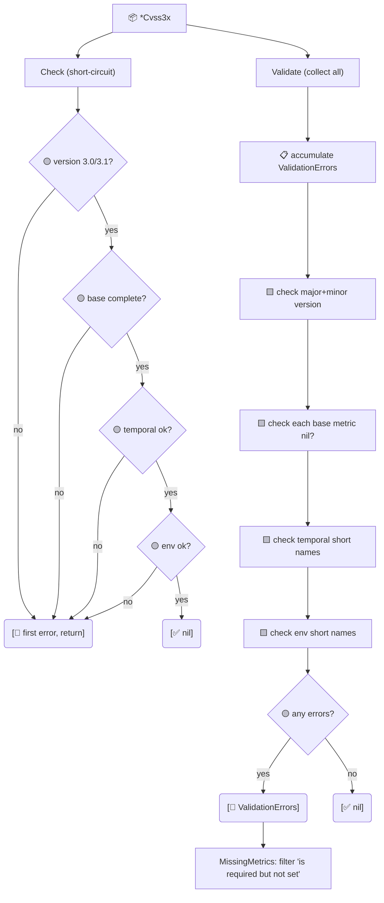

# ✅ 校验

两个校验入口——`Check`（短路）与 `Validate`（收集全部）——外加结构化错误类型与可供 `errors.Is` 匹配的哨兵错误。

## 简介

```go
if err := cv.Validate(); err != nil {
    var ve cvss.ValidationErrors
    if errors.As(err, &ve) {
        fmt.Println("missing:", ve.MissingMetrics())
    }
}
```

## 工作原理

`Check` 在首个问题处返回（在评分前内部使用）；`Validate` 遍历每个基础指标与每个已设置的时间/环境字段，把 `*ValidationError` 条目累积进一个可供 `errors.Is`/`errors.As` 解包的 `ValidationErrors` 切片。`MissingMetrics` 是便捷函数，重跑 `Validate` 并抽取“必填但未设置”条目。



## 类型

### `ValidationError`

| 字段 | 类型 | 含义 |
| --- | --- | --- |
| `Metric` | `string` | 出错指标的短名称（或 `"Version"`/`"Base"`/`"Cvss3x"`） |
| `Message` | `string` | 人类可读描述 |

`Error()` 格式为 `metric <Metric>: <Message>`。

### `ValidationErrors`

`type ValidationErrors []*ValidationError`——收集的切片。

| 方法 | 签名 | 行为 |
| --- | --- | --- |
| `Error` | `func (ve) Error() string` | 用 `; ` 连接所有条目 |
| `MissingMetrics` | `func (ve) MissingMetrics() []string` | 报 `"is required but not set"` 的指标名 |
| `HasErrors` | `func (ve) HasErrors() bool` | `len(ve) > 0` |
| `Unwrap` | `func (ve) Unwrap() []error` | Go 1.20+ 多错误解包 |

## 接口参考

```go
func (x *Cvss3x) Check() error
func (x *Cvss3x) Validate() error
func (x *Cvss3x) MissingMetrics() []string
func (x *Cvss3x) IsComplete() bool
```

- `Check` 校验版本（3.0/3.1）、基础完整性、再校验时间/环境短名称正确性。遇到第一个错误即返回。
- `Validate` 跑同样的检查，但把**每个**问题累积进 `ValidationErrors`，从不短路——每个缺失基础指标都单独报告。
- `MissingMetrics` 是 `Validate` 的糖：只返回报 `"is required but not set"` 的基础指标名。
- `IsComplete` 是布尔形式：8 个基础指标全非 nil。不检查版本或值合法性。

### 哨兵错误（`errors.go`）

```go
var ErrNilReceiver         = errors.New("nil receiver")
var ErrIncompleteBaseMetrics = errors.New("incomplete base metrics")
var ErrUnsupportedVersion  = errors.New("unsupported CVSS version")
var ErrInvalidMetricValue  = errors.New("invalid metric value")
```

::: tip Check 与 Validate——何时用哪个
评分前想要快速 yes/no 时用 `Check`（`Calculator` 内部即调用它）。需要一次告诉用户**全部**问题时用 `Validate`——如表单校验、批量导入报告。
:::

::: warning MissingMetrics 只覆盖基础指标
`MissingMetrics` 只报告 8 个必需基础指标。时间与环境指标按规范是可选的，因此其缺失永不报错——只有短名称错误（如 `E` 槽位放了非 `E` 向量）才会被 `Validate` 标记。
:::

## 示例

```go
package main

import (
    "errors"
    "fmt"

    "github.com/scagogogo/cvss-skills/pkg/cvss"
)

func main() {
    // 不完整向量：只设了 AV 和 AC。
    cv, _ := cvss.NewCvss3xWithOptions(
        cvss.WithVersion31(),
        cvss.WithAV('N'), cvss.WithAC('L'),
    )

    fmt.Println("IsComplete:", cv.IsComplete()) // false

    err := cv.Validate()
    var ve cvss.ValidationErrors
    if errors.As(err, &ve) {
        fmt.Println("missing:", ve.MissingMetrics()) // [PR UI S C I A]
        for _, e := range ve {
            fmt.Println(" -", e.Error())
        }
    }

    // Check 在第一个问题处短路。
    fmt.Println("Check:", cv.Check())

    // 对接收者的哨兵匹配。
    _, _, err = (*cvss.Cvss3x)(nil).GetMetricValue("AV")
    fmt.Println(errors.Is(err, cvss.ErrNilReceiver)) // true
}
```

## 相关

- [pkg/parser](/zh/sdk/parser) —— `ParseAndValidate` 组合解析 + 校验
- [pkg/cvss](/zh/sdk/cvss) —— `Check` 是内部校验钩子
- [评分计算器](/zh/sdk/calculator) —— 每个评分方法都先调 `Check`
