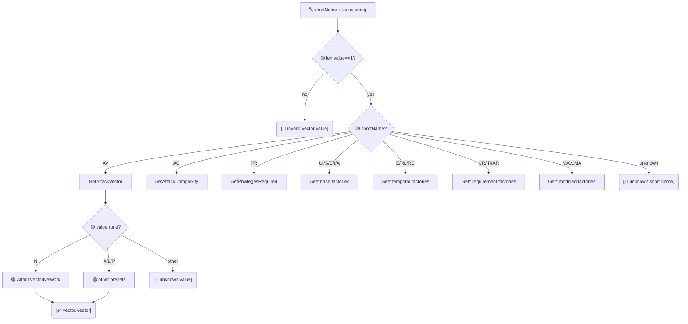

# 🏭 Vector 工厂

`pkg/vector/factory.go` · 1 个分发器 + 23 个有类型工厂

## 简介

工厂层将原始短名（`AV`、`E`、`MAV`、…）与单字符取值码（`'N'`、`'F'`、`'X'`、…）转为有类型的 `vector.Vector` 预设。`GetVectorByShortName` 是 parser 使用的通用分发器；23 个 `Get*` 函数是它委托的目标，也可被调用方直接使用。

```go
v, err := vector.GetVectorByShortName("AV", "N") // -> AttackVectorNetwork, nil
v, err = vector.GetAttackVector('N')              // 同上，经有类型工厂
```

## 工作原理

`GetVectorByShortName` 校验取值为单字符，随后按短名 `switch` 派发到 23 个类型化工厂之一。每个类型化工厂按取值 rune `switch`，返回匹配的包级预设变量；未识别的 rune 产出类型化错误。



## 接口参考

### `GetVectorByShortName`

```go
func GetVectorByShortName(shortName string, value string) (Vector, error)
```

通用分发器。`value` 必须为单字符（否则 `invalid vector value: ...`）。按 `shortName` switch 并委托对应 `Get*` 函数：

| `shortName` | 委托给 |
| --- | --- |
| `AV` | `GetAttackVector` |
| `AC` | `GetAttackComplexity` |
| `PR` | `GetPrivilegesRequired` |
| `UI` | `GetUserInteraction` |
| `S`  | `GetScope` |
| `C`  | `GetConfidentiality` |
| `I`  | `GetIntegrity` |
| `A`  | `GetAvailability` |
| `E`  | `GetExploitCodeMaturity` |
| `RL` | `GetRemediationLevel` |
| `RC` | `GetReportConfidence` |
| `CR` | `GetConfidentialityRequirement` |
| `IR` | `GetIntegrityRequirement` |
| `AR` | `GetAvailabilityRequirement` |
| `MAV` | `GetModifiedAttackVector` |
| `MAC` | `GetModifiedAttackComplexity` |
| `MPR` | `GetModifiedPrivilegesRequired` |
| `MUI` | `GetModifiedUserInteraction` |
| `MS`  | `GetModifiedScope` |
| `MC`  | `GetModifiedConfidentiality` |
| `MI`  | `GetModifiedIntegrity` |
| `MA`  | `GetModifiedAvailability` |

未知 `shortName` 返回 `unknown vector short name: ...`。

### `Get*` 函数（共 23 个）

每个有类型工厂形态一致：

```go
func Get<指标>(shortValue rune) (Vector, error)
```

按 `shortValue` switch 返回对应预设变量，否则返回 `unknown <metric> value: %c`。按段分组完整列表：

**基础指标（8）**

| 函数 | 合法取值 |
| --- | --- |
| `GetAttackVector` | `N` `A` `L` `P` |
| `GetAttackComplexity` | `L` `H` |
| `GetPrivilegesRequired` | `N` `L` `H` |
| `GetUserInteraction` | `N` `R` |
| `GetScope` | `U` `C` |
| `GetConfidentiality` | `N` `L` `H` |
| `GetIntegrity` | `N` `L` `H` |
| `GetAvailability` | `N` `L` `H` |

**时间指标（3）**

| 函数 | 合法取值 |
| --- | --- |
| `GetExploitCodeMaturity` | `X` `U` `P` `F` `H` |
| `GetRemediationLevel` | `X` `O` `T` `W` `U` |
| `GetReportConfidence` | `X` `U` `R` `C` |

**环境需求指标（3）**

| 函数 | 合法取值 |
| --- | --- |
| `GetConfidentialityRequirement` | `X` `L` `M` `H` |
| `GetIntegrityRequirement` | `X` `L` `M` `H` |
| `GetAvailabilityRequirement` | `X` `L` `M` `H` |

**修改后的基础指标（8）**

| 函数 | 合法取值 |
| --- | --- |
| `GetModifiedAttackVector` | `X` `N` `A` `L` `P` |
| `GetModifiedAttackComplexity` | `X` `L` `H` |
| `GetModifiedPrivilegesRequired` | `X` `N` `L` `H` |
| `GetModifiedUserInteraction` | `X` `N` `R` |
| `GetModifiedScope` | `X` `U` `C` |
| `GetModifiedConfidentiality` | `X` `N` `L` `H` |
| `GetModifiedIntegrity` | `X` `N` `L` `H` |
| `GetModifiedAvailability` | `X` `N` `L` `H` |

注：每个修改指标工厂都将 `X` 视为 Not Defined 回退（见 [/zh/sdk/vector-not-defined](/zh/sdk/vector-not-defined)），返回对应的 `*NotDefined` 预设而非 `Modified*` 预设。

## 示例

```go
package main

import (
	"fmt"

	"github.com/scagogogo/cvss-skills/pkg/vector"
)

func main() {
	// 经通用分发器（parser 使用方式）。
	av, err := vector.GetVectorByShortName("AV", "N")
	if err != nil {
		panic(err)
	}
	fmt.Println(av.String()) // AV:N

	// 直接经有类型工厂。
	e, err := vector.GetExploitCodeMaturity('F')
	if err != nil {
		panic(err)
	}
	fmt.Println(e.String()) // E:F

	// 修改指标的 Not Defined 回退。
	mav, _ := vector.GetModifiedAttackVector('X')
	fmt.Println(mav.String(), mav.IsNotDefined()) // MAV:X true

	// 非法取值。
	_, err = vector.GetScope('Z')
	fmt.Println(err) // unknown scope value: Z
}
```

## 相关

- [/zh/sdk/vector](/zh/sdk/vector) — 包概览
- [/zh/sdk/vector-interface](/zh/sdk/vector-interface) — `Vector` 接口与 `VectorImpl`
- [/zh/sdk/vector-not-defined](/zh/sdk/vector-not-defined) — `X` 回退变体
- [/zh/sdk/parser](/zh/sdk/parser) — 驱动 `GetVectorByShortName` 的解析器
