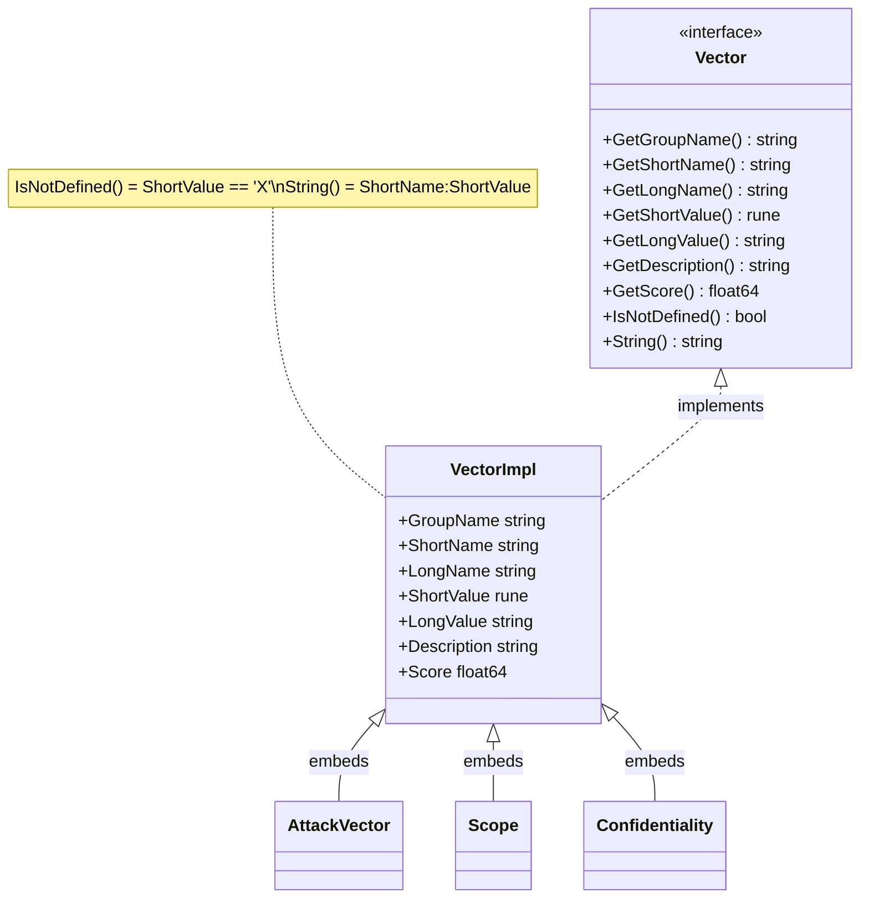

# 🎯 Vector 接口

`pkg/vector/vector.go` + `pkg/vector/vector_impl.go` · 9 方法接口 · 基础结构体

> 本页是 `Vector` 接口与 `VectorImpl` 的类型级参考。包概览、预设变量与 `Get*` 工厂见 [/zh/sdk/vector](/zh/sdk/vector)。

## 简介

`Vector` 是 SDK 最底层的抽象：`Cvss3x` 中的每个指标值（AV、AC、…、MA）都是一个 `vector.Vector`。该接口暴露 9 个方法，覆盖标识、取值、评分与序列化。`VectorImpl` 是具体基础结构体，每个命名指标类型（`*AttackVector`、`*Confidentiality`、…）都内嵌它，因此共享同一份实现。

```go
var v vector.Vector = vector.AttackVectorNetwork
fmt.Println(v.GetShortName(), string(v.GetShortValue())) // AV N
fmt.Printf("%.2f\n", v.GetScore())                        // 0.85
fmt.Println(v.String())                                   // AV:N
fmt.Println(v.IsNotDefined())                             // false
```

## 工作原理

`Vector` 是一个 9 方法接口；`VectorImpl` 是每个具名指标类型都嵌入的单一共享结构，因此接口方法只实现一次并在各处继承。



## 接口参考

### `Vector` 接口

```go
type Vector interface {
    GetGroupName() string
    GetShortName() string
    GetLongName() string
    GetShortValue() rune
    GetLongValue() string
    GetDescription() string
    GetScore() float64
    IsNotDefined() bool
    String() string
}
```

| # | 方法 | 返回 | 说明 |
| --- | --- | --- | --- |
| 1 | `GetGroupName()` | `string` | 指标分组，如 `"Base Metrics"`、`"Temporal Metrics"`、`"Environmental Metrics"`。 |
| 2 | `GetShortName()` | `string` | CVSS 短名，如 `"AV"`、`"E"`、`"MAV"`。 |
| 3 | `GetLongName()` | `string` | 长可读名，如 `"Attack Vector"`。 |
| 4 | `GetShortValue()` | `rune` | 单字符取值码，如 `'N'`、`'L'`、`'X'`。 |
| 5 | `GetLongValue()` | `string` | 长取值名，如 `"Network"`、`"Not Defined"`。 |
| 6 | `GetDescription()` | `string` | 取值的自由描述。 |
| 7 | `GetScore()` | `float64` | 评分公式使用的数值权重。 |
| 8 | `IsNotDefined()` | `bool` | 当 `GetShortValue() == 'X'` 时为 `true`（Not Defined 回退）。 |
| 9 | `String()` | `string` | 规范 `短名:取值` 形式，如 `AV:N`。 |

### `VectorImpl` 结构体

```go
type VectorImpl struct {
    GroupName   string
    ShortName   string
    LongName    string
    ShortValue  rune
    LongValue   string
    Description string
    Score       float64
}
```

`VectorImpl` 是所有命名指标类型内嵌的共享基础（以 `*VectorImpl` 形式）。编译期断言 `var _ Vector = &VectorImpl{}` 保证其满足接口。每个方法仅返回对应结构体字段，另有两个计算行为：

- `IsNotDefined()` 返回 `x.ShortValue == 'X'`。
- `String()` 返回 `fmt.Sprintf("%s:%c", x.ShortName, x.ShortValue)`。

由于命名类型（`*AttackVector`、`*Confidentiality`、…）内嵌 `*VectorImpl`，它们免费继承全部 9 个方法；内嵌方仅添加类型标识与预设变量。

## 示例

```go
package main

import (
	"fmt"

	"github.com/scagogogo/cvss-skills/pkg/vector"
)

func describe(v vector.Vector) {
	fmt.Printf("%s (%s) = %s (%c)  score=%.2f  notDefined=%v  str=%s\n",
		v.GetShortName(), v.GetLongName(),
		v.GetLongValue(), v.GetShortValue(),
		v.GetScore(), v.IsNotDefined(), v.String(),
	)
}

func main() {
	describe(vector.AttackVectorNetwork)
	// AV (Attack Vector) = Network (N)  score=0.85  notDefined=false  str=AV:N

	describe(vector.ExploitCodeMaturityNotDefined)
	// E (Exploit Code Maturity) = Not Defined (X)  score=1.00  notDefined=true  str=E:X
}
```

## 相关

- [/zh/sdk/vector](/zh/sdk/vector) — 包概览、预设变量与 `Get*` 工厂
- [/zh/sdk/vector-factory](/zh/sdk/vector-factory) — `GetVectorByShortName` 分发器与 23 个 `Get*` 函数
- [/zh/sdk/vector-not-defined](/zh/sdk/vector-not-defined) — `X`（Not Defined）回退变体
- [/zh/sdk/cvss3x-base](/zh/sdk/cvss3x-base) · [/zh/sdk/cvss3x-temporal](/zh/sdk/cvss3x-temporal) · [/zh/sdk/cvss3x-environmental](/zh/sdk/cvss3x-environmental) — 字段为 `vector.Vector` 的三段
