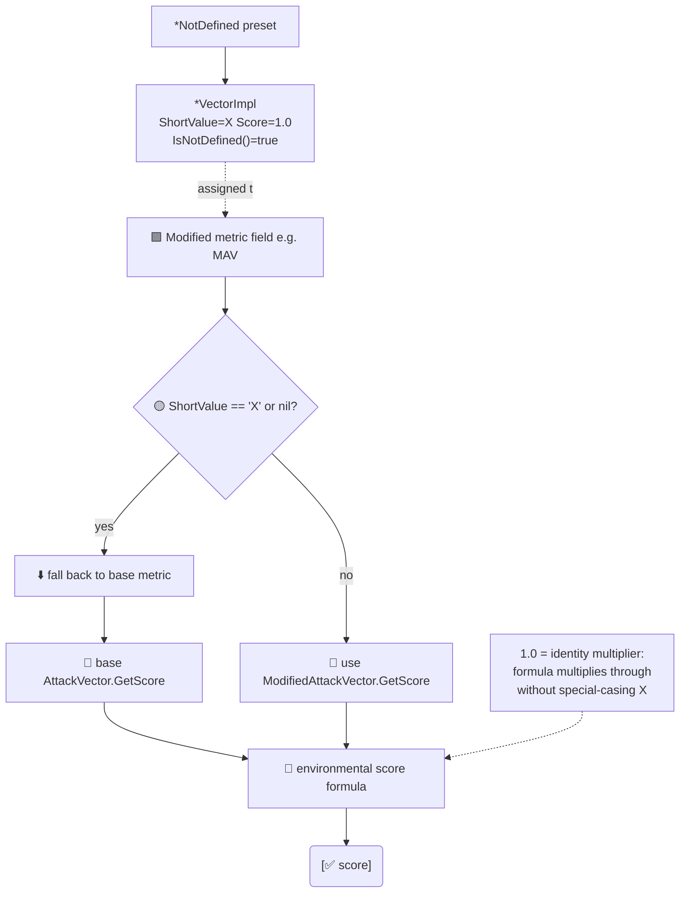

# ❎ Not Defined 向量

`pkg/vector/not_defined_vectors.go` · 8 个预设变量 · score = 1.0

## 简介

当 CVSS 3.x 环境修改指标取值为 `X`（Not Defined）时，含义为"不修改基础指标——回退到基础值"。`not_defined_vectors.go` 声明了 8 个此类预设变量（每个修改基础指标一个）。每个都是有类型预设，`ShortValue == 'X'`、`LongValue == "Not Defined"`、`Score == 1.0`、`GroupName == "Environmental Metrics"`。

```go
mav := vector.AttackVectorNotDefined
fmt.Println(mav.String())        // MAV:X
fmt.Println(mav.IsNotDefined())  // true
fmt.Println(mav.GetScore())      // 1.0
```

## 工作原理

每个 Not Defined 预设都是一个 `ShortValue == 'X'` 且 `Score == 1.0` 的 `*VectorImpl`。计算器的 `getModified*Score` 辅助函数先检查 `!= 'X'`：当修改后指标为 `X`（或 `nil`）时，它们返回**基础**指标的评分，故 `1.0` 权重是让公式可统一乘下去的单位乘子。



## 回退语义

`1.0` 是恒等乘数——不改变基础指标的贡献。CVSS 3.x 规范将修改指标上的 `X` 定义为"改用对应基础指标值"，SDK 将其编码为中性的 `1.0` 权重，使评分公式可统一地乘过去而无需对 `X` 特判。

| 预设变量 | 短名 | 长名 | 短取值 | Score |
| --- | --- | --- | --- | --- |
| `AttackVectorNotDefined` | `MAV` | Modified Attack Vector | `X` | `1.0` |
| `AttackComplexityNotDefined` | `MAC` | Modified Attack Complexity | `X` | `1.0` |
| `PrivilegesRequiredNotDefined` | `MPR` | Modified Privileges Required | `X` | `1.0` |
| `UserInteractionNotDefined` | `MUI` | Modified User Interaction | `X` | `1.0` |
| `ScopeNotDefined` | `MS` | Modified Scope | `X` | `1.0` |
| `ConfidentialityNotDefined` | `MC` | Modified Confidentiality | `X` | `1.0` |
| `IntegrityNotDefined` | `MI` | Modified Integrity | `X` | `1.0` |
| `AvailabilityNotDefined` | `MA` | Modified Availability | `X` | `1.0` |

> 命名说明：尽管变量以*基础*指标命名（如 `AttackVectorNotDefined`），其 `ShortName` 是*修改*短名（`MAV`），因为这些预设只会赋给 `Cvss3xEnvironmental` 的字段。基础短名 `AV` 属于非修改的基础预设。

每个变量都是指向命名指标类型（`*AttackVector`、`*AttackComplexity`、…）的指针，内嵌 `*VectorImpl`，因此满足 `vector.Vector`，且 `IsNotDefined()` 返回 `true`（因 `ShortValue == 'X'`）。

## 接口参考

这些是包级 `var` 声明，而非函数。直接访问：

```go
var (
    AttackVectorNotDefined       = &AttackVector{...}
    AttackComplexityNotDefined   = &AttackComplexity{...}
    PrivilegesRequiredNotDefined = &PrivilegesRequired{...}
    UserInteractionNotDefined    = &UserInteraction{...}
    ScopeNotDefined              = &Scope{...}
    ConfidentialityNotDefined    = &Confidentiality{...}
    IntegrityNotDefined          = &Integrity{...}
    AvailabilityNotDefined       = &Availability{...}
)
```

修改指标的 `Get*` 工厂在传入 `'X'` 时返回它们（见 [/zh/sdk/vector-factory](/zh/sdk/vector-factory)）。

## 示例

```go
package main

import (
	"fmt"

	"github.com/scagogogo/cvss-skills/pkg/cvss"
	"github.com/scagogogo/cvss-skills/pkg/vector"
)

func main() {
	// 修改指标设为 "Not Defined" -> 回退到基础指标。
	env := &cvss.Cvss3xEnvironmental{
		ModifiedAttackVector: vector.AttackVectorNotDefined,
	}
	fmt.Println(env.ModifiedAttackVector.String())       // MAV:X
	fmt.Println(env.ModifiedAttackVector.IsNotDefined()) // true
	fmt.Println(env.ModifiedAttackVector.GetScore())     // 1.0（中性）

	// 工厂在 'X' 时返回同一预设。
	mav, _ := vector.GetModifiedAttackVector('X')
	fmt.Println(mav == vector.AttackVectorNotDefined) // true
}
```

## 相关

- [/zh/sdk/vector](/zh/sdk/vector) — 包概览与完整预设目录
- [/zh/sdk/vector-interface](/zh/sdk/vector-interface) — `Vector` 接口与 `IsNotDefined()`
- [/zh/sdk/vector-factory](/zh/sdk/vector-factory) — 在 `'X'` 时返回这些预设的 `Get*` 工厂
- [/zh/sdk/cvss3x-environmental](/zh/sdk/cvss3x-environmental) — 持有修改指标字段的段
