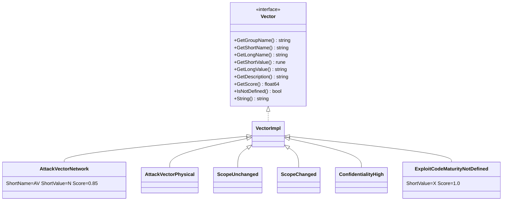

# 🎯 pkg/vector

SDK 的最底层：不可变的指标值对象。`Cvss3x` 的每个字段都是一个 `vector.Vector`，而 `Get*` 工厂函数正是解析器、构建器与选项把短值（`'N'`、`'L'`、…）解析为带类型预设的方式。

## 简介

```go
av, err := vector.GetAttackVector('N') // -> AttackVectorNetwork, nil
fmt.Println(av.GetLongValue())          // Network
fmt.Printf("%.2f\n", av.GetScore())      // 0.85
```

## 工作原理

本包是一个接口（`Vector`）、一个共享结构（`VectorImpl`）以及按指标分组的包级预设变量目录。各 `Get*` 工厂按值返回这些预设；因为预设是不可变指针，克隆 `Cvss3x` 只是复制指针。



## 类型

### `Vector` 接口

```go
type Vector interface {
    GetGroupName() string
    GetShortName() string
    GetLongName() string
    GetShortValue() rune
    GetLongValue() string
    GetDescription() string
    GetScore() float64
    IsNotDefined() bool   // ShortValue == 'X' 时为 true
    String() string        // "AV:N"
}
```

### `VectorImpl`

每个指标类型都内嵌的具体基础结构体（`*VectorImpl`）。字段：

| 字段 | 类型 | 含义 |
| --- | --- | --- |
| `GroupName` | `string` | "Base Metrics" / "Temporal Metrics" / "Environmental Metrics" |
| `ShortName` | `string` | 如 "AV"、"MAV" |
| `LongName` | `string` | 如 "Attack Vector" |
| `ShortValue` | `rune` | 如 `'N'` |
| `LongValue` | `string` | 如 "Network" |
| `Description` | `string` | 规范原文描述 |
| `Score` | `float64` | 静态指标分数（见下方注意事项） |

`IsNotDefined()` 在 `ShortValue == 'X'`（"Not Defined" 哨兵，分数 1.0）时返回 `true`。

## 预设变量

每个指标值都是一个包级 `var` 指针，例如 `vector.AttackVectorNetwork`。命名约定：

- 基础：`<Metric><Value>` —— `AttackVectorNetwork`、`AttackComplexityLow`、`PrivilegesRequiredNone`、`UserInteractionNone`、`ScopeUnchanged`、`ConfidentialityHigh`、`IntegrityLow`、`AvailabilityNone`、…
- 时间：`<Metric><Value>` —— `ExploitCodeMaturityHigh`、`RemediationLevelOfficialFix`、`ReportConfidenceConfirmed`，以及 `*NotDefined`。
- 环境需求：`ConfidentialityRequirementHigh`、`IntegrityRequirementMedium`、`AvailabilityRequirementLow`，以及 `*NotDefined`。
- 修改（`M*`）：`ModifiedAttackVectorNetwork`、`ModifiedScopeChanged`、`ModifiedConfidentialityNone`、…，以及用于修改指标 `X` 值的 `*NotDefined` 变体（`AttackVectorNotDefined`、`ScopeNotDefined`、…）。

## 接口参考

### 按短名称的工厂

```go
func GetVectorByShortName(shortName string, value string) (Vector, error)
```
解析器与 JSON 反序列化所用的分发器。`value` 必须是单字符；未知名称或值返回错误。

### 各指标工厂函数

```go
func GetAttackVector(shortValue rune) (Vector, error)
func GetAttackComplexity(shortValue rune) (Vector, error)
func GetPrivilegesRequired(shortValue rune) (Vector, error)
func GetUserInteraction(shortValue rune) (Vector, error)
func GetScope(shortValue rune) (Vector, error)
func GetConfidentiality(shortValue rune) (Vector, error)
func GetIntegrity(shortValue rune) (Vector, error)
func GetAvailability(shortValue rune) (Vector, error)
func GetExploitCodeMaturity(shortValue rune) (Vector, error)
func GetRemediationLevel(shortValue rune) (Vector, error)
func GetReportConfidence(shortValue rune) (Vector, error)
func GetConfidentialityRequirement(shortValue rune) (Vector, error)
func GetIntegrityRequirement(shortValue rune) (Vector, error)
func GetAvailabilityRequirement(shortValue rune) (Vector, error)
func GetModifiedAttackVector(shortValue rune) (Vector, error)
func GetModifiedAttackComplexity(shortValue rune) (Vector, error)
func GetModifiedPrivilegesRequired(shortValue rune) (Vector, error)
func GetModifiedUserInteraction(shortValue rune) (Vector, error)
func GetModifiedScope(shortValue rune) (Vector, error)
func GetModifiedConfidentiality(shortValue rune) (Vector, error)
func GetModifiedIntegrity(shortValue rune) (Vector, error)
func GetModifiedAvailability(shortValue rune) (Vector, error)
```
各函数返回对应的预设变量，或在值未知时返回描述性错误（如 `unknown attack vector value: Z`）。

### 依赖上下文的分数辅助

部分指标的分数取决于上下文而非固定值。本包为它们暴露了辅助函数：

```go
func GetPrivilegesRequiredScore(pr Vector, scopeChanged bool) float64
func IsScopeChanged(scope Vector) bool
func IsModifiedScopeChanged(modifiedScope Vector, baseScope Vector) bool
func GetUserInteractionScore(ui Vector, minorVersion int) float64
```

| 指标 | 上下文 | 影响 |
| --- | --- | --- |
| PR | Scope Changed 与否 | PR:L = 0.62（Unchanged）/ 0.68（Changed）；PR:H = 0.27 / 0.5 |
| UI | CVSS 版本 | UI:R = 0.56（v3.0）、0.62（v3.1）；UI:N 两者均为 0.85 |
| MS | 回退到基础 Scope | 若 MS 为 `X`/nil，则用 `baseScope` |

::: warning GetScore() 不总是有效分数
`Vector.GetScore()` 返回预设上存储的**静态**分数。对于 PR 与 UI，有效分数依赖上下文——请始终使用 `GetPrivilegesRequiredScore` / `GetUserInteractionScore`（计算器内部正是如此），而不要对这两个指标直接读 `GetScore()`。
:::

## 示例

```go
package main

import (
    "fmt"

    "github.com/scagogogo/cvss-skills/pkg/vector"
)

func main() {
    // 从短名称 + 值字符串解析（如同解析器那样）。
    v, err := vector.GetVectorByShortName("AV", "N")
    if err != nil {
        panic(err)
    }
    fmt.Printf("%s = %s (%.2f)\n", v.GetShortName(), v.GetLongValue(), v.GetScore())

    // 直接使用各指标工厂。
    scope, _ := vector.GetScope('C')
    fmt.Println(vector.IsScopeChanged(scope)) // true

    // PR 分数依赖 Scope。
    pr, _ := vector.GetPrivilegesRequired('L')
    fmt.Println(vector.GetPrivilegesRequiredScore(pr, false)) // 0.62
    fmt.Println(vector.GetPrivilegesRequiredScore(pr, true))  // 0.68

    // UI 分数依赖版本。
    ui, _ := vector.GetUserInteraction('R')
    fmt.Println(vector.GetUserInteractionScore(ui, 0)) // 0.56（v3.0）
    fmt.Println(vector.GetUserInteractionScore(ui, 1)) // 0.62（v3.1）

    // 直接使用预设变量。
    fmt.Println(vector.AttackVectorNetwork.String()) // AV:N
}
```

## 相关

- [pkg/cvss](/zh/sdk/cvss) —— 把这些 vector 作为结构体字段使用
- [Builder 构建器](/zh/sdk/builder) —— `AV('N')` 内部调用 `GetAttackVector`
- [枚举](/zh/sdk/enumerate) —— 列出每个指标的全部合法值
