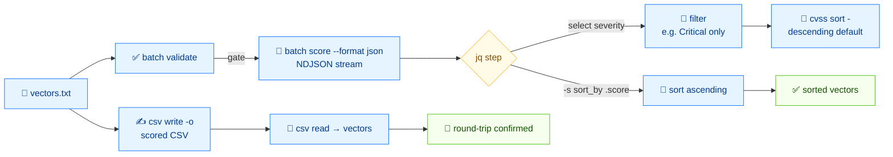

# 📦 批处理脚本

⏱️ 20 分钟 · 中级 · CLI

手动给一个向量评分适合 triage；给一千个评分才是日常工作。本教程走完整个运维闭环：写 `vectors.txt`、批量评分输出 JSON、用 `jq` 过滤、排序、并经 CSV 往返，让电子表格或 SIEM 能消费。

## 前置条件

- `$PATH` 上的 `cvss` 二进制（或仓库根的 `./cvss-cli`）
- 已安装 `jq`（用于 JSON 过滤步骤）
- 学完 [getting-started](./getting-started) 和 [validation-workflow](./validation-workflow)

## 流程



## 第 1 步 —— 构造 `vectors.txt`

创建一个文件，每行一个向量。我们用覆盖整个严重性区间的六个向量：

```bash
cat > vectors.txt <<'EOF'
CVSS:3.1/AV:N/AC:L/PR:N/UI:N/S:U/C:H/I:H/A:H
CVSS:3.1/AV:N/AC:L/PR:N/UI:N/S:C/C:H/I:H/A:H
CVSS:3.1/AV:N/AC:L/PR:N/UI:N/S:U/C:L/I:N/A:N
CVSS:3.1/AV:L/AC:H/PR:H/UI:R/S:U/C:L/I:L/A:L
CVSS:3.1/AV:P/AC:H/PR:H/UI:R/S:U/C:N/I:N/A:L
CVSS:3.1/AV:N/AC:L/PR:N/UI:N/S:U/C:N/I:N/A:N
EOF
```

::: tip 每行一个向量，不支持注释
`batch` 每行读一个向量。不支持空行和 `#` 注释——保持文件干净。
:::

## 第 2 步 —— 批量评分（文本）

```bash
cvss batch score vectors.txt
```

```
9.8 (Critical)  CVSS:3.1/AV:N/AC:L/PR:N/UI:N/S:U/C:H/I:H/A:H
10.0 (Critical)  CVSS:3.1/AV:N/AC:L/PR:N/UI:N/S:C/C:H/I:H/A:H
5.3 (Medium)  CVSS:3.1/AV:N/AC:L/PR:N/UI:N/S:U/C:L/I:N/A:N
3.8 (Low)  CVSS:3.1/AV:L/AC:H/PR:H/UI:R/S:U/C:L/I:L/A:L
1.6 (Low)  CVSS:3.1/AV:P/AC:H/PR:H/UI:R/S:U/C:N/I:N/A:L
0.0 (None)  CVSS:3.1/AV:N/AC:L/PR:N/UI:N/S:U/C:N/I:N/A:N
```

每行是 `分数 (严重性)  向量`。输出顺序与输入一致——并行 worker 不会重排结果。

## 第 3 步 —— 批量评分（JSON）并用 `jq` 过滤

切换到 JSON 以便流水线过滤：

```bash
cvss batch score --format json vectors.txt
```

```json
{
  "line": 1,
  "score": 9.8,
  "severity": "Critical",
  "vector": "CVSS:3.1/AV:N/AC:L/PR:N/UI:N/S:U/C:H/I:H/A:H"
}
{
  "line": 2,
  "score": 10,
  "severity": "Critical",
  "vector": "CVSS:3.1/AV:N/AC:L/PR:N/UI:N/S:C/C:H/I:H/A:H"
}
{
  "line": 3,
  "score": 5.3,
  "severity": "Medium",
  "vector": "CVSS:3.1/AV:N/AC:L/PR:N/UI:N/S:U/C:L/I:N/A:N"
}
{
  "line": 4,
  "score": 3.8,
  "severity": "Low",
  "vector": "CVSS:3.1/AV:L/AC:H/PR:H/UI:R/S:U/C:L/I:L/A:L"
}
{
  "line": 5,
  "score": 1.6,
  "severity": "Low",
  "vector": "CVSS:3.1/AV:P/AC:H/PR:H/UI:R/S:U/C:N/I:N/A:L"
}
{
  "line": 6,
  "score": 0,
  "severity": "None",
  "vector": "CVSS:3.1/AV:N/AC:L/PR:N/UI:N/S:U/C:N/I:N/A:N"
}
```

::: warning 输出是对象流，不是数组
`batch score --format json` 每行输出一个 JSON 对象（流式）。用 `jq -s` 收成数组，或用 `jq 'select(...)'` 直接过滤流。
:::

### 过滤：只要 Critical

```bash
cvss batch score --format json vectors.txt | jq -c 'select(.severity == "Critical")'
```

```json
{"line":1,"score":9.8,"severity":"Critical","vector":"CVSS:3.1/AV:N/AC:L/PR:N/UI:N/S:U/C:H/I:H/A:H"}
{"line":2,"score":10,"severity":"Critical","vector":"CVSS:3.1/AV:N/AC:L/PR:N/UI:N/S:C/C:H/I:H/A:H"}
```

### 过滤：分数 ≥ 7

```bash
cvss batch score --format json vectors.txt | jq -c 'select(.score >= 7)'
```

```json
{"line":1,"score":9.8,"severity":"Critical","vector":"CVSS:3.1/AV:N/AC:L/PR:N/UI:N/S:U/C:H/I:H/A:H"}
{"line":2,"score":10,"severity":"Critical","vector":"CVSS:3.1/AV:N/AC:L/PR:N/UI:N/S:C/C:H/I:H/A:H"}
```

### 收集并按分数升序排序

```bash
cvss batch score --format json vectors.txt | jq -s 'sort_by(.score)'
```

```json
[
  { "line": 6, "score": 0,   "severity": "None",     "vector": "CVSS:3.1/AV:N/AC:L/PR:N/UI:N/S:U/C:N/I:N/A:N" },
  { "line": 5, "score": 1.6, "severity": "Low",      "vector": "CVSS:3.1/AV:P/AC:H/PR:H/UI:R/S:U/C:N/I:N/A:L" },
  { "line": 4, "score": 3.8, "severity": "Low",      "vector": "CVSS:3.1/AV:L/AC:H/PR:H/UI:R/S:U/C:L/I:L/A:L" },
  { "line": 3, "score": 5.3, "severity": "Medium",   "vector": "CVSS:3.1/AV:N/AC:L/PR:N/UI:N/S:U/C:L/I:N/A:N" },
  { "line": 1, "score": 9.8, "severity": "Critical", "vector": "CVSS:3.1/AV:N/AC:L/PR:N/UI:N/S:U/C:H/I:H/A:H" },
  { "line": 2, "score": 10,  "severity": "Critical", "vector": "CVSS:3.1/AV:N/AC:L/PR:N/UI:N/S:C/C:H/I:H/A:H" }
]
```

`jq -s` 把流收成一个数组；`sort_by(.score)` 升序。要降序，再管 `| reverse`。

## 第 4 步 —— 用 `sort` 直接排序向量

`sort` 读向量并按分数打印——无需 JSON：

```bash
cvss sort vectors.txt
```

```
10.0  CVSS:3.1/AV:N/AC:L/PR:N/UI:N/S:C/C:H/I:H/A:H
9.8  CVSS:3.1/AV:N/AC:L/PR:N/UI:N/S:U/C:H/I:H/A:H
5.3  CVSS:3.1/AV:N/AC:L/PR:N/UI:N/S:U/C:L/I:N/A:N
3.8  CVSS:3.1/AV:L/AC:H/PR:H/UI:R/S:U/C:L/I:L/A:L
1.6  CVSS:3.1/AV:P/AC:H/PR:H/UI:R/S:U/C:N/I:N/A:L
0.0  CVSS:3.1/AV:N/AC:L/PR:N/UI:N/S:U/C:N/I:N/A:N
```

默认**降序**（最高分在前）——值班人员想要的。用 `--asc` 翻转：

```bash
cvss sort --asc vectors.txt
```

```
0.0  CVSS:3.1/AV:N/AC:L/PR:N/UI:N/S:U/C:N/I:N/A:N
1.6  CVSS:3.1/AV:P/AC:H/PR:H/UI:R/S:U/C:N/I:N/A:L
3.8  CVSS:3.1/AV:L/AC:H/PR:H/UI:R/S:U/C:L/I:L/A:L
5.3  CVSS:3.1/AV:N/AC:L/PR:N/UI:N/S:U/C:L/I:N/A:N
9.8  CVSS:3.1/AV:N/AC:L/PR:N/UI:N/S:U/C:H/I:H/A:H
10.0  CVSS:3.1/AV:N/AC:L/PR:N/UI:N/S:C/C:H/I:H/A:H
```

`sort` 也读 stdin——把任意过滤器的输出再管进去：

```bash
cvss batch score --format json vectors.txt \
  | jq -r 'select(.severity == "Low" or .severity == "Medium") | .vector' \
  | cvss sort -
```

## 第 5 步 —— 写一份带分数的 CSV 报表

`csv write` 从 stdin 读**纯向量串**（每行一个）并写出带分数的 CSV。用 `-o` 落到文件：

```bash
cat vectors.txt | cvss csv write -o report.csv
```

```bash
cat report.csv
```

```csv
vector_string,version,base_score,base_severity,temporal_score,temporal_severity,environmental_score,environmental_severity,impact_sub_score,exploitability_sub_score
CVSS:3.1/AV:N/AC:L/PR:N/UI:N/S:U/C:H/I:H/A:H,3.1,9.8,Critical,,,,,5.8731,3.8870
CVSS:3.1/AV:N/AC:L/PR:N/UI:N/S:C/C:H/I:H/A:H,3.1,10.0,Critical,,,,,6.1280,3.8870
CVSS:3.1/AV:N/AC:L/PR:N/UI:N/S:U/C:L/I:N/A:N,3.1,5.3,Medium,,,,,1.4124,3.8870
CVSS:3.1/AV:L/AC:H/PR:H/UI:R/S:U/C:L/I:L/A:L,3.1,3.8,Low,,,,,3.3734,0.3330
CVSS:3.1/AV:P/AC:H/PR:H/UI:R/S:U/C:N/I:N/A:L,3.1,1.6,Low,,,,,1.4124,0.1211
CVSS:3.1/AV:N/AC:L/PR:N/UI:N/S:U/C:N/I:N/A:N,3.1,0.0,None,,,,,0.0000,3.8870
```

::: tip csv write 读 stdin，不接收向量参数
`cvss csv write` 从 stdin 读向量（每行一个），不接收位置参数。用管道喂它，不要把向量当参数传。输入必须是纯向量串——`sort` 的输出（带分数前缀）会被拒绝。
:::

空的 `temporal_*` / `environmental_*` 列是正常的——这些纯基础向量没有时间或环境指标，所以这些列为空。行顺序跟随输入顺序（文件顺序），不是分数顺序。要得到按分数排序的 CSV，先用 `jq` 提取向量再排序写入（见下文完整管线）。

## 第 6 步 —— 读回 CSV

`csv read` 把带分数的 CSV 解析回向量串——每行一个：

```bash
cvss csv read report.csv
```

```
CVSS:3.1/AV:N/AC:L/PR:N/UI:N/S:U/C:H/I:H/A:H
CVSS:3.1/AV:N/AC:L/PR:N/UI:N/S:C/C:H/I:H/A:H
CVSS:3.1/AV:N/AC:L/PR:N/UI:N/S:U/C:L/I:N/A:N
CVSS:3.1/AV:L/AC:H/PR:H/UI:R/S:U/C:L/I:L/A:L
CVSS:3.1/AV:P/AC:H/PR:H/UI:R/S:U/C:N/I:N/A:L
CVSS:3.1/AV:N/AC:L/PR:N/UI:N/S:U/C:N/I:N/A:N
```

往返确认：你写进去的向量就是你读出来的。用 `--lax` 跳过坏行而非失败：

```bash
cvss csv read report.csv --lax
```

## 第 7 步 —— 评分前先批量校验

给一批向量评分前，先校验——一个坏向量不该让整轮中止。`batch validate` 报告每行状态和具体失败原因：

```bash
cat > val.txt <<'EOF'
CVSS:3.1/AV:N/AC:L/PR:N/UI:N/S:U/C:H/I:H/A:H
CVSS:3.1/AV:N/AC:L/PR:N/UI:N/S:U/C:H/I:H/A:X
CVSS:3.1/AV:N/AC:L/PR:N/S:U/C:H/I:H/A:H
EOF

cvss batch validate val.txt
```

```
PASS Line 1: CVSS:3.1/AV:N/AC:L/PR:N/UI:N/S:U/C:H/I:H/A:H
FAIL Line 2: CVSS:3.1/AV:N/AC:L/PR:N/UI:N/S:U/C:H/I:H/A:X
  - unknown availability value: X
FAIL Line 3: CVSS:3.1/AV:N/AC:L/PR:N/S:U/C:H/I:H/A:H
  - metric UI: is required but not set
```

见 [validation-workflow](./validation-workflow) 教程了解这些消息背后的完整错误模型。

## 完整闭环，一条管线

把一切串起来——评分、过滤到 High 及以上（≥ 7）、降序排序、写 CSV。因为 `csv write` 需要纯向量串（而 `sort` 会带分数前缀），排序在 `jq` 内做，再提取 `.vector`：

```bash
cvss batch score --format json vectors.txt \
  | jq -rs 'sort_by(-.score) | .[] | select(.score >= 7) | .vector' \
  | cvss csv write -o high-severity.csv
```

`jq -rs` 把流收成一个数组，`sort_by(-.score)` 降序，然后每个匹配的 `.vector` 作为纯串输出。结果落进 CSV，最高分在前：

```bash
cat high-severity.csv
```

```csv
vector_string,version,base_score,base_severity,temporal_score,temporal_severity,environmental_score,environmental_severity,impact_sub_score,exploitability_sub_score
CVSS:3.1/AV:N/AC:L/PR:N/UI:N/S:C/C:H/I:H/A:H,3.1,10.0,Critical,,,,,6.1280,3.8870
CVSS:3.1/AV:N/AC:L/PR:N/UI:N/S:U/C:H/I:H/A:H,3.1,9.8,Critical,,,,,5.8731,3.8870
```

## 小结

- `batch score --format json` 输出对象**流**；`jq 'select(...)'` 过滤，`jq -s 'sort_by(...)'` 收集排序。
- `sort` 按分数排向量，默认降序，`--asc` 翻转。
- `csv write` 从 **stdin** 读（无参数）写带分数 CSV；`csv read` 反向。
- `batch validate` 给一批向量把关——生产中评分前先跑它。

## 下一步

- 在 [comparison-guide](./comparison-guide) 中详细比较两个向量
- 在 [building-vectors](./building-vectors) 中编程构建向量
