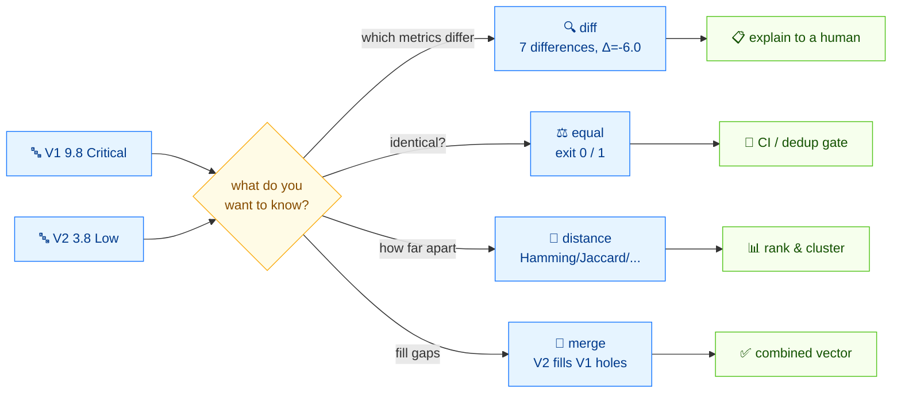

# ⚖️ 比较指南

⏱️ 15 分钟 · 中级 · CLI

CVSS 向量很少孤立存在。厂商公告和内部 triage 常在某个指标上意见不一；两个扫描器可能对同一个 bug 输出不同的环境上下文。本教程拿两个具体向量跑遍全部四个比较命令——`diff`、`equal`、`distance`、`merge`——让你清楚每个命令回答哪个问题。

## 前置条件

- `$PATH` 上的 `cvss` 二进制（或仓库根的 `./cvss-cli`）
- 学完 [getting-started](./getting-started) 和 [your-first-vector](./your-first-vector)

## 流程



## 两个向量

本教程全程比较一个"最坏情况远程 RCE"和一个"低权限本地恶作剧"：

```
V1 = CVSS:3.1/AV:N/AC:L/PR:N/UI:N/S:U/C:H/I:H/A:H   (9.8 Critical)
V2 = CVSS:3.1/AV:L/AC:H/PR:H/UI:R/S:U/C:L/I:L/A:L   (3.8 Low)
```

它们只共享 `S:U`——其他全不同。这使它们成为好测试用例：每个命令都有东西可报。

## 第 1 步 —— `diff`：看*哪些*指标不同

`diff` 是人类可读的比较。它列出每个值有变的指标，并在底部给出分数变动。

```bash
cvss diff "CVSS:3.1/AV:N/AC:L/PR:N/UI:N/S:U/C:H/I:H/A:H" "CVSS:3.1/AV:L/AC:H/PR:H/UI:R/S:U/C:L/I:L/A:L"
```

```
Found 7 difference(s):

  AV: N (Network) → L (Local)
  AC: L (Low) → H (High)
  PR: N (None) → H (High)
  UI: N (None) → R (Required)
  C: H (High) → L (Low)
  I: H (High) → L (Low)
  A: H (High) → L (Low)

Score: 9.8 (Critical) → 3.8 (Low)  [Δ=-6.0]
```

逐行读：

- `Found 7 difference(s)` —— 八个基础指标里有七个不同；只有 `S` 相同。
- 每行展示 `METRIC: V1 (长名) → V2 (长名)`。
- 页脚总结分数变动：**9.8 Critical → 3.8 Low，Δ = −6.0**。

::: tip diff 是"给我讲明白"命令
当需要向人解释*为什么*两个分数不一致——代码评审、公告对账、triage 讨论——时用 `diff`。
:::

### 面向工具的 JSON 形式

```bash
cvss diff --format json "CVSS:3.1/AV:N/AC:L/PR:N/UI:N/S:U/C:H/I:H/A:H" "CVSS:3.1/AV:L/AC:H/PR:H/UI:R/S:U/C:L/I:L/A:L"
```

```json
{
  "differences": [
    { "metric": "AV", "v1": "N", "v1_long": "Network",   "v2": "L", "v2_long": "Local" },
    { "metric": "AC", "v1": "L", "v1_long": "Low",        "v2": "H", "v2_long": "High" },
    { "metric": "PR", "v1": "N", "v1_long": "None",       "v2": "H", "v2_long": "High" },
    { "metric": "UI", "v1": "N", "v1_long": "None",       "v2": "R", "v2_long": "Required" },
    { "metric": "C",  "v1": "H", "v1_long": "High",       "v2": "L", "v2_long": "Low" },
    { "metric": "I",  "v1": "H", "v1_long": "High",       "v2": "L", "v2_long": "Low" },
    { "metric": "A",  "v1": "H", "v1_long": "High",       "v2": "L", "v2_long": "Low" }
  ],
  "score1": 9.8,
  "score2": 3.8,
  "score_delta": -6.000000000000001,
  "severity1": "Critical",
  "severity2": "Low"
}
```

`differences` 数组可机器遍历；`score_delta` 带符号变动。

## 第 2 步 —— `equal`：它们*完全相同*吗？

`equal` 回答更窄的问题：两个向量（规范化后）是否逐字符相同。相同时退出码 `0`，不同时 `1`——可与 `&&` 和 shell 脚本组合。

```bash
cvss equal "CVSS:3.1/AV:N/AC:L/PR:N/UI:N/S:U/C:H/I:H/A:H" "CVSS:3.1/AV:N/AC:L/PR:N/UI:N/S:U/C:H/I:H/A:H"
echo "exit=$?"
```

```
Equal
exit=0
```

```bash
cvss equal "CVSS:3.1/AV:N/AC:L/PR:N/UI:N/S:U/C:H/I:H/A:H" "CVSS:3.1/AV:L/AC:H/PR:H/UI:R/S:U/C:L/I:L/A:L"
echo "exit=$?"
```

```
Not equal
exit=1
```

::: warning 不等时 equal 同时写两个流
不匹配时，`equal` 把 `Not equal` 写到 stdout，把 `not equal` 写到 stderr。如果你解析 JSON 形式，读 stdout。
:::

JSON 形式保留向量记录：

```bash
cvss equal --format json "CVSS:3.1/AV:N/AC:L/PR:N/UI:N/S:U/C:H/I:H/A:H" "CVSS:3.1/AV:L/AC:H/PR:H/UI:R/S:U/C:L/I:L/A:L"
echo "exit=$?"
```

```json
{
  "equal": false,
  "vector1": "CVSS:3.1/AV:N/AC:L/PR:N/UI:N/S:U/C:H/I:H/A:H",
  "vector2": "CVSS:3.1/AV:L/AC:H/PR:H/UI:R/S:U/C:L/I:L/A:L"
}
not equal
exit=1
```

::: tip 何时用 equal 何时用 diff
`equal` 是是非门——用在 CI 步骤或去重流程。`diff` 用于解释不匹配。先跑 `equal`；失败时再跑 `diff` 看原因。
:::

## 第 3 步 —— `distance`：数值上差*多远*

`distance` 把比较归约为数字——五个——让你对向量排名、排序、聚类。

```bash
cvss distance "CVSS:3.1/AV:N/AC:L/PR:N/UI:N/S:U/C:H/I:H/A:H" "CVSS:3.1/AV:L/AC:H/PR:H/UI:R/S:U/C:L/I:L/A:L"
```

```
Euclidean:  0.9670
Manhattan:  2.4600
Hamming:    7
Jaccard:    0.1250
Score diff: 6.0
```

| 指标 | 衡量什么 | 范围 |
| --- | --- | --- |
| `Euclidean` | 各指标数值差的平方和再开方 | ≥ 0 |
| `Manhattan` | 各指标数值绝对差之和 | ≥ 0 |
| `Hamming` | 不同的指标个数 | 0–8（基础） |
| `Jaccard` | 相似度比：`相同 / 并集` | 0–1（1 = 完全相同） |
| `Score diff` | 总分绝对差 | ≥ 0 |

对我们的向量对：`Hamming = 7`（七个指标不同），`Jaccard = 0.125`（只有 `S` 相同，`1/8 = 0.125`），`Score diff = 6.0`（9.8 − 3.8）。

### JSON 形式

```bash
cvss distance --format json "CVSS:3.1/AV:N/AC:L/PR:N/UI:N/S:U/C:H/I:H/A:H" "CVSS:3.1/AV:L/AC:H/PR:H/UI:R/S:U/C:L/I:L/A:L"
```

```json
{
  "euclidean": 0.9669539802906858,
  "hamming": 7,
  "jaccard": 0.125,
  "manhattan": 2.46,
  "score_diff": 6.000000000000001,
  "vector1": "CVSS:3.1/AV:N/AC:L/PR:N/UI:N/S:U/C:H/I:H/A:H",
  "vector2": "CVSS:3.1/AV:L/AC:H/PR:H/UI:R/S:U/C:L/I:L/A:L"
}
```

::: tip 该用哪个距离？
- **Hamming / Jaccard** —— 相似公告的聚类和去重。
- **Score diff** —— "这两个 bug 是否在同一严重性档？"
- **Euclidean / Manhattan** —— 研究和敏感性分析；运维中很少用。
:::

### 用 `--env` 纳入环境指标

当两个向量都带环境指标（`MAV`、`CR`、...）时，加 `--env` 把它们纳入距离：

```bash
cvss distance --env \
  "CVSS:3.1/AV:N/AC:L/PR:N/UI:N/S:U/C:H/I:H/A:H/CR:H" \
  "CVSS:3.1/AV:N/AC:L/PR:N/UI:N/S:U/C:H/I:H/A:H/CR:L"
```

不加 `--env`，不同的 `CR` 被忽略；加了，它就计入距离。

## 第 4 步 —— `merge`：用第二个向量填补缺口

`merge` 是异类——它不比较，它合并。向量 2 的字段填充向量 1 的**缺失**字段；向量 1 已有的字段永不被覆盖。

常见模式：你有一个基础向量和一个独立的时间层叠，想合并成一个。

```bash
cvss merge "CVSS:3.1/AV:N/AC:L/PR:N/UI:N/S:U/C:H/I:H/A:H" "CVSS:3.1/E:F/RL:T/RC:C"
```

```
CVSS:3.1/AV:N/AC:L/PR:N/UI:N/S:U/C:H/I:H/A:H/E:F/RL:T/RC:C
```

基础向量没有 `E`/`RL`/`RC`，所以三个时间指标全部流入。基础指标原封不动。

### merge 展示新分数

JSON 形式揭示合并对分数的影响：

```bash
cvss merge --format json "CVSS:3.1/AV:N/AC:L/PR:N/UI:N/S:U/C:H/I:H/A:H" "CVSS:3.1/E:F/RL:T/RC:C"
```

```json
{
  "version": "3.1",
  "vectorString": "CVSS:3.1/AV:N/AC:L/PR:N/UI:N/S:U/C:H/I:H/A:H/E:F/RL:T/RC:C",
  "baseScore": 9.8,
  "temporalScore": 9.2,
  "baseSeverity": "Critical",
  "temporalSeverity": "Critical",
  "metrics": {
    "base": {
      "attackVector": "Network", "attackComplexity": "Low", "privilegesRequired": "None",
      "userInteraction": "None", "scope": "Unchanged", "confidentiality": "High",
      "integrity": "High", "availability": "High",
      "exploitabilityScore": 3.8870427750000003, "impactScore": 5.873118720000001
    },
    "temporal": {
      "exploitCodeMaturity": "Functional", "remediationLevel": "Temporary Fix",
      "reportConfidence": "Confirmed"
    }
  }
}
```

基础仍是 9.8；合并进来的时间指标产生 **9.2** 的时间分。

::: warning merge 永不覆盖
如果向量 1 已有 `E:U` 而向量 2 有 `E:F`，结果保留 `E:U`。merge 是"填坑"，不是"打补丁"。要覆盖指标，请改用 `cvss modify`。
:::

## 各用哪个？

| 你想要… | 用 | 退出码 |
| --- | --- | --- |
| 向人解释*哪些*指标不同 | `diff` | 总是 0 |
| 在脚本里问"这两个一样吗" | `equal` | 0 = 相同，1 = 不同 |
| 按相似度排名或聚类向量 | `distance` | 总是 0 |
| 把基础向量与时间/环境层叠合并 | `merge` | 总是 0 |

## 小结

- `diff` → *人类*视角：哪些指标、分数变动多少。
- `equal` → *门禁*：是非，可脚本化的退出码。
- `distance` → *数字*：用于排名和聚类的五个指标。
- `merge` → *合并器*：填缺失字段，永不覆盖。

对我们的测试对（`V1` 9.8 Critical vs `V2` 3.8 Low）：`diff` 找到 7 处差异和 Δ = −6.0；`equal` 返回退出码 1；`distance` 报 Hamming 7、Jaccard 0.125、Score diff 6.0；`merge` 是另一次演示，展示时间层叠把基础 9.8 变成 9.2 的时间分。

## 下一步

- 在 [batch-scripting](./batch-scripting) 中规模化跑这些比较
- 在 [building-vectors](./building-vectors) 中从零构建向量
