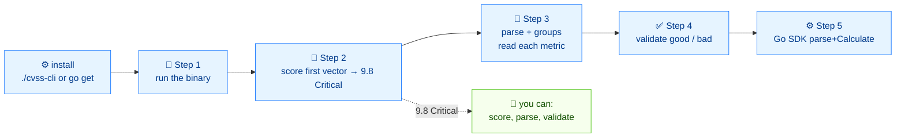

# 🚀 快速开始

⏱️ 30 分钟 · 入门 · CLI + SDK

你将安装 `cvss` 二进制和 Go 模块，解析一个真实向量，给它评分，并理解输出的每一个字段。这里没有任何假设——每个代码块都是一条命令，紧跟其真实输出。

## 前置条件

- Linux 或 macOS 上的 POSIX shell（bash/zsh）
- Go 1.21 或更高（仅 SDK 小节需要）
- 已检出仓库，所以根目录有 `./cvss-cli`

::: tip 无需编译
仓库自带预编译的 `./cvss-cli`。你可以完全不运行 `go build` 就跟上本教程的 CLI 部分。
:::

## 流程



## 第 1 步 —— 运行二进制

在仓库根目录下：

```bash
./cvss-cli --help
```

```
CVSS CLI — parse, score, validate, compare, and serialize CVSS v3.0/v3.1 vectors.

Supports all CVSS 3.x capabilities:
  • Parse and validate vector strings
  • Calculate base, temporal, and environmental scores
  • Compute severity ratings
  • Compare vectors (diff, merge, distance)
  • Serialize to JSON, XML, or vector string format
  • Generate random vectors and presets

Usage:
  cvss [command]
...
```

顶层帮助列出了所有子命令。起步只需要三个：`score`、`parse`、`validate`。

### 安装为 `cvss`（可选）

如果你希望直接敲 `cvss` 而不是 `./cvss-cli`：

```bash
cp ./cvss-cli ~/.local/bin/cvss   # 或任何在 $PATH 上的目录
cvss --version
```

本教程后续使用 `cvss`；如果跳过了这一步，请自行替换为 `./cvss-cli`。

## 第 2 步 —— 评分你的第一个向量

经典的"远程代码执行"向量：

```bash
cvss score "CVSS:3.1/AV:N/AC:L/PR:N/UI:N/S:U/C:H/I:H/A:H"
```

```
9.8 (Critical)
```

这就是核心结论：**9.8，Critical**。分数来自向量串中的八个基础指标。要查看它们的拆解：

```bash
cvss score --all "CVSS:3.1/AV:N/AC:L/PR:N/UI:N/S:U/C:H/I:H/A:H"
```

```
Base: 9.8 (Critical)
```

只出现 `Base`，因为这个向量没有时间或环境指标。[scoring-walkthrough](./scoring-walkthrough) 教程会逐个添加它们。

### JSON 输出

```bash
cvss score --format json "CVSS:3.1/AV:N/AC:L/PR:N/UI:N/S:U/C:H/I:H/A:H"
```

```json
{
  "score": 9.8,
  "severity": "Critical"
}
```

::: tip JSON 适合流水线
把 `--format json` 管到 `jq` 即可过滤和排序。[batch-scripting](./batch-scripting) 教程展示了完整模式。
:::

## 第 3 步 —— 解析向量

`score` 给你数字；`parse` 解释这串字符串的含义。

```bash
cvss parse "CVSS:3.1/AV:N/AC:L/PR:N/UI:N/S:U/C:H/I:H/A:H"
```

```
Version: 3.1
Complete: true
Has Temporal: false
Has Environmental: false

Vector String: CVSS:3.1/AV:N/AC:L/PR:N/UI:N/S:U/C:H/I:H/A:H

Description:
Attack Vector: Network, Attack Complexity: Low, Privileges Required: None, User Interaction: None, Scope: Unchanged, Confidentiality: High, Integrity: High, Availability: High
```

把这份输出当作清单来读：

| 字段 | 含义 |
| --- | --- |
| `Version: 3.1` | CVSS 规范版本 |
| `Complete: true` | 所有必要基础指标都已出现 |
| `Has Temporal: false` | 没有 `E`/`RL`/`RC` 指标 |
| `Has Environmental: false` | 没有 `CR`/`IR`/.../`MAV` 指标 |
| `Description:` | 每个指标的人类可读形式 |

按层级分组查看指标（基础 / 时间 / 环境）：

```bash
cvss groups "CVSS:3.1/AV:N/AC:L/PR:N/UI:N/S:U/C:H/I:H/A:H/E:U/RL:O/RC:C/CR:H"
```

```
[Base]
  AV:N  Attack Vector = Network
  AC:L  Attack Complexity = Low
  PR:N  Privileges Required = None
  UI:N  User Interaction = None
  S:U  Scope = Unchanged
  C:H  Confidentiality = High
  I:H  Integrity = High
  A:H  Availability = High

[Temporal]
  E:U  Exploit Code Maturity = Unproven
  RL:O  Remediation Level = Official Fix
  RC:C  Report Confidence = Confirmed

[Environmental]
  CR:H  Confidentiality Requirement = High
  ...
```

## 第 4 步 —— 校验向量

`parse` 是宽容的；`validate` 是守门人。对一个正确的向量：

```bash
cvss validate "CVSS:3.1/AV:N/AC:L/PR:N/UI:N/S:U/C:H/I:H/A:H"
```

```
Valid [PASS]
  Version: 3.1
  Complete: true
```

对一个错误的向量——注意非法的 `A:X`：

```bash
cvss validate "CVSS:3.1/AV:N/AC:L/PR:N/UI:N/S:U/C:H/I:H/A:X"
```

```
Validation failed: unknown availability value: X
```

[validation-workflow](./validation-workflow) 教程会端到端处理一个坏向量：错误 → 诊断 → 修复 → 复检。

## 第 5 步 —— 使用 Go SDK

安装模块：

```bash
go get github.com/scagogogo/cvss-skills
```

现在用 Go 复现第 2 步。三行代码完成核心工作：解析、构造计算器、计算。

```go
package main

import (
	"fmt"

	"github.com/scagogogo/cvss-skills/pkg/cvss"
	"github.com/scagogogo/cvss-skills/pkg/parser"
)

func main() {
	cv, err := parser.ParseString("CVSS:3.1/AV:N/AC:L/PR:N/UI:N/S:U/C:H/I:H/A:H")
	if err != nil {
		panic(err)
	}
	calc := cvss.NewCalculator(cv)
	score, _ := calc.Calculate()
	fmt.Printf("%.1f\n", score) // 9.8
}
```

```
9.8
```

一次性获取全部三个层级，用 `GetAllScores`：

```go
all, _ := calc.GetAllScores()
fmt.Printf("Base=%.1f(%s) Temporal=%.1f Environmental=%.1f\n",
	all.BaseScore, all.BaseSeverity, all.TemporalScore, all.EnvironmentalScore)
// Base=9.8(Critical) Temporal=0.0 Environmental=0.0
```

`AllScores` 结构体也携带各严重性和子分：

```go
type AllScores struct {
	BaseScore                       float64
	TemporalScore                   float64
	EnvironmentalScore              float64
	BaseSeverity, TemporalSeverity  Severity
	EnvironmentalSeverity           Severity
	ImpactSubScore                  float64
	ExploitabilitySubScore          float64
	// ...modified sub-scores, HasTemporal, HasEnvironmental
}
```

::: warning Calculate 返回的是总分
当存在环境指标时，`Calculate()` 返回环境分；只有时间指标时返回时间分；否则返回基础分。如果你要特定某一层，请用 `GetBaseScore` / `GetTemporalScore` / `GetEnvironmentalScore`。
:::

## 小结

你现在能够：

- 运行 `cvss` 并读懂它的顶层帮助
- 用 `score` 输出文本和 JSON 形式的分数
- 用 `parse` 查看每个指标的含义
- 用 `validate` 校验向量并读懂错误
- 用 Go 的 `parser.ParseString` + `cvss.NewCalculator` 完成同样的事

## 下一步

- 在 [your-first-vector](./your-first-vector) 中逐段读懂那个 9.8 向量
- 在 [scoring-walkthrough](./scoring-walkthrough) 中观察分数逐层变化
