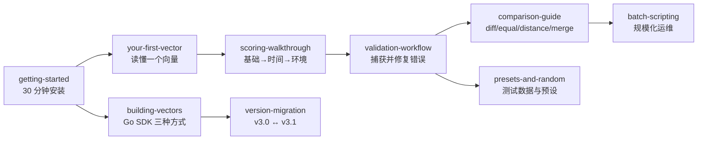

# 📚 教程

⏱️ 自学进度 · 共 10 篇 · 入门 → 进阶

这些教程全部是动手实操：每一步都附有可复制的命令，以及从仓库自带 `cvss` 二进制采集的真实输出。学完后，你将能从命令行和 Go 代码中解析、评分、校验、比较和构建 CVSS v3.0 / v3.1 向量。

## 学习路径

## 路线一 —— 使用 CLI（运维）

如果你在流水线或值班流程中给漏洞评分，按顺序学习这组：

1. [getting-started](./getting-started) —— 安装、第一次解析、第一次评分
2. [your-first-vector](./your-first-vector) —— 拆解 `CVSS:3.1/AV:N/AC:L/PR:N/UI:N/S:U/C:H/I:H/A:H` 到 9.8 Critical
3. [scoring-walkthrough](./scoring-walkthrough) —— 观察基础→时间→环境分数的逐层演变
4. [validation-workflow](./validation-workflow) —— 写坏一个向量，读错误，修好它
5. [comparison-guide](./comparison-guide) —— diff、equal、distance、merge
6. [batch-scripting](./batch-scripting) —— `vectors.txt` + `batch` + `sort` + `csv`

## 路线二 —— 使用 Go SDK（编程）

如果你把评分嵌入到 Go 服务中：

1. [getting-started](./getting-started) —— `go get` 拉取模块，运行第一段代码
2. [building-vectors](./building-vectors) —— `FromMap` vs `Builder` vs 函数式 `Options`
3. [version-migration](./version-migration) —— `UpgradeTo31` / `DowngradeTo30`
4. [presets-and-random](./presets-and-random) —— 单测里的 `mock.RandomCvss3x`

## 你需要准备什么

- 仓库根目录自带的二进制 `./cvss-cli`，可在 Linux/macOS 上运行
- Go 1.21+（SDK 教程需要，模块路径 `github.com/scagogogo/cvss-skills`）
- 前两篇教程约 30 分钟；全部学完约 2 小时

::: tip 先用 CLI
即使是 SDK 用户，先跑几次 CLI 也大有裨益——CLI 的输出就是 SDK 产物的真值。
:::

## 约定

- 每个命令块都可复制粘贴；下方的输出块是真实采集的。
- `cvss` 是已安装的二进制；`./cvss-cli` 是仓库根的那个——同一个程序。
- 向量一律原样书写，如 `CVSS:3.1/AV:N/...`。

## 下一步

从 [getting-started](./getting-started) 开始。
