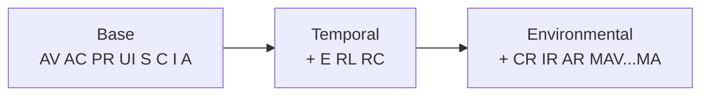

# 📈 评分演算

⏱️ 15 分钟 · 中级 · CLI

CVSS 给你三个评分层级——**基础**、**时间**、**环境**——由逐步增多的指标组计算得出。本教程拿一个向量，每次加一个指标，每步采集真实分数，让你看清每个指标的贡献。

## 前置条件

- `$PATH` 上的 `cvss` 二进制（或 `./cvss-cli`）
- 读完 [your-first-vector](./your-first-vector)，对基础指标熟悉

## 三个层级



- **基础**——内在属性，"这是什么类型的 bug"。永远存在。
- **时间**——"我们现在对它了解多少"（利用成熟度、是否有修复、可信度）。
- **环境**——"它对**我们**意味着什么"（我们关心哪些 CIA 维度、修改后的指标）。

总分规则：有环境取环境，否则有时间取时间，否则取基础。

::: tip 分数从基础只会下降，然后环境可能把它拉回来
时间指标（未证实的利用、已有修复）通常*降低*分数。环境需求（`CR:H`）可能把它*抬高*，因为它们表示"对我们来说这更重要"。
:::

## 第 1 步 —— 基础分

从上一教程的同一个八指标基础向量开始：

```bash
cvss score --all "CVSS:3.1/AV:N/AC:L/PR:N/UI:N/S:U/C:H/I:H/A:H"
```

```
Base: 9.8 (Critical)
```

没有时间、没有环境——只打印 `Base`。**9.8 Critical。**

## 第 2 步 —— 加 `E:U`（Exploit Code Maturity = Unproven）

第一个时间指标。`E` 表示利用代码的成熟度。

| 值 | 含义 |
| --- | --- |
| `X` | 未定义（默认——按 `H` 处理） |
| `H` | High——存在功能性利用 |
| `F` | Functional |
| `P` | Proof-of-concept |
| `U` | Unproven——无已知利用 |

```bash
cvss score --all "CVSS:3.1/AV:N/AC:L/PR:N/UI:N/S:U/C:H/I:H/A:H/E:U"
```

```
Base: 9.8 (Critical), Temporal: 9.0 (Critical)
```

基础不动仍是 9.8；**时间**列出现在 **9.0**。分数降了 0.8，因为利用未证实——但仍属 Critical。

## 第 3 步 —— 加 `RL:O`（Remediation Level = Official Fix）

`RL` 描述是否已有修复。

| 值 | 含义 |
| --- | --- |
| `X` | 未定义（默认 `U`） |
| `U` | Unavailable（无） |
| `W` | Workaround（绕过方案） |
| `T` | Temporary fix（临时修复） |
| `O` | Official fix（官方修复） |

```bash
cvss score --all "CVSS:3.1/AV:N/AC:L/PR:N/UI:N/S:U/C:H/I:H/A:H/E:U/RL:O"
```

```
Base: 9.8 (Critical), Temporal: 8.5 (High)
```

已有官方修复，紧迫度再降——时间分现在是 **8.5 High**。我们刚刚从 Critical 跨入 High。

## 第 4 步 —— 加 `RC:C`（Report Confidence = Confirmed）

`RC` 表示我们对报告准确度的把握。

| 值 | 含义 |
| --- | --- |
| `X` | 未定义（默认 `C`） |
| `C` | Confirmed（已确认） |
| `R` | Reasonable（合理） |
| `U` | Unknown（未知） |

```bash
cvss score --all "CVSS:3.1/AV:N/AC:L/PR:N/UI:N/S:U/C:H/I:H/A:H/E:U/RL:O/RC:C"
```

```
Base: 9.8 (Critical), Temporal: 8.5 (High)
```

没有变化——`RC:C` 是默认假设，所以显式加上后时间分仍是 **8.5**。这一步是为了展示默认值在起作用。

## 第 5 步 —— 加 `CR:H`（Confidentiality Requirement = High）

现在进入**环境**。`CR`/`IR`/`AR` 表示每个 CIA 维度*对你的环境*有多重要。它们重新加权影响。

| 值 | 含义 |
| --- | --- |
| `X` | 未定义（默认 `M` Medium） |
| `H` | High |
| `M` | Medium |
| `L` | Low |

```bash
cvss score --all "CVSS:3.1/AV:N/AC:L/PR:N/UI:N/S:U/C:H/I:H/A:H/E:U/RL:O/RC:C/CR:H"
```

```
Base: 9.8 (Critical), Temporal: 8.5 (High), Environmental: 8.7 (High)
```

**环境**列出现在 **8.7**——高于时间的 8.5，因为我们刚声明机密性对我们至关重要。修复可用性带来的惩罚被"这是高价值资产"部分抵消。

::: warning 需求只重新加权已有影响
`CR:H` 在这里抬高分数，是因为向量里已有 `C:H`。它不会无中生有地造出影响。下一步在 `IR`/`AR` 上展示同样的道理。
:::

## 第 6 步 —— 加 `IR:H` 和 `AR:H`

我们的向量已有 `I:H` 和 `A:H`，所以声明完整性和可用性也高度重要不应改变太多——它们已按最大影响权重计入：

```bash
cvss score --all "CVSS:3.1/AV:N/AC:L/PR:N/UI:N/S:U/C:H/I:H/A:H/E:U/RL:O/RC:C/CR:H/IR:H/AR:H"
```

```
Base: 9.8 (Critical), Temporal: 8.5 (High), Environmental: 8.7 (High)
```

确认——环境分仍是 **8.7**。需求无法突破底层 `C:H/I:H/A:H` 影响本身允许的范围。

### 看需求真正移动分数

要观察需求*改变*环境分，反过来降低它：

```bash
cvss score --all "CVSS:3.1/AV:N/AC:L/PR:N/UI:N/S:U/C:H/I:H/A:H/E:U/RL:O/RC:C/CR:L"
```

```
Base: 9.8 (Critical), Temporal: 8.5 (High), Environmental: 8.3 (High)
```

`CR:L` 表示"机密性在这里是低风险"，环境分降到 **8.3**。对比 `CR:M`（隐式默认），它把分数留在 8.5：

```bash
cvss score --all "CVSS:3.1/AV:N/AC:L/PR:N/UI:N/S:U/C:H/I:H/A:H/E:U/RL:O/RC:C/CR:M"
```

```
Base: 9.8 (Critical), Temporal: 8.5 (High), Environmental: 8.5 (High)
```

所以 `CR` 移动环境分：`L` → 8.3，`M` → 8.5，`H` → 8.7。

## 第 7 步 —— 环境的另一根杠杆：修改后指标

环境还包括**修改后的**基础指标（`MAV`、`MAC`、`MUI`、...）。它们表示"在*我们的*部署中，有效的攻击向量不同"。它们在环境公式中覆盖基础值。

例如，虽然基础写的是 `AV:N`（网络可达），但假设我们的部署把服务放在仅物理控制台后面，所以*有效*攻击向量是 Physical：

```bash
cvss score --all "CVSS:3.1/AV:N/AC:L/PR:N/UI:N/S:U/C:H/I:H/A:H/E:U/RL:O/RC:C/MAV:P"
```

```
Base: 9.8 (Critical), Temporal: 8.5 (High), Environmental: 5.9 (Medium)
```

`MAV:P` 把环境分从 8.7 一口气砍到 **5.9 Medium**——修改后的攻击向量在计算环境影响时替换了基础值。这是最强大的环境杠杆。

## 旅程一览

| 步骤 | 新增 | Base | Temporal | Environmental |
| --- | --- | --- | --- | --- |
| 1 | — | 9.8 Crit | — | — |
| 2 | `E:U` | 9.8 | 9.0 Crit | — |
| 3 | `RL:O` | 9.8 | 8.5 High | — |
| 4 | `RC:C` | 9.8 | 8.5 High | — |
| 5 | `CR:H` | 9.8 | 8.5 | 8.7 High |
| 6 | `IR:H/AR:H` | 9.8 | 8.5 | 8.7 High |
| 7 | `MAV:P`（替换） | 9.8 | 8.5 | 5.9 Medium |

## 小结

- **基础**是内在的，一旦 8 个基础指标定下就永不再变。
- **时间**叠加 `E`/`RL`/`RC`；通常把分数往现实方向拉低。
- **环境**叠加 `CR`/`IR`/`AR`（重新加权影响）和 `MAV`...`MA`（覆盖基础指标）；可升可降，反映你的上下文。
- `cvss score` 返回的总分是存在的最具体那一层。

## 下一步

- 在 [validation-workflow](./validation-workflow) 中捕获并修复畸形向量
- 在 [building-vectors](./building-vectors) 中用 Go SDK 复现整场演算
