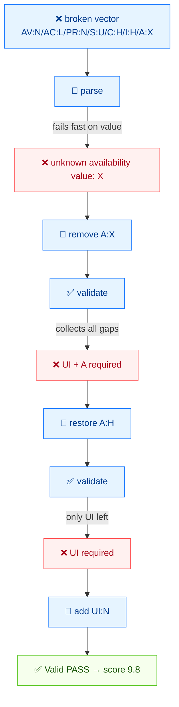

# 🔍 校验工作流

⏱️ 12 分钟 · 入门 · CLI + SDK

你将故意写一个坏向量，观察 CLI 用两种不同方式拒绝它，逐个指标修复，并理解为什么 `Check` 和 `Validate` 是两个独立操作。

## 前置条件

- `cvss` 二进制（或 `./cvss-cli`）
- 学完 [getting-started](./getting-started) 和 [your-first-vector](./your-first-vector)

## 流程



## 第 1 步 —— 从一个错误向量开始

假设一位初级分析师给你这样一个"远程崩溃"bug 的向量：

```
CVSS:3.1/AV:N/AC:L/PR:N/S:U/C:H/I:H/A:X
```

里面藏着两个问题：

1. `UI` **缺失**（必要基础指标）。
2. `A:X` —— `X` **不是合法的 Availability 值**（合法值是 `H`/`L`/`N`）。

让 CLI 找出它们。

## 第 2 步 —— `parse` 它

`parse` 是宽容的读取器。它接受字符串并告诉你它理解了什么：

```bash
cvss parse "CVSS:3.1/AV:N/AC:L/PR:N/S:U/C:H/I:H/A:X"
```

```
Parse error: unknown availability value: X
```

`parse` 在遇到**第一个非法值**时停下——这里是 `A:X`。它还没抱怨缺失的 `UI`，因为它根本没走到那一步。

::: tip parse 对坏值快速失败
`parse` 在读取时即校验值。当你想要最直接的"字符串在哪里断了"的答案时用它。
:::

## 第 3 步 —— `validate` 它

`validate` 是严格的守门人。对同一个坏向量试一下：

```bash
cvss validate "CVSS:3.1/AV:N/AC:L/PR:N/S:U/C:H/I:H/A:X"
```

```
Validation failed: unknown availability value: X
```

同样的值错误。现在把非法的 `A:X` 段整个删掉，看 `validate` 接下来报什么：

```bash
cvss validate "CVSS:3.1/AV:N/AC:L/PR:N/S:U/C:H/I:H"
```

```
Validation failed: validation failed: metric UI: is required but not set; metric A: is required but not set
```

两个缺失指标同时浮现：`UI`（向量里从来没有）和 `A`（我们刚删掉的）。值错误消失了；剩下的是纯粹的**结构**问题——必要基础指标缺失。

::: tip validate 收集所有结构缺口
不像 `parse` 在第一个问题处停下，`validate` 一次报出所有缺失的必要指标。这正是它适合做 CI 门禁的原因。
:::

## 第 4 步 —— 恢复 Availability

把 `A` 加回并取合法值——`A:H`（完整可用性损失，符合崩溃）：

```bash
cvss validate "CVSS:3.1/AV:N/AC:L/PR:N/S:U/C:H/I:H/A:H"
```

```
Validation failed: validation failed: metric UI: is required but not set
```

`A` 的缺口补上了；只剩下**真正**缺失的指标 `UI`。

## 第 5 步 —— 补上缺失的指标

`UI:N`（无需用户交互）：

```bash
cvss validate "CVSS:3.1/AV:N/AC:L/PR:N/UI:N/S:U/C:H/I:H/A:H"
```

```
Valid [PASS]
  Version: 3.1
  Complete: true
```

修好了。评分确认一下：

```bash
cvss score "CVSS:3.1/AV:N/AC:L/PR:N/UI:N/S:U/C:H/I:H/A:H"
```

```
9.8 (Critical)
```

## 第 6 步 —— `Check` 与 `Validate`（SDK 的区别）

Go SDK 里有**两个**相关操作。CLI 的 `validate` 命令两者都跑；代码里你分开调用：

| 操作 | 检查什么 | 失败示例 |
| --- | --- | --- |
| `parser.ParseString` | 读字符串；拒绝**非法值** | `unknown availability value: X` |
| `Cvss3x.Check()` | 解析后的结构**完整性** | `Availability can not empty` |

关键点是，`ParseString` **不要求**所有基础指标都存在——它对部分向量也能成功：

```go
package main

import (
	"errors"
	"fmt"

	"github.com/scagogogo/cvss-skills/pkg/cvss"
	"github.com/scagogogo/cvss-skills/pkg/parser"
)

func main() {
	// 部分：AV/AC/PR/UI/S/C/I 出现，A 缺失
	cv, err := parser.ParseString("CVSS:3.1/AV:N/AC:L/PR:N/UI:N/S:U/C:H/I:H")
	fmt.Println("ParseString err:", err) // <nil>  — 解析成功
	fmt.Println("Check():", cv.Check())  // Availability can not empty

	// Validate 收集所有问题而不是在第一个错误处短路。
	if err := cv.Validate(); err != nil {
		var ve cvss.ValidationErrors
		if errors.As(err, &ve) {
			fmt.Println("Missing:", ve.MissingMetrics()) // [A]
		}
	}
}
```

```
ParseString err: <nil>
Check(): Availability can not empty
Missing: [A]
```

所以模式是：

```go
cv, err := parser.ParseString(input) // 1. 值级错误
if err != nil {
	return err
}
if err := cv.Check(); err != nil {    // 2. 结构级错误
	return err
}
// cv 现在可以安全评分
```

::: tip 为什么要拆开？
你有时会故意解析一个*部分*向量——计算分数[范围](../cli/commands/range)或稍后合并指标。`ParseString` 允许你这么做；`Check()` 是显式的"这够不够完整到能评分？"的问题。
:::

## 第 7 步 —— 批量校验一个文件

当你有大量向量时，一次全部校验：

```bash
cat > /tmp/vec.txt <<'EOF'
CVSS:3.1/AV:N/AC:L/PR:N/UI:N/S:U/C:H/I:H/A:H
CVSS:3.1/AV:N/AC:L/PR:N/UI:N/S:U/C:H/I:H/A:X
CVSS:3.1/AV:N/AC:L/PR:N/S:U/C:H/I:H/A:H
EOF

cvss batch validate /tmp/vec.txt
```

```
PASS Line 1: CVSS:3.1/AV:N/AC:L/PR:N/UI:N/S:U/C:H/I:H/A:H
FAIL Line 2: CVSS:3.1/AV:N/AC:L/PR:N/UI:N/S:U/C:H/I:H/A:X
  - unknown availability value: X
FAIL Line 3: CVSS:3.1/AV:N/AC:L/PR:N/S:U/C:H/I:H/A:H
  - metric UI: is required but not set
```

第 1 行通过；第 2 行因非法 `A:X` 值失败；第 3 行因缺失 `UI` 指标失败。`batch validate` 对每一行跑**完整**校验（值 + 完整性），并在每个失败下打印具体原因。

## 小结

- `parse` 对**非法值**快速失败；用它找第一个坏值。
- `validate` 是完整守门人：值错误**和**缺失指标错误都报。
- SDK 里 `parser.ParseString`（值）和 `Cvss3x.Check()`（完整性）刻意分开，方便处理部分向量。
- 先修值错误，再追缺失指标——畸形段可能引发连锁。

## 下一步

- 在 [comparison-guide](./comparison-guide) 中比较和合并向量
- 在 [batch-scripting](./batch-scripting) 中规模化跑校验
