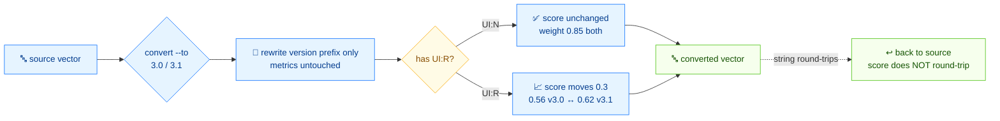

# 🔁 版本迁移

⏱️ 12 分钟 · 中级 · CLI + SDK

CVSS v3.0 与 v3.1 的指标集几乎相同，但有一个权重不同：`UI:R`（User Interaction = Required）在 v3.0 贡献 `0.56`，在 v3.1 贡献 `0.62`。这一个变化会让任何 `UI:R` 向量的分数移动。本教程展示如何在版本间转换、分数在哪里移动、以及如何在 Go 中完成。

## 前置条件

- `$PATH` 上的 `cvss` 二进制（或仓库根的 `./cvss-cli`）
- 学完 [getting-started](./getting-started) 和 [your-first-vector](./your-first-vector)
- SDK 小节：Go 1.18+

## 流程



## 唯一变化的权重

| 指标值 | v3.0 权重 | v3.1 权重 |
| --- | --- | --- |
| `UI:N`（None） | 0.85 | 0.85 |
| `UI:R`（Required） | 0.56 | **0.62** |

其他所有指标的权重在两版间保持不变。所以 `UI:N` 向量在 v3.0 和 v3.1 中评分**相同**；只有 `UI:R` 向量会移动。`convert` 命令只改版本前缀——指标值保留——分数按目标版本的权重重算。

## 第 1 步 —— v3.0 → v3.1（`UI:N` 向量，分数不变）

```bash
cvss convert "CVSS:3.0/AV:N/AC:L/PR:N/UI:N/S:U/C:H/I:H/A:H" --to 3.1
```

```
Original:  CVSS:3.0/AV:N/AC:L/PR:N/UI:N/S:U/C:H/I:H/A:H (9.8)
Converted: CVSS:3.1/AV:N/AC:L/PR:N/UI:N/S:U/C:H/I:H/A:H (9.8)
```

`UI:N` 不受权重变化影响，所以分数仍是 **9.8**。只有版本前缀从 `CVSS:3.0` 翻成 `CVSS:3.1`。

## 第 2 步 —— v3.0 → v3.1（`UI:R` 向量，分数移动）

现在取一个带 `UI:R` 的向量。这才是转换有意思的地方：

```bash
cvss convert "CVSS:3.0/AV:N/AC:L/PR:N/UI:R/S:U/C:H/I:H/A:H" --to 3.1
```

```
Original:  CVSS:3.0/AV:N/AC:L/PR:N/UI:R/S:U/C:H/I:H/A:H (8.5)
Converted: CVSS:3.1/AV:N/AC:L/PR:N/UI:R/S:U/C:H/I:H/A:H (8.8)
```

指标值逐字节相同；只有 `CVSS:3.0` → `CVSS:3.1` 变了。但分数从 **8.5 → 8.8**，因为 `UI:R` 的权重从 `0.56` 升到 `0.62`，抬高了可利用性子分。

::: tip convert 永不改指标值
`convert` 只重写版本前缀。你看到的分数差纯粹是 v3.0 与 v3.1 权重差异施加在同一组指标上的结果。
:::

## 第 3 步 —— v3.1 → v3.0（降级）

用 `--to 3.0` 反向：

```bash
cvss convert "CVSS:3.1/AV:N/AC:L/PR:N/UI:R/S:U/C:H/I:H/A:H" --to 3.0
```

```
Original:  CVSS:3.1/AV:N/AC:L/PR:N/UI:R/S:U/C:H/I:H/A:H (8.8)
Converted: CVSS:3.0/AV:N/AC:L/PR:N/UI:R/S:U/C:H/I:H/A:H (8.5)
```

同一向量、同方向的分数变化——`8.8 → 8.5`。降级到 v3.0 把 `UI:R` 权重降回 `0.56`。

## 第 4 步 —— 改变范围会放大差距

当 `S:C`（Scope = Changed）介入时，`UI:R` 的差值会通过改变范围影响公式放大：

```bash
cvss convert "CVSS:3.1/AV:N/AC:L/PR:N/UI:R/S:C/C:H/I:H/A:H" --to 3.0
```

```
Original:  CVSS:3.1/AV:N/AC:L/PR:N/UI:R/S:C/C:H/I:H/A:H (9.7)
Converted: CVSS:3.0/AV:N/AC:L/PR:N/UI:R/S:C/C:H/I:H/A:H (9.4)
```

仍是 `0.3` 差距（`9.7 → 9.4`）——与 `S:U` 情况相同的绝对变化，因为 `UI:R` 权重差线性地喂入可利用性子分。关键在于这个差距出现在 Critical 区间顶部，可能影响优先级阈值。

## 第 5 步 —— 在 Go 中完成：`UpgradeTo31` / `DowngradeTo30`

SDK 镜像 CLI。`ConvertToVersion(major, minor)` 是通用形式；`UpgradeTo31()` 和 `DowngradeTo30()` 是便捷封装。

```go
package main

import (
	"fmt"

	"github.com/scagogogo/cvss-skills/pkg/cvss"
	"github.com/scagogogo/cvss-skills/pkg/parser"
)

func main() {
	// 从一个 v3.0 的 UI:R 向量开始
	cv30, err := parser.ParseString("CVSS:3.0/AV:N/AC:L/PR:N/UI:R/S:U/C:H/I:H/A:H")
	if err != nil {
		panic(err)
	}
	s30, _ := cvss.NewCalculator(cv30).Calculate()

	// 升级到 3.1
	cv31, err := cv30.UpgradeTo31()
	if err != nil {
		panic(err)
	}
	s31, _ := cvss.NewCalculator(cv31).Calculate()

	fmt.Printf("v3.0 vector: %s\n", cv30.String())
	fmt.Printf("v3.1 vector: %s\n", cv31.String())
	fmt.Printf("v3.0 score: %.1f\n", s30)
	fmt.Printf("v3.1 score: %.1f\n", s31)

	// 降级回去
	back, _ := cv31.DowngradeTo30()
	fmt.Printf("downgraded: %s\n", back.String())
}
```

```
v3.0 vector: CVSS:3.0/AV:N/AC:L/PR:N/UI:R/S:U/C:H/I:H/A:H
v3.1 vector: CVSS:3.1/AV:N/AC:L/PR:N/UI:R/S:U/C:H/I:H/A:H
v3.0 score: 8.5
v3.1 score: 8.8
downgraded: CVSS:3.0/AV:N/AC:L/PR:N/UI:R/S:U/C:H/I:H/A:H
```

Go 输出与 CLI 完全一致：v3.0 为 `8.5`，v3.1 为 `8.8`。`DowngradeTo30()` 往返回原始字符串。

::: warning 转换对评分不总是无损的
向量*字符串*完美往返（`v3.0 → v3.1 → v3.0` 得到同一字符串），但*分数*不会——`UI:R` 向量在每个版本评分不同。如果你把分数和向量一起存储，转换后要重算，别沿用旧分。
:::

## 何时转换

| 场景 | 转到 | 原因 |
| --- | --- | --- |
| 你摄入的公告混有 v3.0 和 v3.1 | 3.1 | 统一到更新、更保守的权重 |
| 下游工具只认 v3.0 | 3.0 | 兼容旧消费者 |
| 你要复现一个已发布的 v3.0 分数 | 3.0 | 精确匹配原始计算 |

::: tip 除非必须，优先 3.1
v3.1 是现行标准。仅当旧消费者要求时才转 3.0，并注明 `UI:R` 向量在未改变范围下分数会降 `0.3`。
:::

## 小结

- v3.0 ↔ v3.1 仅在 `UI:R` 权重上不同：`0.56`（v3.0）vs `0.62`（v3.1）。
- `cvss convert <vector> --to 3.1|3.0` 重写版本前缀并重算分数；指标值不动。
- `UI:N` 向量两版同分；`UI:R` 向量移动 `0.3`（未改变范围）。
- Go 中：`cv.UpgradeTo31()`、`cv.DowngradeTo30()`，或通用 `cv.ConvertToVersion(major, minor)`。
- 向量串往返；分数不往返——转换后重算。

## 下一步

- 在 [presets-and-random](./presets-and-random) 中跨两个版本生成测试数据
- 在 [building-vectors](./building-vectors) 中用 SDK 在任一版本构建向量
