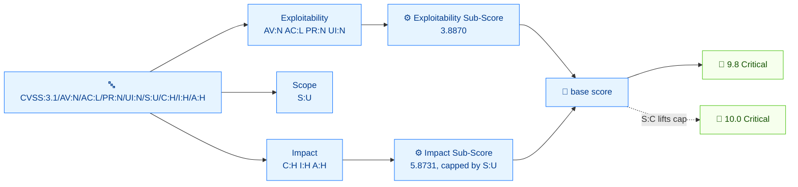

# 🧩 你的第一个向量

⏱️ 20 分钟 · 入门 · CLI

你将拆解野外最常见的 CVSS v3.1 向量：

```
CVSS:3.1/AV:N/AC:L/PR:N/UI:N/S:U/C:H/I:H/A:H
```

学完后你会知道每一对 `KEY:VALUE` 的含义、为什么这个组合得到 **9.8 Critical**，以及如何改动一个指标让分数下降。本教程全程使用 `cvss` CLI。

## 前置条件

- `$PATH` 上的 `cvss` 二进制（或仓库根的 `./cvss-cli`）
- 学完 [getting-started](./getting-started)，能跑 `score` 命令

## 流程



## 第 1 步 —— 向量的形状

每个 CVSS 3.x 向量都有相同的骨架：

```
CVSS:<version>/<Metric>:<Value>/<Metric>:<Value>/...
```

- `CVSS:3.1` 是**版本前缀**，决定使用哪套评分规则。
- 第一个 `/` 之后是**指标:值 对**，以 `/` 分隔。
- 顺序对分数无影响，但 CLI 可以用 `canonicalize` 规范化：

```bash
cvss canonicalize "CVSS:3.1/C:H/AV:N/AC:L/PR:N/UI:N/S:U/I:H/A:H"
```

```
CVSS:3.1/AV:N/AC:L/PR:N/UI:N/S:U/C:H/I:H/A:H
```

我们的向量有八对。它们全部是**基础**指标——产生分数所需的最小集。这里没有时间（`E`/`RL`/`RC`）或环境（`CR`/`MAV`/...）指标。

## 第 2 步 —— 可利用性指标（AV、AC、PR、UI）

前四个指标描述漏洞被利用的难易程度。

### `AV:N` —— Attack Vector = Network（网络）

攻击者如何到达受影响组件。

| 值 | 含义 | 可达范围 |
| --- | --- | --- |
| `N` | Network（网络） | 任意网络——最严重 |
| `A` | Adjacent（邻接） | 同一广播/认证域 |
| `L` | Local（本地） | 本地执行或物理接触 |
| `P` | Physical（物理） | 直接接触设备 |

`AV:N` 表示可远程通过网络利用——最可怕的情形。

### `AC:L` —— Attack Complexity = Low（低）

攻击者无法控制、使攻击变难的条件。

| 值 | 含义 |
| --- | --- |
| `L` | Low——无特殊条件 |
| `H` | High——如竞态、特殊时序 |

`AC:L` 表示攻击易于实施。

### `PR:N` —— Privileges Required = None（无）

攻击者是否需要在攻击前通过认证。

| 值 | 含义 |
| --- | --- |
| `N` | None（无） |
| `L` | Low（低权限） |
| `H` | High（高权限） |

`PR:N` 表示完全无需认证的攻击者。

### `UI:N` —— User Interaction = None（无）

是否需要第二个用户（非攻击者本人）做某事。

| 值 | 含义 |
| --- | --- |
| `N` | None（无） |
| `R` | Required（需要） |

`UI:N` 表示无需受害者交互。

::: tip 这四个加在一起 = "远程、轻松、匿名、自主"
`AV:N/AC:L/PR:N/UI:N` 是经典的"路过式 RCE"画像——可利用性拉满。
:::

## 第 3 步 —— `S:U` —— Scope = Unchanged（未改变）

Scope 是最微妙的基础指标。它刻画的是：**受影响组件**中的成功利用，能否影响到**另一个组件**（不同的安全权威）中的资源。

| 值 | 含义 |
| --- | --- |
| `U` | Unchanged——影响停留在受影响组件内 |
| `C` | Changed——影响跨入另一个组件 |

`S:U` 表示爆炸半径被限制。`S:C` 会放大影响——这就是 [presets-and-random](./presets-and-random) 中 critical 预设用 `S:C` 达到 10.0 的原因。

## 第 4 步 —— 影响指标（C、I、A）

最后三个指标描述攻击者得手后的后果。

| 指标 | 关注点 | 取值 |
| --- | --- | --- |
| `C` | 机密性 | `H` High / `L` Low / `N` None |
| `I` | 完整性 | `H` High / `L` Low / `N` None |
| `A` | 可用性 | `H` High / `L` Low / `N` None |

我们的向量是 `C:H/I:H/A:H`——三项安全性质全部失守。加上 `S:U`，这就是未改变范围漏洞的最大影响。

## 第 5 步 —— 一次看全

```bash
cvss describe "CVSS:3.1/AV:N/AC:L/PR:N/UI:N/S:U/C:H/I:H/A:H"
```

```
Attack Vector: Network, Attack Complexity: Low, Privileges Required: None, User Interaction: None, Scope: Unchanged, Confidentiality: High, Integrity: High, Availability: High
```

以及计算器使用的每个指标权重：

```bash
cvss score --breakdown "CVSS:3.1/AV:N/AC:L/PR:N/UI:N/S:U/C:H/I:H/A:H"
```

```
=== Score Breakdown ===
--- Base Metrics ---
  AV:N = 0.8500  (Attack Vector)
  AC:L = 0.7700  (Attack Complexity)
  PR:N = 0.8500  (Privileges Required)
  UI:N = 0.8500  (User Interaction)
  S:U = 0.0000  (Scope)
  C:H = 0.5600  (Confidentiality)
  I:H = 0.5600  (Integrity)
  A:H = 0.5600  (Availability)
```

::: warning S:U = 0.0000 不是"没有贡献"
Scope 是乘子/开关，不是线性权重——它在分解中的 `0.0000` 只表示每指标权重列为零；评分公式仍会用 `S` 决定走哪条影响公式。
:::

## 第 6 步 —— 为什么是 9.8？

基础分由两个子分构成：

- **影响子分（ISC）**——C/I/A 损失有多大
- **可利用性子分（ESS）**——AV/AC/PR/UI 让它多容易

直接用 `subs` 查看：

```bash
cvss subs "CVSS:3.1/AV:N/AC:L/PR:N/UI:N/S:U/C:H/I:H/A:H"
```

```
Impact Sub-Score:        5.8731
Exploitability Sub-Score: 3.8870
```

对于 `S:U` 配 `C:H/I:H/A:H`，影响子分（ISC）在 5.8731 处饱和——未改变范围公式 `ISC = 6.42 × (1 − (1−C)(1−I)(1−A))` 在进一步缩放前被 6.42 封顶。可利用性子分（ESS）为 3.8870，因为四个可利用性指标都处于最严重值。两者合成 9.8。

```bash
cvss score "CVSS:3.1/AV:N/AC:L/PR:N/UI:N/S:U/C:H/I:H/A:H"
```

```
9.8 (Critical)
```

::: tip 为什么不是 10.0？
ISC 的封顶是 `S:U` 无法到 10.0 的原因。要达到 10.0 需要 `S:C`（改变范围），它会抬高封顶。比较：
:::

```bash
cvss score "CVSS:3.1/AV:N/AC:L/PR:N/UI:N/S:C/C:H/I:H/A:H"
```

```
10.0 (Critical)
```

一个字符——`S:U` → `S:C`——就把 9.8 推到 10.0。这就是 Scope 的全部意义。

## 第 7 步 —— 改一个指标，看分数移动

降低影响：把 `C:H/I:H/A:H` 改成 `C:L/I:N/A:N`：

```bash
cvss score "CVSS:3.1/AV:N/AC:L/PR:N/UI:N/S:U/C:L/I:N/A:N"
```

```
5.3 (Medium)
```

或加固可利用性：把 `AC:L` 提到 `AC:H`：

```bash
cvss score "CVSS:3.1/AV:N/AC:H/PR:N/UI:N/S:U/C:H/I:H/A:H"
```

```
8.1 (High)
```

这两个例子展示了基础分给你的两根杠杆——影响和可利用性。

## 小结

你把 `CVSS:3.1/AV:N/AC:L/PR:N/UI:N/S:U/C:H/I:H/A:H` 拆开了：

- `AV:N/AC:L/PR:N/UI:N` = 可利用性拉满
- `S:U` = 爆炸半径受限（把分数压在 9.8 而非 10.0 的封顶）
- `C:H/I:H/A:H` = 机密性/完整性/可用性全失
- 合在一起 → **9.8 Critical**

你也看到 `S:C` 能到 10.0，以及降低影响会掉到 Medium。

## 下一步

- 在 [scoring-walkthrough](./scoring-walkthrough) 中观察添加时间和环境指标后分数的演变
- 在 [building-vectors](./building-vectors) 中用 Go 从零构建向量
